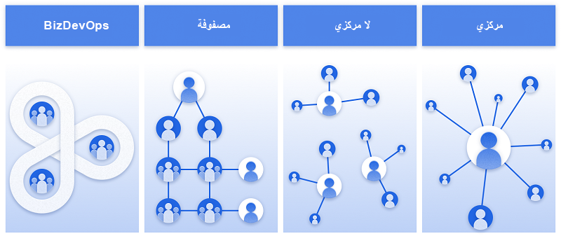

في الغالب، يكون لدى المؤسسات التي تنفّذ حلول Power Platform مستخدمون متميزون ومطورون محترفون يعملون جنبًا إلى جنب في المشروعات. ينشئ المستخدمون المتميزون التطبيقات التي من شأنها أن تساعد على تحسين مهمة الوظيفة أو تحسين الإنتاجية، بينما ينشئ المطورون المكونات الأكثر تقنية التي تعمل بها هذه الحلول.

تختلف هذه العملية عما كان يتم في الماضي. قد يؤدي وجود العديد من الأشخاص لديك الذين يقومون بالتعاون وإنشاء الحلول إلى ظهور تحديات مختلفة ذات صلة بالأمان، والتوافق، والأداء وغير ذلك.

ولذا فإن من الأهمية بمكان الأخذ بعين الاعتبار ما سيبدو عليه الأمر قبل البدء في إنشاء حلول باستخدام نظام Microsoft الأساسي. يمكن بقدر ضئيل من التخطيط والاعتبار أن تمهد الطريق لقطع شوط كبير في رحلة نجاح أي مشروع. يتضمن هذا استخدام أدوات وممارسات مختلفة مصممة للمساعدة في ضمان إنشاء الحلول بسلاسة أكبر.

## إنشاء مركز تميز

من أول الأمور التي يجب أخذها بعين الاعتبار هو إنشاء مركز تميز Microsoft Power Platform. إنشاء مركز تميز (CoE) يعني الاستثمار في النمو العضوي ورعاية هذا النمو الذي يمكن أن توفره مجموعة خدمات Power Platform مع الحفاظ على الإدارة والتحكم. يكون مركز التميز، بالنسبة للعديد من المؤسسات، هو الخطوة الأولى في تعزيز قدر أكبر من الإبداع والابتكار عبر المؤسسة. فهو يمكّن وحدات العمل المختلفة من رقمنة عمليات الأعمال الخاصة بها وتنفيذها بشكل تلقائي، مع المحافظة على المستوى اللازم للإدارة والإشراف المركزي.

من المبادئ الأساسية توضيح سبب إعدادك لمركز تميز، وما تهدف إلى إنجازه، ونتائج الأعمال الأساسية التي تأمل تحقيقها. ثم يأتي بعد ذلك الشروع في العمل والتعلّم والتطوير على طول الطريق.

صُمم مركز التميز لدعم الابتكار والتحسين. يمكن لمركز التميز أن يقوم بتقسيم المستودعات الجغرافية والمؤسسية لجعل بعض الأشخاص ذوي التفكير المشابه مثل الأشخاص الذين لديهم أهداف تجارية متشابهة يتشاركون المعرفة والنجاح أثناء تقديم المقاييس والتناسق والإدارة في نفس الوقت. باختصار، يمكن أن يكون مركز التميز طريقة فعالة لمؤسسة للمحاذاة حول أهداف العمل بدلاً من مقاييس الأقسام الفردية.

عادةً ما يكون الأشخاص التالون أو الأقسام التالية هم الدوافع الأساسية أو أصحاب المصلحة عند إنشاء مركز تميز:

-   صانعو التطبيقات والتدفق

-   إدارة دورة حياة التطبيقات ومستخدمو DevOps

-   تكنولوجيا المعلومات المركزية

-   مهندسو الدعم والتدريب

-   إدارة التغيير في الأعمال

في البداية، قد يبدأ إنشاء مركز تميز ببساطة بفرد واحد باستخدام الأدوات المتوفرة وتطبيق أفضل الممارسات للحصول على عرض لتبنّي Microsoft Power Platform في مؤسسته. وكلما تطورت مؤسستك، نمت في استثمار أكثر نضجًا باستخدام عدة وظائف وأدوار لإدارة العديد من جوانب الحوكمة، والتدريب، والدعم، والتوزيع الآلي للتطبيقات في جميع أنحاء المؤسسة.

نوصي بالإستراتيجية التالية لبدء رحلتك نحو إنشاء مركز تميز:

-   التأمين عن طريق إنشاء سياسات لتفادي فقدان البيانات، وإدارة التراخيص والوصول إلى مصادر البيانات.

-   التبشير بتوفير مساحة مجتمعية على Teams، أو Yammer أو SharePoint، مع مجموعة من الارتباطات للأشخاص لبدء رحلة التعلّم الخاصة بهم.

-   مراقبة استخدامك، ومعرفة من يقوم بإنشاء التطبيقات، وما التطبيقات التي يتم إنشاؤها، وكيفية استخدامها.

-   تطوير إستراتيجية مركز التميز الخاصة بك بهذه الدروس.

يمكنك معرفة المزيد حول إنشاء مركز تميز Microsoft Power Platform هنا: [الشروع في العمل باستخدام مركز تميز Microsoft Power Platform.](/training/modules/get-started-center-excellence/?azure-portal=true)

## الأدوار والمسؤوليات

عادة ما تتطلب عمليات تخطيط حلول Power Platform وصيانتها وكذلك إنشاء مركز تميز إدخالات وتعليقات العديد من أصحاب المصلحة المختلفين لكي تكون فعالة. للمساعدة في ذلك، نوصي بتضمين الأدوار والمسؤوليات التالية كجزء من إستراتيجيتك. فهذا من شأنه أن يساعد في توفير الإرشادات ذات الصلة بإنشاء التطبيق، والمساعدة في ضمان أمان البيانات، والمساعدة كذلك في التأكد من استخدام صنّاع التطبيقات لأفضل الممارسات أثناء قيامهم بإنشاء حلول. تمثل القائمة أدناه نقطة بدء مقترحة. في مؤسستك، قد يكون هذا مختلفًا، أو يمكنك البدء ببعض الأدوار فقط وزيادة هذه الأدوار بينما تستمر رحلة التبنّي الخاصة بك.

### فريق إستراتيجية منخفضة التعليمات البرمجية

يمثل فريق الإستراتيجية منخفضة التعليمات البرمجية متخذي القرار الأساسيين ويضمن مواءمة إستراتيجية Microsoft Power Platform مع أهداف المؤسسة. هذا الفريق مسؤول أيضًا عن إدارة التبنّي والتغيير، واستعراض طرق العمل عبر المؤسسة. وبصفة الفريق محركًا للابتكار الرقمي، فهو يضمن وضع خطة عمل ملموسة لزيادة المعرفة الرقمية موضع التنفيذ. في الغالب يتم إنجاز هذا من خلال مجموعة من المبادرات التصاعدية والتنازلية.

-   **التصاعدية:** تثقيف الصنّاع لديك، وتقليل شعورهم بالخوف، وتشجيع التمكين الذاتي.

-   **التنازلية:** العمل على محو الأمية التنفيذية وإنشاء ثقافة داعمة للابتكار.

### فريق مسؤولي Microsoft Power Platform

فريق مسؤولي Microsoft Power Platform مسؤول عن إنشاء إستراتيجية بيئة، وإعداد [سياسات لتفادي فقدان البيانات (DLP)](/power-platform/guidance/adoption/dlp-strategy/?azure-portal=true)، وإدارة المستخدمين، [والسعة والتراخيص](/power-platform/guidance/adoption/capacity-and-licenses/?azure-portal=true). كما يعملون أيضًا على جعل البيانات متوفرة للصنّاع من خلال الموصلات، أو التكامل، أو الترحيل.

### فريق دعم Microsoft Power Platform

فريق دعم Microsoft Power Platform — والذي قد يتألف من الروّاد لديك — معني بتنظيم أحداث إنشاء تطبيق في يوم واحد وأحداث البرمجة (الهاكاثونس‬)، وتوفير التوجيه والإرشاد للصنّاع مع ضمان حصول الصنّاع الجدد على بداية جيدة، والسعي الحثيث نحو التبشير بالنظام الأساسي.

## التنفيذ التلقائي والمكونات القابلة لإعادة الاستخدام

هناك وظيفة أخرى أو فريق آخر يجب أخذه بعين الاعتبار وهو الفريق الذي ينظر إلى تنفيذ المهام بشكل تلقائي، مثل أرشفة الموارد غير المستخدمة، وتحديد الموارد المستخدمة بدرجة كبيرة لتوفير مزيد من الدعم الرسمي، واعتماد البيئة وطلبات الترخيص من المستخدمين النهائيين. سيقوم هذا الفريق أيضًا بإعداد إدارة دورة حياة البرنامج باستخدام [Microsoft Power Platform Build Tools لـ Azure DevOps](/power-platform/alm/devops-build-tools/?azure-portal=true)، ودعم مراجعات البنية مع الصنّاع، ومشاركة القوالب العامة والمكونات القابلة لإعادة الاستخدام. ووجود هذه الوظائف في مكانها من شأنه أن يضمن استخراج مؤسستك للفوائد بسرعة أكبر، وذلك من خلال التأكد من اتساق العمليات وتطبيق أفضل الممارسات عبر المؤسسة.

## نماذج التسليم

من الاعتبارات الأخرى التي ينبغي أخذها في الحسبان في البداية هو كيفية تسليم الحلول إلى المؤسسة. ووفقًا لحجم مؤسستك، قد ترغب في إضفاء الطابع الرسمي على نهج تبنّي Microsoft Power Platform الخاص بك من خلال تنفيذ نموذج مؤسسة مهيكل. تجب مراعاة الطرق التالية لهيكلة فريقك وتحديد الأفضل ملاءمة لوضعك ومؤسستك.

تحتوي خدمة Microsoft Power Platform على أربعة نماذج تسليم، ولكن كل منها مجرد نموذج ذهني، فلكل مؤسسة تباين يتألف من العديد من النماذج على طول مجموعة ميزات continuum هذه. على سبيل المثال، حتى إذا اخترت نموذجًا مركزيًا، حيث ترد جميع المتطلبات إلى فريق تسليم مركزي، فسيظل لديك مطورو التقنيات السهلة لاكتشاف النظام الأساسي وإنشاء التطبيقات لفرقهم. سيكون لديك عناصر مصفوفة أو BizDevOps على أية حال.

قد تساعدك هذه النماذج في الأخذ بعين الاعتبار ما هو نموذج تسليم البرنامج الحالي الخاص بك والطريقة التي قد تتراكب بها Microsoft Power Platform فيه، أو الكيفية التي قد يتطور بها النموذج الحالي لديك لاستيعاب القدرة على التطوير السريع الممكّنة بواسطة Microsoft Power Platform.

> [!div class="mx-imgBorder"]
> 

### مركزي

يمكنك في هذا النموذج إنشاء فرق مركزية من مالكي المنتجات الذين يمتلكون التسليم منخفض التعليمات البرمجية لحلول الأقسام من وحدات الأعمال من جميع أنحاء المؤسسة. سيعمل المطورون المحترفون الذين يمتلكون حلول code-first (التعليمات البرمجية أولاً) جنبًا إلى جنب مع الشركة لتسليم نموذج مشترك. سيمتلك مهندسو المؤسسة الخدمات والمستوى المتوسط، مع التأكد من توفر البيانات للصنّاع. سيمتلك فريق ‏‫تكنولوجيا المعلومات المركزية‬ التراخيص والأنظمة التي يعمل بها الجميع.

يمكنك باستخدام هذا النموذج إنشاء فريق مركزي يمكنه جلب تطوير التطبيقات استنادًا إلى أولويات المؤسسة. بالإضافة إلى ذلك، ونظرًا لأن الفريق ستكون له خبرة أساسية في Power Apps، فإنه سيتضمن أعضاء متخصصين في أجزاء معينة من Microsoft Power Platform، مثل Power Automate، وPower BI، وPower Apps component framework، أو قد يتخصصون في الذكاء الاصطناعي وتكامل الجهة الخارجية. يُعد هذا النموذج طريقة فعالة لدفع التغيير عبر مؤسستك، كما أنه أفضل طريقة لتسليم أي نوع من التطبيقات.

### لا مركزي

يمكنك في هذا النموذج إنشاء العديد من الفرق عبر المؤسسة، هذه الفرق التي تكون قريبة من التشغيل اليومي للفرق المختلفة. ستتمتع هذه الفرق بالموارد اللازمة لتسليم التطبيقات باتساق داخل إرشادات المؤسسة. يمكن لكل فريق العمل بشكل مستقل، كما يمكنهم الانقسام والنمو بطريقة خلوية. ومع ذلك، باستخدام هذا النموذج، ستظل في حاجة إلى إدارة مركزية لتطبيق بعض حواجز الحماية الرقمية عالية المستوى لضمان توافق الشركة. وقد تتضمن حواجز الحماية هذه أشياء مثل إدارة تفادي فقدان البيانات (DLP)، وإدارة الموصّلات، وإدارة التراخيص للتأكد من أنه يتسنى للمستخدمين والمطورين إنشاء الحلول بأقل تدخل وإطلاقها بأمان من تكنولوجيا المعلومات، مع الحفاظ على أمان بيانات الشركة وتوافقها. وهذا يُعد خيار خدمة ذاتية رائعًا.

### مصفوفة

يمكنك مع هذا النموذج مزج أفضل نموذج مركزي ولا مركزي. لديك فريق مركزي من المتخصصين المدربين على Microsoft Power Platform والمعتمدين فيها. سيكون لديك قادة التغيير، والتصميم، والتسليم، والهندسة، بالإضافة إلى مدربين متخصصين لتدريب الفرق المحلية في جميع أنحاء المؤسسة. يتم ربط الفرق المحلية التي تشكّلت من مطوري التقنيات السهلة بخبراء من البنية المركزية، للتأكد من عدم فقدان أي شيء في الترجمة بين الأشخاص الذين يقومون بالوظائف اليومية ويستخدمون التطبيقات التي يجري إنشاؤها. يمكنك باستخدام هذا النموذج تغيير الحجم لاستيعاب آلاف الأشخاص الذين يعملون في إنشاء التطبيقات.

يجب أن يأخذ هذا الفريق أيضًا بعين الاعتبار فكرة إنشاء مركز تميز لإدارة مقتنيات البيانات الخاصة بهم ونشر الحلول مع توفير إرشادات للجميع. وهذا يعمل بشكل جيد لفرق الخدمة الذاتية والفرق الصغيرة لتسليم الخيارات بسرعة مع تفاعل طفيف من تكنولوجيا المعلومات.

### BizDevOps

لا يمكن أن يحدث تطوير التطبيقات السريع إلا بالسرعة التي يمكن أن تدعم بها العمليات، مثل تكنولوجيا المعلومات، التطبيقات التي تم إنشاؤها. BizDevOps عبارة عن علاقة شاملة بين صنّاع التطبيقات والعمليات تعمل في حلقة قوية وفعالة. ولكي يؤتي هذا العمل ثمرته، يجب أن تتوفر لجميع الفرق رؤية واضحة عن الثقافة الرقمية التي تنتقل المؤسسة نحوها. وهم يحتاجون، إذا أرادوا الحصول على أقصى قيمة من التطبيقات التي تم إنشاؤها، إلى دعم موثوق به، وإدارة، وقابلية للصيانة. وبينما تتطور التكنولوجيا، يجب إجراء التحديثات على التطبيقات لتكون حديثة باستمرار. ومن أهم مفاتيح نجاح التطبيقات، ليس فقط أن تكون على دراية بالتغيير، ولكن أيضًا أن تكون لديك خطة لإدارة هذا التغيير. 

والآن بعد أن اختبرنا بعض العناصر الأساسية التي يجب أخذها بعين الاعتبار عند تطوير إستراتيجية ورؤية Power Platform، لنقم باختبار بعض الأشياء التي ينبغي مراعاتها أيضًا عند تخطيط عملية توزيع.
