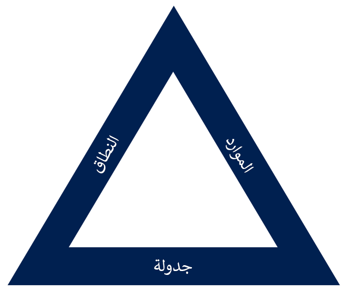

يحدد تحليل الفروق والتوافق الفرق بين المتطلبات المعروفة والحل المقترح أو الحالي. وهو يُظهر العناصر المفقودة من الحل بحيث يمكنك معالجتها. لتنفيذ هذه المهمة، تحتاج إلى تكوين فهم كامل للمتطلبات وتحليل الأجزاء المتحركة من الحل المقترح.

> [!VIDEO https://www.microsoft.com/videoplayer/embed/RE4pxOy]

ستختلف الطريقة التي تتبعها لمعالجة الفروق المحددة لأسباب عديدة؛ الوقت والموازنة والموارد هي من بين التأثيرات الأكثر شيوعاً. تعرض الصورة الآتية مثلث المقايضة. القاعدة بسيطة مع المثلث: إذا تغير أحد الجوانب، فيجب أن يتغير أيضاً جانب واحد آخر على الأقل.

خلال هذه الوحدة، سوف تتمكن مما يلي:

-   استكشاف جدوى المتطلبات.

-   تحسين المتطلبات من رؤى إثبات المفهوم.

-   تنفيذ تحليل الفروق والتوافق. 

-   تقييم تطبيقات Dynamics 365 لاستيفاء المتطلبات.

-   تقييم تطبيقات الطرف الثالث.

-   استخدام الحلول البديلة.
