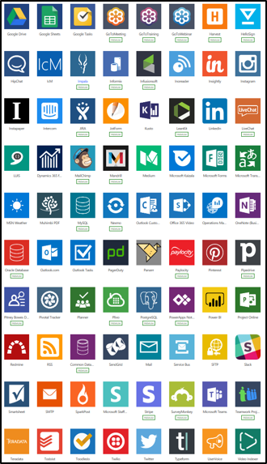

لن يتم إنشاء كل حل في Dynamics 365 أو Power Platform. للاستماع إلى الخبراء الذين يفكرون في معرفة وقت استخدام تطبيق Dynamics 365 الخاص بالطرف الأول، شاهد الفيديو التالي.

> [!VIDEO https://www.microsoft.com/videoplayer/embed/RE4pxAg]

## الموصلات وواجهات API

تسمح لك الموصلات بالاستفادة من Microsoft Power Platform بدون نقل بياناتك. يستخدم كلٌ من Power BI وPower Apps وPower Automate الموصلات، ما يسمح لك بتحليل البيانات والخدمات واتخاذ إجراءات بشأنها وأتمتتها.

تمنحك الموصلات المدمجة لأكثر من 275 نظامًا وخدمات (وآخذة في الازدياد) إمكانية إنشاء موصلات مخصصة تتوسع لتشمل أي نظام أو خدمة بها واجهة API REST.

لا يمكن للتطبيقات المستندة إلى النموذج الأصلية من Dynamics 365 استخدام موصل مباشرة.
ومع ذلك، من خلال تضمين تطبيق لوحة Power Apps، والذي يمكنه استخدام الموصلات، يمكنك استخدامها لمساعدتك في جلب البيانات إلى Dynamics 365 بدون ترحيل البيانات.

في الفيديو التالي، يناقش اثنان من مهندسي الحلول التكامل مع تطبيقات Dynamics 365 وMicrosoft Power Platform.

> [!VIDEO https://www.microsoft.com/videoplayer/embed/RE4pkuz]

## المسرعات الصناعية

مبادرة البيانات المفتوحة هي رؤية تم تطويرها بشكل مشترك من قبل Microsoft وAdobe وSAP. نتج عن هذه المبادرة Microsoft Common Data Model المدعومة بالفعل في Microsoft Dataverse وDynamics 365 وPower Apps وPower BI وخدمات بيانات Azure القادمة، والتي تكتسب قيمة مباشرة تجاه "مبادرة البيانات المفتوحة".

هدف نموذج البيانات العام هو تمكين البيانات المتداخلة والبيانات القابلة للتطبيق التي تمتد إلى قنوات متعددة وتطبيقات الخدمة والموردين. يوفر نموذج البيانات المشتركة بيانات ذاتية الوصف (هيكليًا ودلاليًا)، مما يمكّن التطبيقات من قراءة البيانات وفهمها.

يحدد معيار نموذج البيانات المشترك لغة مشتركة لكيانات الأعمال التي تغطي، بمرور الوقت، النطاق الكامل لعمليات الأعمال عبر المبيعات والخدمات والتسويق والعمليات والتمويل والموهبة والتجارة وللكيانات العميل والأفراد والمنتج على جوهر العمليات التجارية للشركة.

يساعد نموذج البيانات المشتركة على تبسيط قدرتهم على إنشاء قيمة من تلك البيانات حيث يتيح ذلك النموذج الاتساق الأفقي لبيانات عمل العملاء.
ومع ذلك، فإن العديد من العملاء والشركاء يرغبون في الحلول والأنظمة الأساسية المخصصة لصناعتهم. تعمل Microsoft بشكل وثيق مع مجموعة من الصناعات لجعل نموذج البيانات المشتركة أكثر ارتباطًا بها من خلال مسرعات الصناعة.

باستخدام المسرعات، يمكنك الحصول على مخطط جاهز للإنتاج لبدء عمليات التنفيذ الخاصة بك. الصناعات التالية لديها معجلات متوفرة حاليًا:

-   [الخدمات البنكية](/common-data-model/banking-accelerator/?azure-portal=true)

-   [الرعاية الصحية](/common-data-model/health-accelerator/?azure-portal=true)

-   التعليم بما في ذلك [التعليم العالي](/common-data-model/hied-accelerator/?azure-portal=true) ومن الحضانة حتى الثانوي

-   [غير الربحية](/common-data-model/nfp-accelerator/?azure-portal=true)

-   [السيارات](/common-data-model/automotive-accelerator/?azure-portal=true)

-   الوسائط

## AppSource

مع [Microsoft AppSource](https://appsource.microsoft.com/)، يمكنك اكتشاف تطبيقات لإضافتها إلى حلول أعمالك.

احصل على التطبيق الملائم لك على الفور. اعثر على أفضل حلول للأعمال مقدمة من Microsoft لمجال عملك واختر الشركاء، بما في ذلك تطبيقات حصرية.

نبني على ما لديك. أضف إمكانيات جديدة إلى تطبيقات أعمالك الحالية. من Dynamics إلى Power BI، ستجد حلولاً لتحسين ما تستخدمه بالفعل.

ابدأ بثقة. جرّب أي تطبيق مجانًا قبل أن تشتريه، ثم اعمل مع شريك Microsoft موثوق به لتنفيذ الحل الجديد.

باستخدام AppSource، يمكنك:

-   تسويق خدماتك على نطاق واسع.

-   الوصول إلى 100 مليون مستخدم نشط تجاريًا.

-   ساعد مستخدمي الأعمال على القيام بالمزيد باستثماراتهم الحالية في Microsoft.

-   تبسيط اكتشاف تطبيقات الأعمال وخدماتها وتجربتها واكتسابها.

