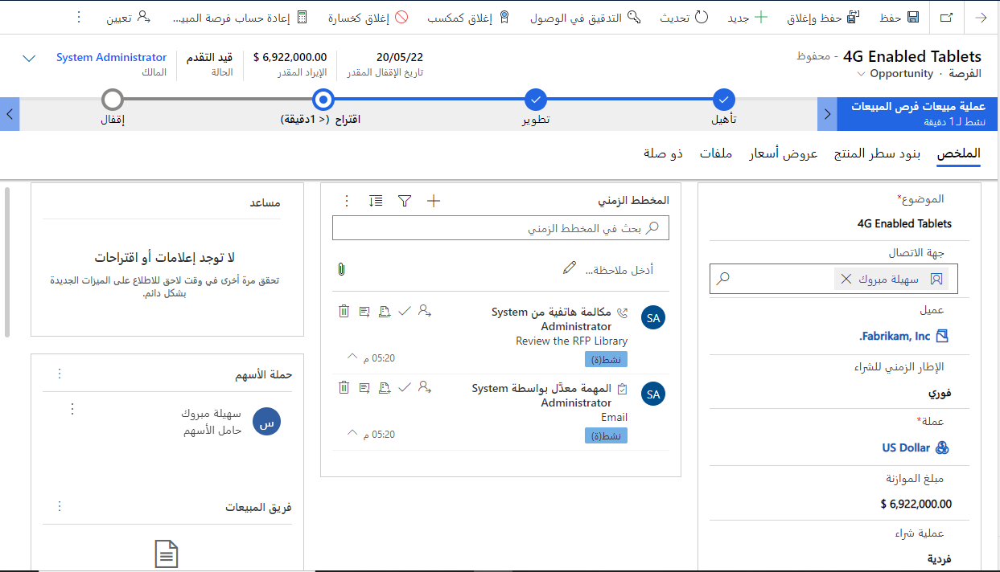
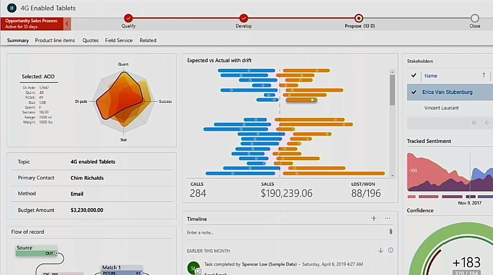

يسمح لك Microsoft Power Apps component framework بإنشاء مكونات تعليمات برمجية قابلة لإعادة الاستخدام يمكنك استخدامها مع تطبيقاتك في Power Apps. يسمح component framework للمطورين بإنشاء مكونات تعليمات برمجية عندما لا تتلاءم المكونات الجاهزة مع احتياجات منشئ التطبيق. مكونات التعليمات البرمجية هي عناصر تحكم مرئية تساعدك على إنشاء تجربة مستخدم مخصصة. بإمكان هذه المكونات أن تتضمن أيضاً منطق عمل يكمّل الرسوم المرئية لفرض تنفيذ أدوار فريدة تتعلق بالسيناريو الجاري تنفيذه.

على سبيل المثال، قد يبدو نموذج تفاصيل يتعلق بتطبيق موجود مماثلاً للصورة التالية.

> [!div class="mx-imgBorder"]
> 

ومع ذلك، إذا أعدت تكوين تطبيقك لاستخدام مكونات التعليمات البرمجية المخصصة، فقد يبدو تطبيقك مماثلاً للصورة التالية.

> [!div class="mx-imgBorder"]
> 

قبل وجود Power Apps component framework، كانت موارد ويب HTML‬ تُستخدم لتوفير أي نوع من أنواع العروض التقديمية المخصصة لنموذج Power Apps'. الآن، يمكنك استخدام إطار عمل أكثر حداثة يسمح بعرض القدرات في تطبيقك التي كان من المستحيل الوصول إليها بطريقة أخرى، أو الأسوأ من ذلك، لم تكن تحظى بدعم Microsoft.

## مزايا Power Apps component framework

تم بناء مكونات Power Apps على إطار عمل متين يدعم ممارسات الويب الحديثة. ونتيجة لذلك، بعض المزايا هي:

-   الوصول إلى مجموعة غنية من واجهات API لإطار العمل التي تعرض قدرات مثل إدارة دورة حياة المكونات وبيانات سياقية بالإضافة إلى بيانات تعريف.

-   دعم أطر عمل العميل مثل React وAngularJS.

-   وصول سلس إلى الخادم من خلال واجهة API الويب وأساليب تنسيق الأدوات المساعدة والبيانات وميزات الأجهزة مثل الكاميرا والموقع والميكروفون.

-   تحسين الأداء.

-   قابلية إعادة الاستخدام

-   استخدام مبادئ تصميم الويب سريعة الاستجابة لتوفير تجربة عرض وتفاعل مثالية لأي حجم شاشة أو جهاز أو اتجاه.

-   القدرة على تجميع جميع الملفات في ملف حل واحد مع موارد التطبيق الأخرى.

## أنواع المكونات التي يمكنك إضافتها

-   **حقل** - عنصر تحكم مخصص لحقل في نموذج. على سبيل المثال، بدلاً من مربع نص بسيط لإدخال رقم، يمكن استخدام مكون تعليمات برمجية مخصص لعرض شريط التمرير. قد يتضمن شريط التمرير منطق عمل مخصصاً قام بحد نقاط التوقف على شريط التمرير استناداً إلى البيانات الأخرى المتاحة والمرتبطة بالمكون.

-   **مجموعة بيانات** - عنصر تحكم مخصص لعرض صفوف البيانات. على سبيل المثال، بدلاً من شبكة عامة مكونة من صفوف وأعمدة لعرض مواعيد اليوم، يمكن إنشاء مكون تعليمات برمجية لمجدول يومي. بإمكان مكون التعليمات البرمجية أن يتضمن ميزات مثل السحب والإفلات لإعادة جدولة المواعيد.

## مكونات المجتمع

لقد كان مجتمع Power Apps نشطاً في إنشاء مكونات تعليمات برمجية ذات مصدر مفتوح ومشاركتها مع الآخرين. على سبيل المثال، يُعد التحقق من صحة إدخال المستخدم مقابل تعبير عادي مطلباً شائعاً. بينما يمكنك كتابة النص البرمجي للكمبيوتر العميل لتنفيذ عملية التحقق من الصحة هذه، أو حتى كتابة مكون تعليمات برمجية خاص بك في Power Apps واستخدامه، فقد يكون من المفيد لك التحقق مما إذا كان شخص آخر قد حل هذه المشكلة نيابة عنك. يمكن العثور على عينات متعددة في [معرض PCF](https://pcf.gallery/?azure-portal=true).

## أين يمكن العثور على المساعدة

إذا صادفت مجالات تحتاج فيها إلى المساعدة، فإن أفضل مكان للبدء هو [منتدى مجتمع Power Apps component framework وALM وPro Dev](https://powerusers.microsoft.com/t5/Power-Apps-Component-Framework/bd-p/pa_component_framework/?azure-portal=true)، حيث يمكنك العثور على كمية ضخمة من الأسئلة والأجوبة حول مجموعة واسعة من المواضيع، ويمكنك إرسال أسئلتك الخاصة أيضاً.
