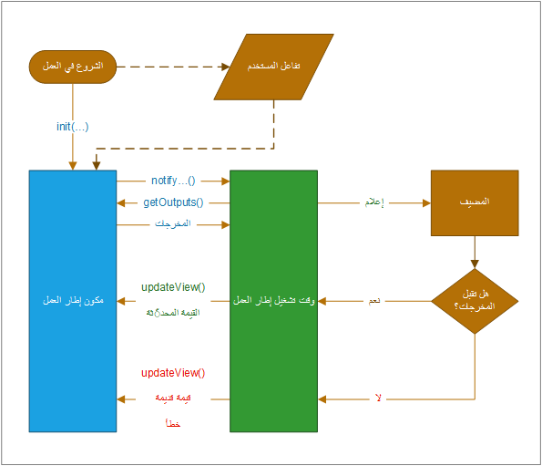

يتم تنفيذ مكونات التعليمات البرمجية باستخدام HTML وCSS وTypeScript. في حين أنه ليس مطلوباً أن تستخدم أي إطار عمل محدد لواجهة المستخدم ، إلا أن [React](https://reactjs.org/?azure-portal=true) وكذلك [Fluent UI](https://developer.microsoft.com/fluentui#/) من الخيارات الشائعة.

## تركيب المكون

كما تظهر الصورة التالية، يتم تمثيل مكون Power Apps في ثلاثة مجالات رئيسية: ملف إدخال البيان وتنفيذه وأي ملفات موارد إضافية قد يحتاجها المكون.

> [!div class="mx-imgBorder"]
> 

يتم استخدام البيان لتحديد أي خصائص متاحة للاستخدام بواسطة التطبيق الذي يستضيف المكون. عندما يتم استخدام مكون الكود من قبل صانعي التطبيقات، سيكون لديهم خيارات إما لتعيين قيمة للخصائص بشكل ثابت أو ربطها ديناميكياً بأحد أعمدة البيانات المتاحة في التطبيق. تسمح الخصائص للتطبيق والمكون بالاتصال بالبيانات دون الحاجة إلى فهم التطبيق لتنفيذ المكون.

لإنشاء مكون، تحتاج التعليمات البرمجية الخاصة بك إلى تنفيذ واجهة توفر طريقة متسقة لتطبيق الاستضافة للتفاعل مع المكون الخاص بك. يتم تحقيق ذلك من خلال فئة مكون التعليمات البرمجية الخاصة بك التي تقوم بتنفيذ واجهة StandardControl.

`export class FirstControl implements ComponentFramework.StandardControl<IInputs, IOutputs> {}`

## دورة حياة مكون Power Apps

عند تطوير أحد المكونات، من المتوقع أن تقوم بتنفيذ أساليب واجهة StandardControl الموضحة في الجدول التالي. تسمح هذه الطرق لوقت تشغيل الاستضافة بإدارة دورة حياة مكون التعليمات البرمجية.

| الأسلوب     | الوصف                                                  |
| ---------- | ------------------------------------------------------------ |
| init       | مطلوب. يُستخدم هذا الأسلوب لتهيئة مثيل المكون. يمكن للمكونات بدء مكالمات الخادم البعيد وإجراءات التهيئة الأخرى بهذه الطريقة. لا يمكن تهيئة قيم مجموعة البيانات باستخدام هذا الأسلوب؛ ستحتاج إلى استخدام أسلوب updateView لهذا الغرض. |
| updateView | مطلوب. سيتم استدعاء هذا الأسلوب عندما تتغير أي قيمة في مجموعة خصائص المكون. |
| getOutputs | اختياري. يستدعيه إطار العمل قبل استلام البيانات الجديدة. استخدم هذه الطريقة عند إدارة الخصائص المرتبطة ديناميكياً في عنصر تحكم. |
| destroy    | مطلوب. يتم استدعاؤه عند إزالة المكون من شجرة DOM. يُستخدم لتنظيف الذاكرة وتحرير أي ذاكرة يستخدمها المكون. |

يتم استدعاء هذه الطرق من خلال عملية وقت التشغيل إطار العمل في دورة حياة قياسية، كما هو موضح في الرسم التوضيحي التالي.

> [!div class="mx-imgBorder"]
> 

في الجزء العلوي من الصورة، يستدعي إطار العمل وظيفة init () لمكونك. إذا كان المكون الخاص بك تفاعلياً، فستحتاج أيضاً إلى إخطار المضيف بأن ناتج المكون قد تغير عن طريق استدعاء طريقة notifyOutputChanged.

سيستدعي وقت تشغيل إطار العمل بعد ذلك طريقة getOutputs للحصول على قيم لجميع الخصائص المرتبطة للمكون الخاص بك.

سيقوم وقت التشغيل بعد ذلك بإخطار المضيف، والذي سيقوم بإجراء التحقق من صحة الإخراج. إذا تم العثور على الإخراج صالحاً، فسوف يستدعي طريقة updateView على المكون الخاص بك. إذا لم يكن صالحاً لأي سبب من الأسباب (أي، وجدت قاعدة العمل أن المخرجات الجديدة غير صالحة)، فستقوم باستدعاء طريقة updateView الخاصة بك وتمرير القيمة القديمة مع رسالة خطأ. في أي من السيناريوهين، يمكن للمكون الخاص بك تحديث واجهة المستخدم وعرض رسالة خطأ إذا كان ذلك مناسباً.
