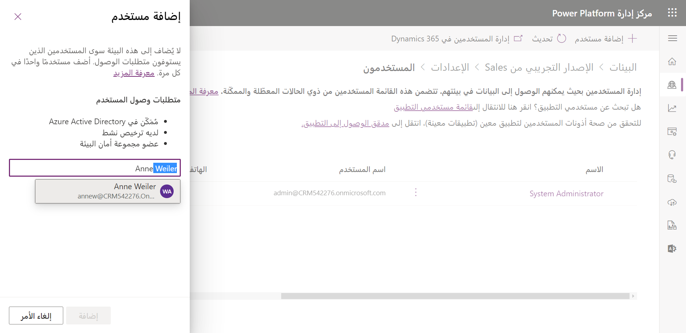

يمثل المستخدم الفرد الذي سيصل إلى البيانات في بيئة ما.
على سبيل المثال، يجب إضافة وكيل عقارات يمكنه الوصول إلى تطبيق إدارة عقارات كمستخدم في البيئة التي تحتوي على التطبيق.

> [!IMPORTANT]
> قبل أن يمكن إضافة مستخدم إلى بيئة ما، يجب أن يكون موجوداً أولاً في مستأجر Microsoft 365 الخاص بك وأن يتم تعيين التراخيص اللازمة التي ستكون مطلوبة.

يمكنك معرفة المزيد عن هذه المواضيع هنا:

-   [إضافة مستخدم في مركز مسؤولي Microsoft 365.](/microsoft-365/admin/add-users/add-users#add-users-one-at-a-time-in-the-dashboard-view)

-   [تعيين التراخيص للمستخدمين.](/microsoft-365/admin/manage/assign-licenses-to-users)

بمجرد حصول المستخدم على الترخيص اللازم، سيحتاج إلى إضافته كمستخدمين إلى أي بيئة سيصلون إليها. يتم إجراء هذا في مركز مسؤولي Power Platform (<Https://admin.powerplatform.microsoft.com>).

ستساعدك الخطوات التالية على إضافة مستخدمين من المستأجر إلى بيئة معينة.

1.  تحديد بيئة.

2.  ابحث عن قسم **الوصول** في الجانب الأيمن، وحدد **مشاهدة الكل** ضمن **المستخدمين**.

3.  حدد زر **إضافة مستخدمين** في الشريط.

4.  أضف مستخدماً واحداً أو أكثر بإدخال اسمه أو عنوان بريده الإلكتروني.

5.  بعد تحديد المستخدمين الذين ترغب في إضافتهم، حدد **إضافة**.

    

إذا كنت ترغب في تعطيل مستخدم داخل بيئة ما، فقم بإزالة ترخيص من المستخدم أو إزالة المستخدم من مجموعة الأمان (*المزيد في مجموعات الأمان لاحقاً*) المقترنة بالبيئة. لا تؤدي إزالة مستخدم من مجموعة الأمان إلى إزالة ترخيص المستخدم. إذا كنت ترغب في إتاحة الترخيص لمستخدم آخر، فيجب عليك إزالة الترخيص من حساب المستخدم الذي تم تعطيله.

تتم إزالة الترخيص وتعطيل المستخدم وإزالة المستخدم من مجموعة أمان باستخدام [مركز مسؤولي Microsoft 365](https://admin.microsoft.com/?azureportal=true). للحصول على مزيد من المعلومات، راجع [تعطيل حساب مستخدم في بيئة](/power-platform/admin/create-users-assign-online-security-roles?azure-portal=true#disable-a-user-account-in-an-environment).
