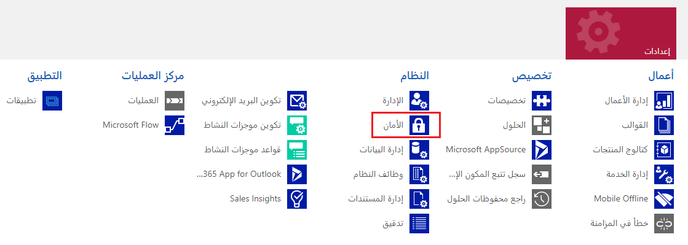
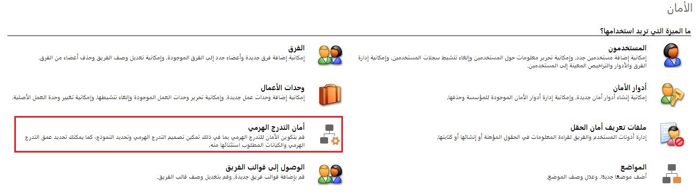
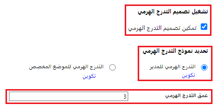
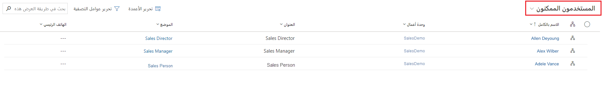
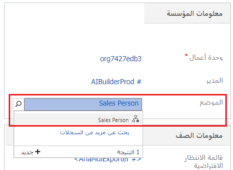
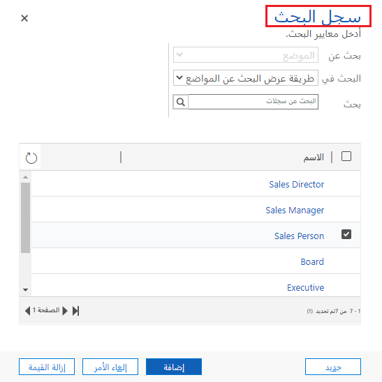
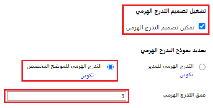
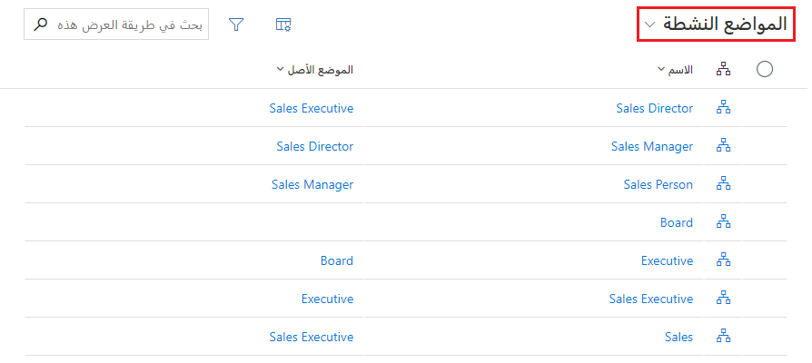

تتمثل إحدى ميزات Dataverse الرئيسية في نموذج الأمان الغني الذي يمكن أن يتكيّف مع العديد من سيناريوهات الاستخدام للأعمال. يعمل نموذج الأمان هذا فقط عندما يكون هناك قاعدة بيانات Dataverse في البيئة. بصفتك مسؤولاً، من الأرجح أنك لن تبني نموذج الأمان بالكامل بنفسك. ولكنك ستشارك غالبًا في عملية إدارة المستخدمين والتحقق من أن لديهم التكوين المناسب واستكشاف المشكلات المتعلقة بالوصول الأمني وإصلاحها.

## الأمان المستند إلى الدور

يستخدم الأمان المستند إلى الدور من Dataverse لتجميع مجموعة من الامتيازات معاً. يمكن ربط أدوار الأمان هذه مباشرة بالمستخدمين أو يمكن إقرانها بفرق Dataverse ووحدات الأعمال. يمكن إقران المستخدمين بالفِرق؛ وسيستفيد بالتالي جميع المستخدمين المقترنين بالفرق من الدور. من المفاهيم الجوهرية في أمان Dataverse أن فهم أن الامتيازات تتراكم، ويتم تطبيق امتيازات الوصول الأكبر على مستخدم لديه أدوار أمان متعددة. على سبيل المثال، إذا كان لدى المستخدم دوران للأمان، لأحدهما امتيازات الحذف ولكن دون امتيازات الكتابة، وللآخر امتيازات الكتابة ولكن دون امتيازات الحذف، فسيتمكن المستخدم من القراءة والكتابة في البيئة.

## وحدات الأعمال

توفر وحدات الأعمال الأمان والبنية لتجميع المستخدمين وغالباً ما تُستخدم لتقليد بنية إدارة المؤسسة. سينتمي كل مستخدم مخصص لبيئة Dataverse إلى وحدة أعمال. تسمى وحدة الأعمال الأولى التي تم إنشاؤها لمؤسسة وحدة الأعمال الأساسية. يمكن حذف وحدات الأعمال، ومع ذلك، لا يمكن حذف وحدة الأعمال الأساسية. يمكن حذف وحدات الأعمال، ومع ذلك، لا يمكن حذف وحدة الأعمال الأساسية. تحتوي وحدة الأعمال على وحدة أعمال أصلية واحدة فقط ولكن قد تحتوي على وحدات أعمال فرعية متعددة.

- وحدة الأعمال الأصلية هي أي وحدة أعمال بها وحدة عمل واحدة أو أكثر تقدم تقاريرها إليها في التدرج الهرمي.

- وحدة الأعمال الفرعية هي وحدة أعمال تقع مباشرة ضمن وحدة أعمال أخرى في التدرج الهرمي للأعمال لمؤسسة ما.

> [!NOTE]
> يتم تعيين أدوار أمان المستخدم داخل وحدة الأعمال الخاصة بها. يجب إعادة تعيين أدوار الأمان الخاصة به، إذا تم نقل مستخدم إلى وحدة أعمال مختلفة. يُعد كل مستخدم عضواً في وحدة عمل واحدة فقط، ولكن يمكن أن يضم الفريق أعضاء مستخدمين من وحدات أعمال متعددة.
سيتم وصف تنفيذ الأمان على مستوى العمود لاحقًا في هذه الوحدة.

## ملكية الكيان أو السجل

يدعم Dataverse نوعين من ملكية السجل. مملوكة للمؤسسة ومملوكة للمستخدم أو الفريق. ملكية السجل هي خيار يحدث في الوقت الذي يتم فيه إنشاء الجدول ولا يمكن تغييره. لأغراض الأمان، السجلات المملوكة للمؤسسة، تمثل خيارات مستوى الوصول الوحيدة إما أن يتمكن المستخدم من القيام بالعملية أو لا يمكنه ذلك. بالنسبة إلى السجلات المملوكة للمستخدم والفريق، فإن خيارات مستوى الوصول لمعظم الامتيازات هي:

- منظمة متدرجة

- وحدة عمل

- وحدة الأعمال ووحدة الأعمال الفرعية

- أو فقط سجلات المستخدم الخاصة.

## Teams

Teams هي إحدى الكتل الأخرى المهمة لإنشاء الأمان. تمتلك Teams وحدة الأعمال. تضم كل "وحدة أعمال" فريقاً افتراضياً واحداً يتم إنشاؤه تلقائياً عند إنشاء "وحدة الأعمال". تتم إدارة أعضاء الفريق الافتراضيين من قِبل Dataverse وتضم دائماً جميع المستخدمين المرتبطين بـ "وحدة الأعمال" هذه. نظراً لأن المستخدمين الجدد مرتبطون / غير مرتبطين بوحدات الأعمال، لا يمكنك إضافة أعضاء أو إزالتهم يدوياً من الفريق الافتراضي، حيث يتم تعديلهم ديناميكياً بواسطة النظام. هناك ثلاثة أنواع من الفِرق، وهي الفِرق المالكة، وفرق الوصول، والفرق الجماعية من Azure AD.

## الأمان على مستوى العمود للتحكم في الوصول

قد يكون لديك أعمدة معينة مرتبطة بجدول يحتوي على بيانات أكثر حساسية من الأعمدة الأخرى، ورغم ذلك، يتم منح الأذونات على مستوى العمود على مستوى الجدول. يمكنك في هذه الحالات استخدام الأمان على مستوى العمود للتحكم في الوصول إلى أعمدة معينة.

نطاق الأمان على مستوى العمود على مستوى المؤسسة ويسري على جميع طلبات الوصول إلى البيانات بما في ذلك:

- طلبات الوصول إلى البيانات من داخل تطبيق العميل، مثل مستعرض الويب أو عميل الهاتف المحمول أو Microsoft Dynamics 365 for Outlook.

- مكالمات خدمة الويب باستخدام خدمات ويب Microsoft Dataverse (لاستخدامها في المكوّنات الإضافية وأنشطة سير العمل المخصصة والتعليمات البرمجية المخصصة)

- إعداد التقارير (باستخدام طرق العرض المصفاة)

يتوفر الأمان على مستوى العمود للأعمدة الافتراضية في معظم الجداول الجاهزة والأعمدة المخصصة والأعمدة المخصصة داخل الجداول المخصصة. تتم إدارة الأمان على مستوى العمود بواسطة ملفات تعريف الأمان.

لتنفيذ الأمان على مستوى العمود، يقوم مسؤول النظام بتنفيذ المهام التالية.

1. تمكين أمان العمود على عمود واحد أو أكثر لجدول معين.

1. قم بربط ملف تعريف أمان آخر موجود أو قم بإنشاء واحد أو أكثر من ملفات تعريف الأمان الجديدة لمنح الوصول المناسب لمستخدمين أو فرق محددة.

يحدد ملف تعريف الأمان:

- أذونات الأعمدة الآمنة

- المستخدمون والفِرق

يمكن تكوين ملف تعريف الأمان لمنح المستخدم أو أعضاء الفريق الأذونات التالية على مستوى العمود:

- Read. حق الوصول للقراءة فقط إلى بيانات العمود.

- Create. يمكن للمستخدمين أو الفِرق في ملف التعريف هذا إضافة بيانات إلى هذا العمود عند إنشاء سجل ما.

- Update. يمكن للمستخدمين أو الفِرق في ملف التعريف هذا تحديث بيانات العمود بعد إنشائه.

يمكن تكوين مجموعة من هذه الأذونات الثلاثة لتحديد امتيازات المستخدم لعمود بيانات محدد.

> [!IMPORTANT]
> سيمكن فقط للمستخدمين ممن لديهم دور أمان مسؤول النظام حق الوصول إلى الحقل ما لم يتم تعيين ملف تعريف أمان واحد أو أكثر إلى حقل تم تمكين الأمان فيه.

### مثال لتقييد عمود حد الائتمان لجدول الحساب

الخلفية: تنص سياسة شركتك على أن مديري الحسابات ومسؤولي النظام هم فقط من يفترض أن يتمكنوا من عرض حد ائتمان العميل.

لتقييد الوصول، نفِّذ أمان مستوى العمود من خلال إكمال المهام التالية:

### تمكين أمان العمود

1. قم بتسجيل الدخول إلى Power Apps كمسؤول.

1. تحديد بيئة.

1. في الجزء الأيسر، حدد **Dataverse**.

1. حدد **الجداول** ثم حدد **كل** العروض.

1. في الجزء الأوسط ، حدد ملف **جدول الحساب**. في عمود **الاسم** ابحث عن **الحساب**.

1. في **المخطط** حدد **الأعمدة** .ضمن اسم العرض، حدد عمود **الحد الائتماني** .

1. في الجزء الأيمن، حدد **خيارات متقدمة**.

1. حدد **تمكين أمان العمود**.

1. حدد **حفظ**.

### تكوين ملف تعريف الأمان

1. قم بتسجيل الدخول إلى Power Apps كمسؤول.

1. تحديد بيئة.

1. في الجزء العلوي الأيمن، حدد رمز **تحكم رئيسي** وحدد **إعدادات متقدمة**.

1. من القائمة العلوية ، تحت **الإعدادات** تحت **النظام**، حدد **الأمان**.

1. حدد **ملفات تعريف أمان المجال**.

1. حدد **الجديد**، أدخل اسمًا مثل Account Manager، ويمكنك أيضًا إضافة وصف إذا أردت.

1. حدد **حفظ وإغلاق**.

1. 1. من القائمة العلوية ، تحت **الإعدادات** تحت **النظام**، حدد **الأمان**. على اليسار، حدد **المستخدمون** (يمكنك منح حق الوصول إلى مستخدم (مستخدمين) أو فريق).

1. حدد **إضافة** وحدد المستخدم (المستخدمين) الذي تريد منحه حق الوصول للقراءة إلى عمود حد الائتمان **وحدد** ثم **إضافة**.

1. ضمن "عام" على اليسار، حدد **أذونات الحقل**.

1. حدد **الحد الائتماني** في الأعلى، حدد **تحرير**.

1. من شاشة "تحرير أمان الحقل"، ضمن "السماح بالقراءة"، حدد **نعم**، وحدد **موافق**.

1. حدد **حفظ وإغلاق**.

لن يتمكن أي مستخدمين لم يتم تحديدهم في ملفات تعريف أمان الحقول المنشأة مسبقاً من الوصول إلى عمود "الحد الائتماني" في جدول الحساب أو طرق العرض. تعرض قيمة الحقل رمز قفل باستخدام ********، ما يشير إلى أن الحقل مؤمّن.

## أمان التدرج الهرمي للتحكم في الوصول

يوسع نموذج الأمان الهرمي أمان Dataverse من خلال السماح للمديرين بالوصول إلى سجلات وحدات الأعمال التابعة لهم أو العمل نيابة عنهم. يمكن استخدامه مع جميع نماذج الأمان الأخرى الحالية.

يمكن استخدام نموذجي أمان للتسلسلات الهرمية، والتدرج الهرمي للإدارة والتدرج الهرمي للموضع. مع التدرج الهرمي "للمدير"، يجب أن يكون المدير داخل نفس وحدة الأعمال مثل التابعة، أو في وحدة الأعمال الأصلية لوحدة الأعمال التابعة، حتى يتمكن من الوصول إلى البيانات التابعة. يتيح التدرج الهرمي للموضع الوصول إلى البيانات عبر وحدات الأعمال.

### التدرج الهرمي للمدير

يعتمد نموذج أمان التدرج الهرمي للمدير على سلسلة الإدارة أو بنية التقارير المباشرة. يتم إنشاء علاقة المدير والمرؤوس باستخدام حقل المدير في جدول المستخدم. باستخدام نموذج الأمان هذا، يمكن للمديرين الوصول إلى البيانات التي يمكن لمرؤوسيهم الوصول إليها. إنهم قادرون على أداء العمل نيابة عن تقاريرهم المباشرة أو الوصول إلى المعلومات التي تحتاج إلى موافقة. يمكن للمدير الوصول الكامل إلى البيانات التابعة للتقارير المباشرة. بالنسبة للتقارير غير المباشرة، يمكن للمدير الحصول على حق الوصول إلى بياناته عبر إذن "القراءة فقط".

### التدرج الهرمي للموضع

يمكن تحديد المواضع المختلفة وترتيبها في المؤسسة في التدرج الهرمي باستخدام الجدول "الموضع"، باستخدام أمان التدرج الهرمي للموضع. يمكنك بعد ذلك إضافة مستخدمين إلى أي موضع محدد باستخدام العمود "البحث في الموضع" في سجل المستخدم. في مسار الأصل المباشر، يمكن للمستخدمين في المواضع العليا في التدرج الهرمي الوصول إلى بيانات المستخدمين في المواضع الأدنى. على غرار التدرج الهرمي للمدير، تتمتع المواضع الرئيسية بحق الوصول الكامل إلى بيانات المواضع الفرعية ولكن المواضع الأعلى من الأصل المباشر التي لها حق الوصول "القراءة فقط".

> [!NOTE]
> في كلا نموذجي التدرج الهرمي، يجب أن يتمتع المستخدم الأعلى في التدرج الهرمي بامتياز القراءة على مستوى المستخدم على الأقل في الجدول، للاطلاع على البيانات التابعة. على سبيل المثال، إذا لم يكن لدى المدير حق الوصول "القراءة" إلى الكيان "الحالة"، فلن يتمكن المدير من رؤية الحالات التي يمكن لتابعيه الوصول إليها.

### تكوين إعدادات نظام الأمان ذات التدرج الهرمي

تأكد من أنك تتمتع بدور أمان "مسؤول النظام" أو "مخصص النظام" أو لديك الأذونات المكافئة لتحديث الإعداد.

يتم تعطيل أمان التدرج الهرمي افتراضياً. لتمكين:

1. قم بتسجيل الدخول إلى Power Apps كمسؤول.

1. تحديد بيئة.

1. في الجزء العلوي الأيمن، حدد رمز **تحكم رئيسي** وحدد **إعدادات متقدمة**.

1. من القائمة العلوية، حدد "الإعدادات"، حدد **الأمان**.

    > [!div class="mx-imgBorder"]
    > 

1. حدد **أمان التدرج الهرمي**.

    > [!div class="mx-imgBorder"]
    > 

1. حدد Enable Hierarchy Modeling وسترى الخيارين ممكّنين:

    > [!div class="mx-imgBorder"]
    > 

يتم تحديد نموذج التدرج الهرمي للمدير وتعيين عُمق التدرج الهرمي إلى 3.

## قم بإعداد التدرجات الهرمية للمدير والوظائف

### لإنشاء تسلسل هرمي للمدير

قم بتشغيل تمكين نمذجة التدرج الهرمي وتمكين التدرج الهرمي للمدير.

1. ضمن التدرج الهرمي للمدير ، حدد **التكوين**.

1. عيّن لكل مستخدم مديراً ومنصباً (اختياري).

في المثال التالي، تقدم Adele Vance تقاريرها إلى Alex Wilber في التدرج الهرمي للمدير ولديها أيضاً منصب مندوب المبيعات في التدرج الهرمي للمناصب:

> [!div class="mx-imgBorder"]
> 

لإضافة مستخدم إلى منصب معين في التدرج الهرمي للمنصب، استخدم حقل البحث المسمى "المنصب" في نموذج سجل المستخدم، على النحو الموضح أدناه:

> [!div class="mx-imgBorder"]
> 

> [!div class="mx-imgBorder"]
> 

### لإنشاء تسلسل هرمي للمنصب

1. قم بتسجيل الدخول إلى Power Apps كمسؤول.

1. تحديد بيئة.

1. في الجزء العلوي الأيمن، حدد رمز **تحكم رئيسي** وحدد **إعدادات متقدمة**.

1. من القائمة العلوية، حدد "الإعدادات"، حدد **الأمان**.

    > [!div class="mx-imgBorder"]
    > 

1. حدد **أمان التدرج الهرمي**.

    > [!div class="mx-imgBorder"]
    > 

1. حدد Enable Hierarchy Modeling وسترى الخيارين ممكّنين:

    > [!div class="mx-imgBorder"]
    > 

1. للتسلسل الهرمي الموضعي، اضبط على **التدرج الهرمي للموضع المخصص**.

1. ضمن "التدرج الهرمي للمنصب المخصص"، حدد **تكوين**.

1. لكل منصب، قم بتوفير اسم الدالة، وأصل المنصب، والوصف. أضف المستخدمين إلى هذا المنصب باستخدام حقل البحث المسمى "المستخدمون في هذا المنصب". يوجد أدناه مثال على "التدرج الهرمي للمنصب" مع المناصب النشطة.

    > [!div class="mx-imgBorder"]
    > 

1. تأكد من إعداد كلّ مستخدم بالمناصب الصحيحة.

فيما يلي مثال للمستخدمين الذين تم تمكينهم بالمناصب المقابلة لهم:

> [!div class="mx-imgBorder"]
> 
