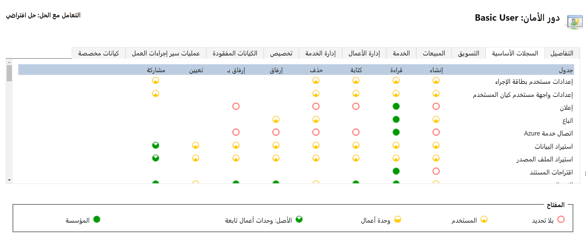
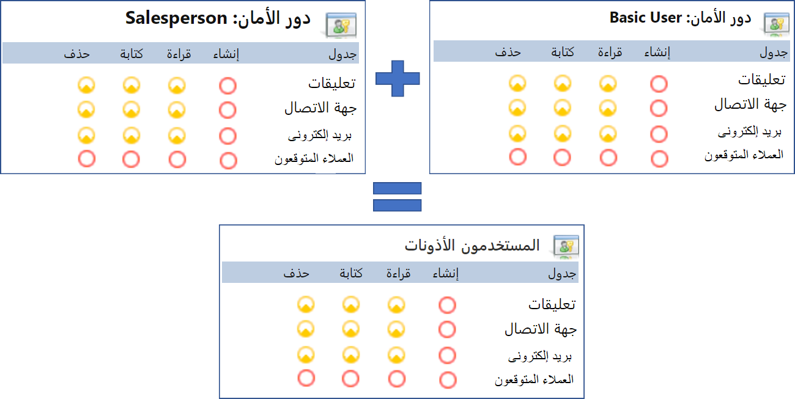

أدوار الأمان هي مجموعات من الامتيازات ومستويات الوصول المحددة لجداول وميزات مختلفة في بيئة ما. يمكن تعيين أدوار الأمان لكلٍّ من المستخدمين والفرق. الأدوار مُفصّلة ومن المحتمل أن تحتوي على امتيازات ومستويات وصول لجداول وميزات متعددة. بالإضافة إلى المساعدة في التحكم في الوصول إلى السجلات، يمكن لأدوار الأمان أيضاً التحكم في إجراءات معينة، مثل القدرة على إنشاء كيان مخصص أو مجموعات خيارات. على عكس وحدات الأعمال، حيث يمكن تعيين مستخدم واحد فقط، يمكن إقران المستخدمين بواحد أو أكثر من أدوار الأمان. يتيح إقران المستخدم بالدور الوصول إلى البيانات والوظائف المحددة ضمن هذا الدور.

تُظهر الصورة أدناه مثالاً لما قد يبدو عليه دور أمان المستخدم الأساسي، الذي يوفر بعض الإمكانات الأساسية، مثل القدرة على إنشاء وتحرير سجلات الحسابات في التطبيق.

يمكنك أن ترى أن كل امتياز، باستثناء المشاركة، يتم تعيينه للمستخدم، مما يعني أن أي مستخدم لديه دور الأمان هذا سيكون قادراً فقط على إنشاء وتعديل وعرض وحذف السجلات التي يملكها. يمكنك تغيير الأذونات لكل جدول في دور الأمان عن طريق تحديد الدائرة الموجودة ضمن كل امتياز تريد تعديله. سيؤدي هذا إلى التبديل بين مستويات الوصول المختلفة المتاحة لهذا "الامتياز".

تُظهر الصورة أدناه نفس دور الأمان، ولكن تم تحديث الامتيازات الموجودة في جدول الحساب.

والآن، سيتمكن أي مستخدم لديه دور الأمان هذا من القيام بما يلي:

-   إنشاء حسابات جديدة لنفسه.

-   عرض جميع سجلات الحسابات في المؤسسة بأكملها.

-   تحرير الحسابات المملوكة له أو لأي مستخدم في نفس وحدة الأعمال مثله.

-   عدم التمكن من حذف أي سجلات حسابات.

## أدوار أمان المستخدم الافتراضية

يتم إنشاء قاعدة بيانات بكيانات قياسية ويتم إنشاء العديد من أدوار الأمان الافتراضية وذلك عند إنشاء مثيل جديد من Dataverse في بيئة ما.
تتوفر الأدوار التالية المحددة مسبقاً في كل مرة تنشئ فيها بيئة Dataverse باستخدام مدخل Power Apps.

يتضمن Dataverse العديد من الأدوار الافتراضية مع مستويات وصول مختلفة إلى الكيانات والإجراءات القياسية. يتم سرد الأدوار القياسية الافتراضية في الجدول التالي.

| دور الأمان        | امتيازات قاعدة البيانات                                                   | الوصف‏‎                                                                                                                                                                                                                                                                                                                                                                                                                                                                                                 |
|----------------------|-------------------------------------------------------------------------|-------------------------------------------------------------------------------------------------------------------------------------------------------------------------------------------------------------------------------------------------------------------------------------------------------------------------------------------------------------------------------------------------------------------------------------------------------------------------------------------------------------|
| مسؤول البيئة    | إنشاء، قراءة، كتابة، حذف، تخصيصات، أدوار أمان             | يمكن لدور "مسؤول البيئة" تنفيذ جميع الإجراءات الإدارية في بيئة ما، بما في ذلك ما يلي: إضافة مستخدم أو إزالته من دور مسؤول البيئة أو منشئ البيئة. توفير قاعدة بيانات Dataverse للبيئة. بعد توفير قاعدة البيانات، يجب أيضاً تعيين دور "مُخصص النظام" لمسؤول البيئة لمنحه حق الوصول إلى بيانات البيئة. عرض وإدارة جميع الموارد، التي تم إنشاؤها داخل بيئة. تعيين سياسة تفادي فقدان البيانات. |
| منشئ البيئة    | التخصيصات                                                          | يمكن إنشاء موارد جديدة مرتبطة بالبيئة، بما في ذلك التطبيقات والاتصالات وواجهات API المخصصة والبوابات والتدفقات باستخدام Microsoft Power Automate. ومع ذلك، لا يمتلك هذا الدور أي امتيازات للوصول إلى البيانات داخل البيئة. المزيد من المعلومات: [نظرة عامة على البيئات](/power-platform/admin/environments-overview/?azure-portal=true)                                                                                                                                                       |
| مسؤول النظام | إنشاء، قراءة، كتابة، حذف، تخصيصات، أدوار أمان             | لديه الإذن الكامل لتخصيص البيئة أو إدارتها، بما في ذلك إنشاء أدوار الأمان وتعديلها وتعيينها. يمكن عرض جميع البيانات الموجودة في البيئة. المزيد من المعلومات: [الامتيازات المطلوبة للتخصيص](/power-apps/maker/model-driven-apps/privileges-required-customization/?azure-portal=true)                                                                                                                                                                                       |
| مخصص النظام    | الإنشاء (ذاتي)، القراءة (ذاتي)، الكتابة (ذاتي)، الحذف (ذاتي)، التخصيصات | لديه الإذن الكامل لتخصيص البيئة. ومع ذلك، يمكن للمستخدمين الذين لديهم هذا الدور فقط عرض سجلات كيانات البيئة التي قاموا بإنشائها. المزيد من المعلومات: [الامتيازات المطلوبة للتخصيص](/power-apps/maker/model-driven-apps/privileges-required-customization/?azure-portal=true)                                                                                                                                                                                                         |
| المستخدم الأساسي           | قراءة (ذاتي)، إنشاء (ذاتي)، كتابة (ذاتي)، حذف (ذاتي)                 | يمكنهم تشغيل تطبيق داخل البيئة وتنفيذ المهام الشائعة للسجلات التي يمتلكونها. ينطبق هذا فقط على الكيانات غير المخصصة.                                                                                                                                                                                                                                                                                                                                                                     |
| التفويض             | التصرف بالنيابة عن مستخدم آخر                                           | يسمح للتعليمة البرمجية *بانتحال الشخصية* أو التشغيل كمستخدم آخر. يُستخدم عادةً مع دور أمان آخر للسماح بالوصول إلى السجلات. المزيد من المعلومات: [انتحال شخصية مستخدم آخر](/power-apps/developer/common-data-service/impersonate-another-user/?azure-portal=true)                                                                                                                                                                                                                                              |
| مستخدم الدعم         | اقرأ التخصيصات، اقرأ إعدادات إدارة الأعمال                  | لديه إذن قراءة كامل للتخصيص وإعدادات إدارة الأعمال للسماح لموظفي الدعم باستكشاف مشكلات تكوين البيئة وإصلاحها. ليس لديه حق الوصول إلى السجلات الأساسية.                                                                                                                                                                                                                                                                                                                   |

يمكن إضافة أدوار أخرى حسب الحاجة بناءً على متطلبات عملك. كما ذكرنا سابقاً، يمكن أن يكون لمستخدم واحد عدة أدوار أمان معيّنة له. على سبيل المثال، عندما يبدأ مستخدم جديد، قد يتم تعيين دور أمان أساسي له يوفر له الوصول الأساسي إلى البيانات. بالإضافة إلى ذلك، قد يتم تعيين دور ثانٍ له بناءً على منصبه (مثل بائع).

سيكون وصول المستخدم إلى البيانات هو التركيبة الأقل تقييداً لكلٍّ من دوري الأمان.

في المثال أعلاه، يتم تعيين دورين مختلفين للأمان للمستخدم، وهما المستخدم الأساسي والبائع.

-   لاحظ كيف يوفر دور المستخدم الأساسي وصول المستخدم لإنشاء الرسائل الإلكترونية وقراءتها وكتابتها، ولكن دور البائع لا يفعل ذلك.

-   بالإضافة إلى ذلك، يوفر دور البائع إمكانية الوصول لتنفيذ إجراءات على جدول يسمى العميل المتوقع، بينما لا يقوم المستخدم الأساسي بذلك.

-   يوفر البائع أيضاً بعض مستويات الوصول الأخرى إلى الحسابات وجهات الاتصال، التي لا يوفرها المستخدم الأساسي.

-   ستكون الأذونات الفعلية للمستخدمين عبارة عن مجموعة أو امتيازات البريد الإلكتروني من المستخدم الأساسي، وامتيازات العميل المحتمل من البائع، وامتيازات جهة الاتصال والحساب من البائع، نظراً لأنها توفر الوصول الأكبر.

والآن بعد أن فهمنا المفاهيم الأساسية لدور الأمان، دعنا نفحص عملية إنشاء دور أمان.
