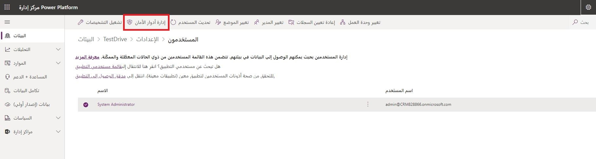

يحتوي Microsoft Dataverse على العديد من الأدوار الافتراضية القياسية، ولكن قد تكون هناك أوقات تريد فيها تحديد دور أمان مخصص.
يدعم Dataverse الامتيازات الثمانية المختلفة التالية على مستوى السجل التي يمكن استخدامها لتحديد كيفية تفاعل المستخدم مع البيانات لجدول واحد أو أكثر لاستخدامها في بناء دور مخصص. تشمل الامتيازات المتاحة على مستوى السجل للأدوار المخصصة ما يلي:

**إنشاء** - مطلوب لإنشاء سجل جديد. تعتمد السجلات التي يمكن إنشاؤها على مستوى الوصول للإذن المحدد في دور الأمان الخاص بك.

**قراءة** - مطلوب لفتح سجل لعرض المحتويات. تعتمد السجلات التي يمكن قراءتها على مستوى الوصول للإذن المحدد في دور الأمان الخاص بك.

**كتابة** - مطلوب لإجراء تغييرات على أحد السجلات. تعتمد السجلات التي يمكن تغييرها على مستوى الوصول للإذن المحدد في دور الأمان الخاص بك.

**حذف** - مطلوب لإزالة سجل نهائياً. تعتمد السجلات التي يمكن حذفها على مستوى الوصول للإذن المحدد في دور الأمان الخاص بك.

**إلحاق** - مطلوب لإقران سجل بالسجل الحالي. على سبيل المثال، إذا كان لدى المستخدم حقوق "إلحاق" في إحدى الفرص، فيمكن للمستخدم إضافة ملاحظة إلى الفرصة. تعتمد السجلات التي يمكن إلحاقها على مستوى الوصول للإذن المحدد في دور الأمان الخاص بك.

**إلحاق بـ** - مطلوب لإقران السجل الحالي بسجل آخر. على سبيل المثال، يمكن إرفاق ملاحظة بفرصة إذا كان لدى المستخدم حقوق "إلحاق بـ" بالملاحظة. تعتمد السجلات التي يمكن إلحاقها على مستوى الوصول للإذن المحدد في دور الأمان الخاص بك.

**تعيين** - مطلوب لمنح ملكية سجل إلى مستخدم آخر. تعتمد السجلات التي يمكن تعيينها على مستوى الوصول للإذن المحدد في دور الأمان الخاص بك.

**مشاركة** - مطلوب لمنح مستخدم آخر حق الوصول إلى سجل مع الاحتفاظ بحق الوصول الخاص بك. تعتمد السجلات التي يمكن مشاركتها على مستوى الوصول للإذن المحدد في دور الأمان الخاص بك.

يمكن تجميع هذه الامتيازات على مستوى السجل حسب الحاجة وربطها بدور مخصص. يمكن بعد ذلك تطبيق هذا الدور المخصص على جدول واحد أو أكثر بحسب الحاجة.

> [!TIP]
> يمكن نسخ الأدوار حتى تتمكن من إنشاء أدوار متشابهة بسرعة قد تكون مختلفة قليلاً. 

### إنشاء دور أمان مخصص وقم بتعيينه للجداول والمستخدمين

سيوضح لك هذا المعمل كيفية إنشاء دور جديد وربط هذا الدور بجدول مخصص. بعد ذلك، يمكنك إقران المستخدمين بالدور الجديد حتى يتمكنوا من الوصول إلى البيانات الموجودة في الجداول المخصصة بحسب الحاجة.

لمنح حق الوصول، ستحتاج إلى القيام بما يلي:

- قم بإنشاء دور أمان مستخدم جديد أو قم بتعديل دور أمان مستخدم موجود لتضمين إعدادات الجدول المخصص.

- قم بتعيين مستخدمين إلى دور الأمان.

للبدء، استخدم الخطوات التالية لإنشاء دور أمان جديد.

1.  سجل دخولك إلى [مركز مسؤولي Power Apps](https://admin.powerplatform.microsoft.com/) كمسؤول.

1. حدد اسم البيئة للبيئة التي ترغب في إدارتها.

1. حدد **مشاهدة الكل** ضمن "أدوار الأمان" في القسم **الوصول** على اليمين.

1.  حدد **دور جديد** في شريط القائمة، والذي سيفتح مصمم دور الأمان.

1.  في حقل **اسم الدور**، أدخل اسماً لدور الأمان الخاص بك.

    

1.  حدد الجداول التي يستخدمها تطبيقك عن طريق تحديد كل علامة تبويب في مصمم دور الأمان. إذا كانت الجداول الخاصة بك مخصصة، فستكون ضمن علامة التبويب **الكيانات المخصصة**.

1.  عندما تحدد موقع الجداول الخاصة بك، حدد الامتيازات التي تريد منحها للمستخدمين، مثل القراءة والكتابة والحذف وما إلى ذلك. حدد النطاق لتنفيذ هذا الإجراء عن طريق تحديد اسم الجدول. يحدد النطاق مدى عمق التدرج الهرمي للبيئة أو ارتفاعه بحيث يمكن للمستخدم تنفيذ إجراء معين.

    > 

8.  حدد **حفظ وإغلاق**.

تهانينا، لقد قمت بإنشاء دور أمان مخصص جديد. بعد ذلك، ستقوم بتعيين المستخدمين لهذا الدور.

لتعيين مستخدم لدور أمان، يجب أن تكون عضواً في دور مسؤول النظام في البيئة الحالية ثم اتبع الخطوات التالية:

1.   سجل دخولك إلى [مركز مسؤولي Power Apps](https://admin.powerplatform.microsoft.com/) كمسؤول.

1.  حدد البيئة التي تريد تحديث دور الأمان فيها.

1.  حدد **مشاهدة الكل** ضمن "المستخدمين" في القسم **الوصول** على اليمين.

1.  تحقق مما إذا كان المستخدم (المستخدمين) موجوداً بالفعل في البيئة.
    انتقل إلى الخطوة 5، إذا لم يكن المستخدم مدرجاً في القائمة.
    وخلافاً لذلك، يمكنك التخطي إلى الخطوة 6.

    

1.  يمكنك إضافة المستخدم عن طريق تحديد الزر **إضافة مستخدم** وإدخال عنوان البريد الإلكتروني للمستخدم في مؤسستك، في حالة عدم وجود المستخدم في البيئة.

1.  بعد معرفة المستخدم (المستخدمين) الذي تريد تعيين دور أمان له/لهم موجود/موجودين في بيئتك، حدد اسم المستخدم الخاص به/بهم.

1.  حدد **إدارة أدوار الأمان** في الجزء العلوي.

    

1.  في مربع الحوار **إدارة أدوار الأمان**، في قسم **اسم الدور** حدد خانات الاختيار المجاورة للدور (الأدوار) الذي قمت بإنشائه في القسم السابق وقم بإجراء تأكد أيضاً من تحديد دور **مستخدم أساسي** (إذا لم يكن كذلك). يجب تعيين دور المستخدم الأساسي لأي مستخدم يريد استخدام تطبيقك أو الوصول إلى Dataverse.

1.  حدد **حفظ** لتعيين الدور (الأدوار) للمستخدم الذي حددته. 
