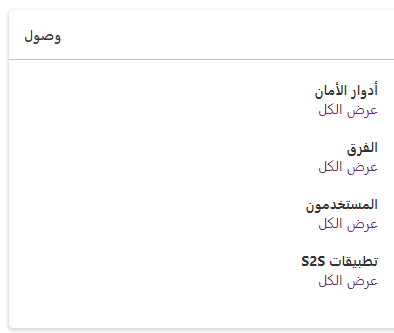

يُعد التحقق من الأدوار التي ينتسب إليها المستخدم أمراً بسيطاً ويمكنك القيام بذلك من داخل Power Apps باتباع الخطوات التالية:

1.  سجل دخولك إلى [مركز مسؤولي Power Apps](https://admin.powerplatform.microsoft.com/?azure-portal=true) كمسؤول.

1.  افتح خيار **البيئات** على الجانب الأيمن من الصفحة.

1.  حدد البيئة التي تريد التحقق من إعدادات أذونات المستخدم فيها.

1.  ابحث عن قسم **الوصول** في الجانب الأيسر، وحدد **مشاهدة الكل** ضمن **المستخدمون**.

    > [!div class="mx-imgBorder"]
     

1.  حدد خانة الاختيار بجوار اسم المستخدم لعرض أدوار الأمان التي تم تعيين المستخدم لها.

1.  حدد **إدارة أدوار الأمان** في القائمة العلوية لعرض أدوار المستخدم التي تم تعيينها للمستخدم.

    > [!div class="mx-imgBorder"]
    
