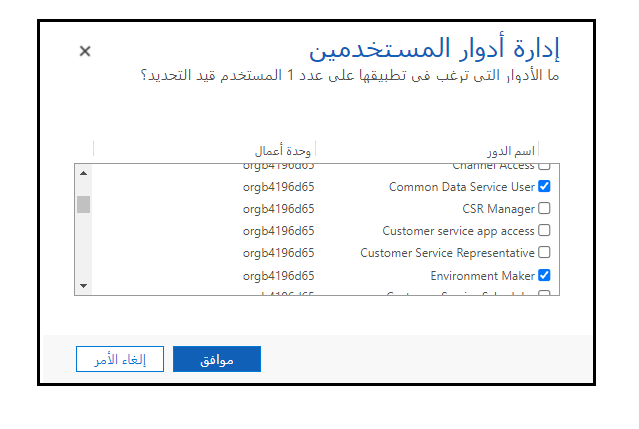

يُعد التحقق من الأدوار التي ينتسب إليها المستخدم أمراً بسيطاً ويمكنك القيام بذلك من داخل Power Apps باتباع الخطوات التالية:

1.  سجِّل الدخول إلى [إدارة Power Apps](https://admin.powerplatform.microsoft.com/) كمسؤول.

2.  افتح خيار **البيئات** على الجانب الأيسر من الصفحة.

3.  حدد البيئة التي تريد التحقق من إعدادات أذونات المستخدم فيها.

4.  حدد علامة التبويب **الأمان**.

5.  حدد الارتباط التشعبي **قائمة المستخدمين** ضمن خيار **الخطوة الأولى - إضافة مستخدم** على الشاشة.

6.  حدد خانة الاختيار بجوار اسم المستخدم لعرض أدوار الأمان التي تم تعيين المستخدم لها.

7.  في مربع الحوار **إدارة أدوار المستخدم**، حدد **إدارة الأدوار** في القائمة العلوية لعرض أدوار المستخدم التي تم تعيينها للمستخدم.

    
