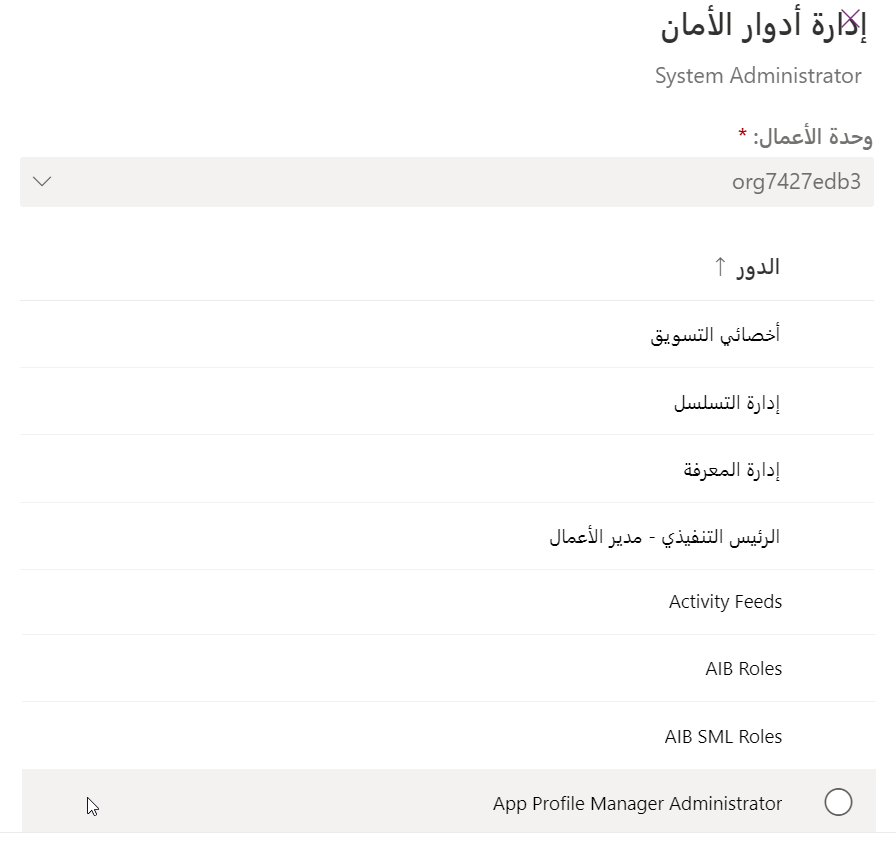

كما ذكرنا سابقاً، يحتاج كل مستخدم إلى تعيين دور أمان واحد على الأقل حتى يتمكن من الوصول إلى البيانات. واستناداً إلى دور المستخدم في مؤسسة، ليس من غير المألوف أن يتم تعيين أدوار أمان متعددة للمستخدم. وعلى الرغم من أن تعيين أدوار أمان متعددة للمستخدمين يضمن إمكانية الوصول إلى كل ما يحتاجون إليه، إلا أنه يكون من الصعب في بعض الأحيان ضمان إضافة مستخدم إلى الأدوار الصحيحة. على سبيل المثال، قد يلزم إضافة موظف جديد إلى العديد من أدوار الأمان المختلفة. ربما يُنسى تعيين موظف واحد، ولا يتمكن من القيام بعمله بفعالية.

وإحدى الميزات التي يمكن أن تساعد في ذلك هي إنشاء Teams واستخدامه في Dataverse. ويُعد استخدام فرق Microsoft Dataverse اختيارياً، ويمكن للمؤسسة تنفيذ الأمان من دونها. ومع ذلك، فإنها توفر طريقة سهلة لمشاركة كائنات الأعمال وتسمح للمستخدمين بالتعاون بشكل أفضل مع أشخاص آخرين عبر وحدات الأعمال.

مثل المستخدمين، يجب تعيين سجلات الفرق إلى وحدة أعمال. ويمكن لأعضاء الفريق تضمين مستخدمين من وحدات أعمال أخرى. يوفر هذا طريقة رائعة لتوسيع نموذج أمان Dataverse لتزويد المستخدمين بإمكانية الوصول إلى البيانات، حيث قد لا يتمكنون عادةً من الوصول بناءً على وحدة الأعمال التي ينتمون إليها.

ويستطيع المستخدم الانتماء إلى فرق متعددة. ويجعل هذا من السهل ضمان وصول المستخدمين إلى البيانات الصحيحة. ونظراً لأنه يمكن تعيين أدوار الأمان إلى الفرق، فعندما يبدأ مستخدم جديد، لا تحتاج إلى تعيين أدوار أمان إلى المستخدم مباشرةً، ويمكنك فقط إضافتها إلى الفرق التي يجب أن يكون عضواً فيها وسيحصل تلقائياً على الأدوار الأمنية الضرورية اللازمة لأداء عمله. بالإضافة إلى دعم الأمان، يمكن أيضاً استخدام الفرق لمشاركة السجلات مع مستخدمين آخرين في سيناريوهات، حيث تحتاج إلى توفير وصول مؤقت إلى سجل محدد لمستخدم.

توجد ثلاثة أنواع مختلفة من الفرق التي يمكن إنشاؤها:

-   **الفريق المالك:** يمكن تعيين هذا النوع من الفريق كمالك للسجلات.
    سيوفر هذا لأي عضو في الفريق إمكانية الوصول المباشر إلى هذا السجل.

-   **فرق الوصول:** يتم استخدام هذا النوع من الفريق لتسهيل مشاركة الوصول إلى سجل محدد بشكل أفضل. يمكنك معرفة المزيد حول "فرق الوصول" هنا: [استخدام فرق الوصول](/power-apps/developer/data-platform/use-access-teams-owner-teams-collaborate-share-information)

-   **فريق مجموعة Azure AD:** مشابه في السلوك لفرق المالك، ولكن أعضاء هذه الفرق مرتبطون بمجموعة Azure Active Directory (Azure AD). عند إضافة مستخدم إلى مجموعة Azure AD المرتبطة بالفريق، ستتم إضافته تلقائياً إلى الفريق في Dataverse أيضاً.

## عمليات الفرق

يمكن إنشاء الفرق في **مركز مسؤولي Power Platform**. بعد تحديد البيئة، تريد العمل مع الانتقال إلى **الإعدادات** -
**المستخدمون + الأذونات** - **الفرق**.

> [!div class="mx-imgBorder"] 
> 

عندما تنشئ سجل فريق جديداً، ستحتاج إلى تحديد المعلومات التالية:

-   **اسم الفريق:** يحدد اسم الفريق، الذي سيتم عرضه في التطبيق. يجب أن تكون أسماء الفرق فريدة داخل وحدة الأعمال.

-   **الوصف:** أدخل وصفاً للفريق.

-   **وحدة الأعمال:** تحدد وحدة الأعمال، التي سينتمي إليها الفريق.
    يجب أن ينتمي الفريق إلى وحدة أعمال.

-   **المسؤول:** يحدد مَن المسؤول عن الفريق.

-   **نوع الفريق:** يحدد نوع الفريق، الذي ستقوم بإنشائه. يمكنك الاختيار من المالك أو الوصول أو مجموعة أمان ADD أو مجموعة Azure AD ‏Office.

    > [!div class="mx-imgBorder"] 
    > 

بعد تحديد نوع الفريق الذي ترغب في إنشائه، سيتم نقلك إلى شاشاتـ حيث يمكنك تحديد أعضاء الفريق وتكون قادراً على تحديد أدوار الأمان المقابلة.

على الرغم من أن إضافة فريق إلى دور الأمان أمر اختياري، إلا أنه يُوصى به بشدة لأنه يساعد في توسيع إمكانات نموذج الأمان.
