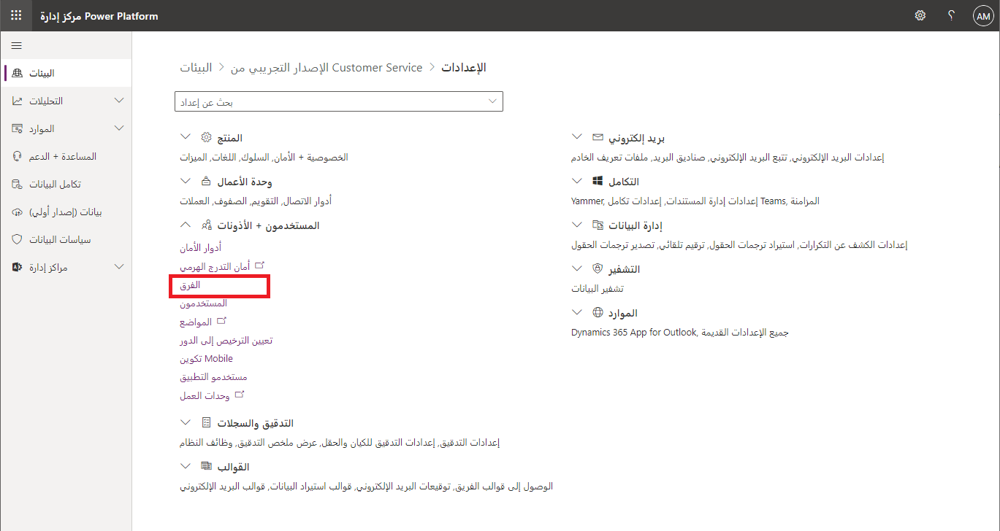
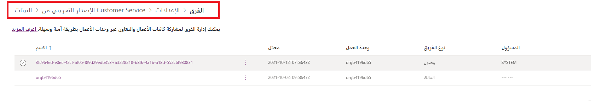
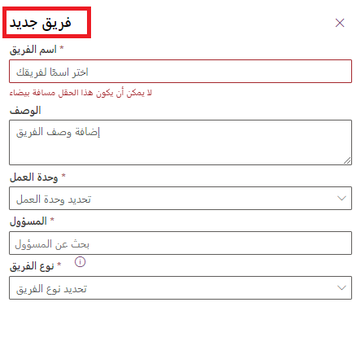
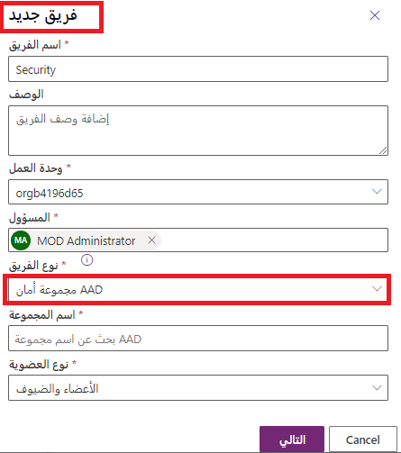

يعد استخدام فرق Microsoft Dataverse اختيارياً. ومع ذلك، توفر الفرق طريقة سهلة لمشاركة كائنات العمل وتتيح التعاون مع أشخاص آخرين عبر وحدات العمل. وعلى الرغم من أن الفريق ينتمي إلى وحدة عمل واحدة، إلا أنه يمكن أن يشمل مستخدمين من وحدات أعمال أخرى. يمكنك إقران مستخدم بأكثر من فريق واحد.

## أنواع الفرق

- يمكن لـ **الفريق المالك** امتلاك السجلات، والتي تمنح أي عضو في الفريق وصولاً مباشراً إلى هذا السجل. يمكن أن يكون المستخدمون أعضاء في فِرق متعددة. إنها طريقة فعالة لمنح الأذونات للمستخدمين بطريقة واسعة دون إدارة الوصول الجزئي على مستوى المستخدم الفردي.

- توفر **فرق الوصول** مفهوماً أكثر تقدماً للمشاركة.  تقوم فرق الوصول تلقائيًا بإنشاء فريق ومشاركة الوصول إلى السجلات مع الفريق. يعتمد الوصول إلى السجل على نموذج فريق الوصول (قالب الأذونات) الذي يتم تطبيقه. يمكن أيضاً استخدام "فرق الوصول" بدون القوالب، مع إضافة/إزالة يدوية لأعضائها. تكون فرق الوصول أكثر أداءً لأنها لا تسمح للفريق بامتلاك السجلات أو تعيين أدوار أمان للفريق. يحصل المستخدمون على حق الوصول لأن السجل مشترك مع الفريق والمستخدم عضو.

- يتشابه **فريق مجموعة Azure AD** مع "فرق المالك"، ويمكن لفريق مجموعة Azure Active Directory (Azure AD) امتلاك سجلات ويمكن تعيين أدوار أمان للفريق. هناك نوعان من فرق المجموعة هما الأمان وOffice، يتوافقان مباشرة مع أنواع مجموعات Azure AD. يمكن تعيين أدوار أمان المجموعة فقط لفريق معين أو لعضو فريق لديه امتيازات مستخدم تتضمن وراثة امتيازات الأعضاء. يتم اشتقاق أعضاء الفريق ديناميكياً (تتم إضافتهم وإزالتهم) عند وصولهم إلى بيئة استناداً إلى عضوية مجموعة Azure AD الخاصة بهم.

> [!NOTE]
> يمكنك تعيين أدوار الأمان مباشرةً لـ "فرق المالكين" وفرق مجموعة Azure AD والمستخدمين. يتعرف منتقي البيئة فقط على المستخدمين الأعضاء في فرق مجموعة Azure AD والمستخدمين الذين تم تعيين أدوار أمان لهم مباشرة.

## عمليات الفريق

### الوصول إلى صفحة فريقك

1. سجّل الدخول إلى مركز إدارة Power Platform.

1. تحديد بيئة.

1. حدد الإعدادات > المستخدمون + الأذونات > الفرق.

> [!div class="mx-imgBorder"]
> 

يتم عرض قائمة بجميع الفرق في البيئة.

> [!div class="mx-imgBorder"]
> 

### إنشاء فريق جديد

1. سجّل الدخول إلى مركز إدارة Power Platform.

1. حدد بيئة، ثم حدد الإعدادات > المستخدمون + الأذونات > الفرق.

1. حدد "+ إنشاء فريق".

1. حدد الحقول التالية:

    - **اسم الفريق:** تأكد من أن هذا الاسم فريد داخل وحدة الأعمال.
    - **الوصف:** أدخل وصفاً للفريق.
    - **وحدة الأعمال:** حدد وحدة الأعمال من القائمة المنسدلة.
    - **المسؤول:** ابحث عن المستخدمين في المؤسسة.
    - **نوع الفريق:** حدد نوع الفريق من القائمة المنسدلة.

    > [!div class="mx-imgBorder"]
    > 

    > [!NOTE]
    > يمكن أن يكون الفريق أحد الأنواع التالية: المالك أو الوصول أو مجموعة أمان Azure AD أو مجموعة Azure AD Office.

1. إذا كان نوع الفريق هو مجموعة أمان Azure AD أو مجموعة Azure AD Office، فيجب عليك أيضاً إدخال هذه الحقول:

    - اسم المجموعة: ابدأ في إدخال نص لتحديد اسم مجموعة Azure AD موجود. يتم إنشاء هذه المجموعات مسبقا في Azure AD.

    - نوع العضوية: حدد نوع العضوية من القائمة المنسدلة.

    > [!div class="mx-imgBorder"]
    > 

يمكنك بعد إنشاء الفريق إضافة أعضاء الفريق وتحديد أدوار الأمان المقابلة. هذه الخطوة اختيارية ولكن يوصى بها.
