يوفر Microsoft Dataverse مجموعة متنوعة من الآليات سابقة الإنشاء لإخراج بياناته لأغراض التكامل. يتناول هذا الدرس كيفية إتمام عرض بيانات Dataverse إلى ناقل خدمة Azure باستخدام ميزة تسجيل نقطة نهاية الخدمة الخاصة بـ Dataverse، والموجودة في أداة تسجيل المكونات الإضافية.

## إعداد بيئة ناقل خدمة Azure الخاصة بك

أنشئ مساحة اسم ناقل خدمة Azure وصف الرسائل بالخطوات التالية.

1.  سجل الدخول إلى مدخل [Azure](https://portal.azure.com/?azure-portal=true).

2.  في جزء التنقل الأيمن من البوابة الإلكترونية، حدد **+ إنشاء مورد**، وحدد **تكامل**، ثم حدد **ناقل الخدمة**.

    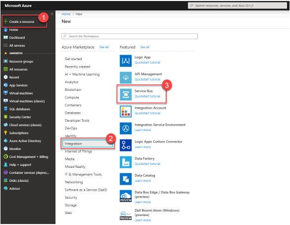

3.  أدخل التفاصيل المناسبة لمساحة الاسم الخاصة بك ثم حدد **إنشاء**.

    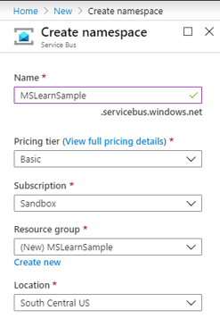

    قد يستغرق توفير الموارد بضع دقائق. عند الانتهاء، من المفترض أن ترى شيئاً مشابهاً للصورة التالية في منطقة **الإخطارات** في مدخل Azure الخاص بك:

    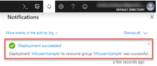

4.  بعد إنشاء المورد الخاص بك، انتقل إلى مساحة الاسم التي تم إنشاؤها حديثاً لإنشاء صف جديد.

    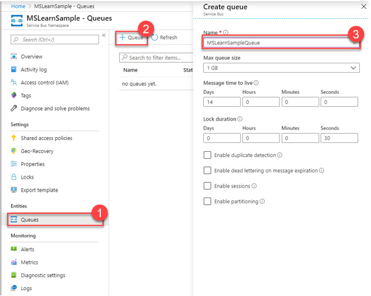

5.  لاحظ بعض الأصناف الموجودة في مساحة الاسم الخاصة بك بحيث يحتوي Dataverse على بيانات الاعتماد الصحيحة للاتصال بالصف الجديد. بالنسبة لهذا الإجراء، استخدم نهج الوصول المشترك الحالي الذي تم إنشاؤه تلقائياً كجزء من مساحة الاسم الخاصة بك. إذا كنت تريد المزيد من قيود الوصول، يمكنك إنشاء سياسة وصول مشترك للصف الفردي الخاص بك أيضاً.

    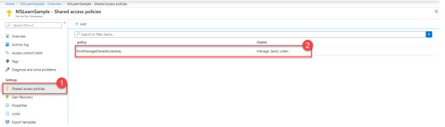

7.  من داخل سياسة الوصول المشترك، انسخ **سلسلة الاتصال الأساسية** وقم بتخزينها للاستخدام المستقبلي لأنك ستحتاج إلى هذه السلسلة كجزء من تكوين نقطة نهاية ناقل الخدمة في Dataverse:

    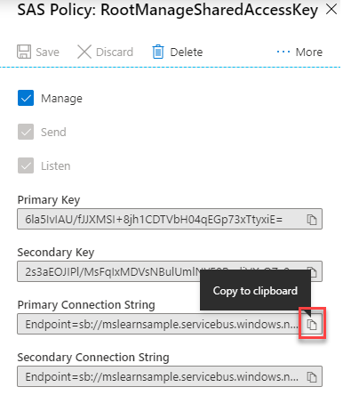

## تسجيل نقطة نهاية ناقل الخدمة في Dataverse

الآن بعد أن أعددت صف الرسائل في Azure، يمكنك توفير Dataverse بمعلومات التكوين المطلوبة للوصول إليها.

> [!NOTE]
> ستستخدم أداة تسجيل المكونات الإضافية لـ Dataverse لتكوين نشر بيانات Dataverse إلى ناقل الخدمة. يتم توفير هذه الأداة كجزء من أدوات مطور Dataverse، والتي توجد في NuGet. لمزيد من المعلومات حول كيفية تثبيت أداة تسجيل المكونات الإضافية من خلال NuGet، راجع [تنزيل الأدوات من NuGet](/powerapps/developer/common-data-service/download-tools-nuget).

1.  افتح أداة تسجيل المكون الإضافي واتصل ببيئة Dataverse الخاصة بك.

2.  عند الاتصال بالبيئة، قم بتسجيل نقطة نهاية ناقل الخدمة الخاصة بك عن طريق تحديد **تسجيل** ثم تحديد **تسجيل نقطة نهاية خدمة جديدة**.

    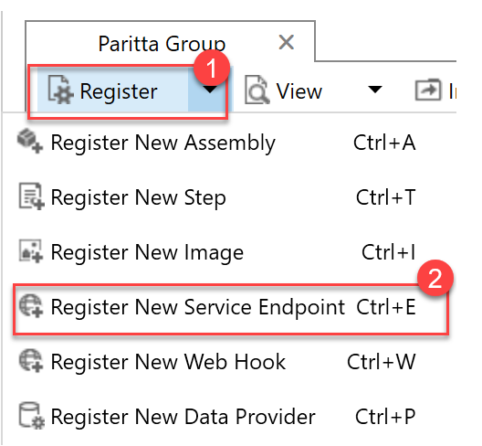

3.  انسخ والصق قيمة **سلسلة الاتصال الأساسية** التي أشرت إليها سابقاً عند إعداد مثيل ناقل الخدمة، ثم حدد **التالي**.

    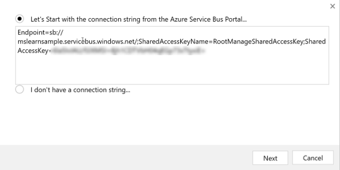

4.  يجب ملء جميع الحقول من سلسلة الاتصال الخاصة بك مسبقاً في النموذج. في هذا المثال، ستكتب ناشراً أحادي الاتجاه في الصف، لذا يمكنك ترك **نوع التعيين** **كصف**. يدعم Dataverse العديد من أنواع التعيين الأخرى لدعم بروتوكولات المراسلة المختلفة.

    أدخل اسم الصف الخاص بك في حقل **اسم الصف** وحدد **تنسيق الرسالة** كـ **JSON**. يدعم Dataverse تنسيقات رسائل .NETBinary وJSON وXML. أنت تستخدم JSON لهذه الرسالة لأنها أصبحت تنسيق رسائل قياسياً صناعياً نظراً لإمكانية نقلها وطبيعتها خفيفة الوزن. أخيراً، لإرسال معلومات المستخدم الخاصة بك إلى الصف الخاصة بك، يمكنك تحديد **معرّف المستخدم** في القائمة المنسدلة **معلومات المستخدم المرسلة**.

    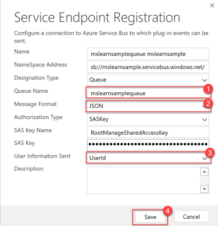

## تسجيل خطوة تكامل ناقل الخدمة

في هذا السيناريو، ستقوم بتسجيل خطوة تكامل تنشر رسالة إلى صف "ناقل الخدمة" في كل مرة يتم فيها إنشاء حساب. بتسجيل خطوة، يمكنك تحديد الكيان ومجموعة الرسائل، ويمكنك تحديد الشروط التي ستؤدي إلى إرسال الرسالة التي تتم معالجتها بواسطة Dataverse على ناقل الخدمة إلى قائمه صف Azure.

1.  قم بتسجيل خطوة جديدة لنقطة نهاية الخدمة الخاصة بك عن طريق النقر بزر الماوس الأيمن وتحديد **تسجيل خطوة جديدة**.

2.  أدخل التفاصيل التالية لتسجيل خطوة تكامل جديدة ستبدأ عند إنشاء سجل حساب. تأكد من مسح **علامة حذف AsyncOperation إذا كان رمز الحالة = ناجح**. يعد مسح هذه العلامة لأغراض الاختبار فقط، لذا يمكنك التحقق من أن سجلات وظائف النظام التي تم إنشاؤها تُظهر أن خطوة تكامل ناقل الخدمة قد بدأت بنجاح عند إنشاء سجل حساب. في سيناريو إنتاج في العالم الحقيقي، نوصي بترك هذه القيمة محددة.

    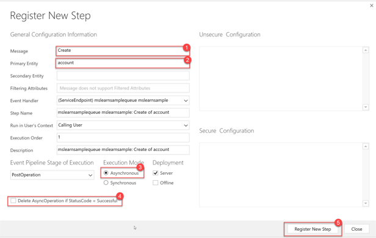

## اختبار تكامل ناقل الخدمة

اختبر تكامل ناقل الخدمة من خلال الخطوات التالية:

1.  لاختبار تكامل "ناقل الخدمة" الخاص بك، انتقل إلى بيئة Dataverse وأنشئ حسابًا.

2.  لمعرفة ما إذا كان التكامل قد تم تشغيله، انتقل إلى **الإعدادات> الإعدادات المتقدمة** وحدد عرض **وظائف النظام**.

    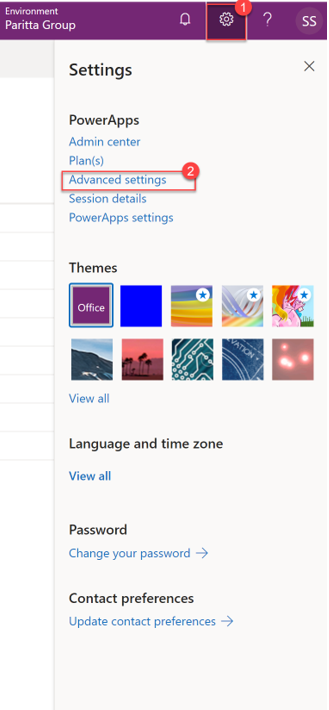

3.  انتقل إلى عرض **وظائف النظام** من خلال الانتقال إلى **الإعدادات> وظائف النظام**.

    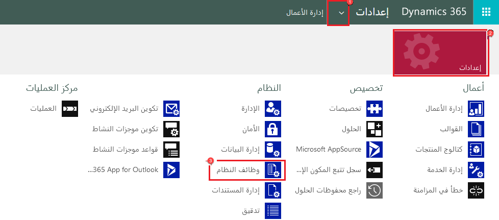

4.  تحقق من تنفيذ خطوة التكامل بنجاح من خلال عرضها في عرض **وظائف النظام**. إذا تم تشغيله بنجاح، فيجب أن يكون **سبب الحالة** **نجاح**. ستستخدم أيضاً طريقة العرض هذه لاستكشاف أخطاء التكامل التي يتم تشغيلها وإصلاحها في حالة حدوث خطأ. في حالة الفشل، افتح سجل مهمة النظام لعرض معلومات الخطأ.

    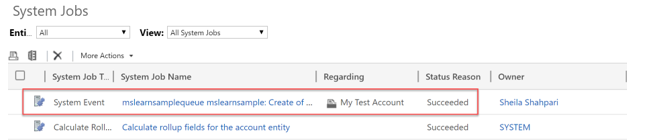

5.  نظراً لتشغيل خطوة التكامل بنجاح، يمكنك الآن التحقق من وصول رسالة إنشاء الحساب إلى صف ناقل الخدمة بالانتقال إلى الصف في مدخل Azure.

    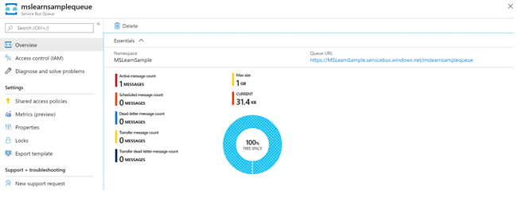

