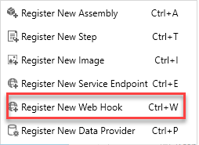
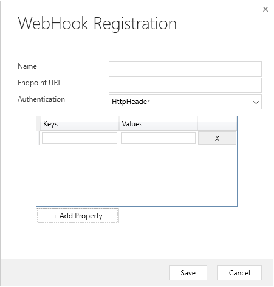
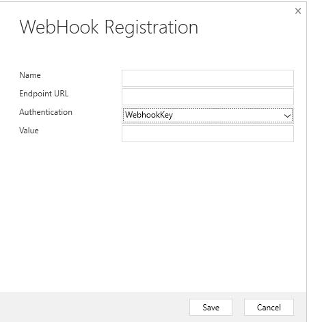
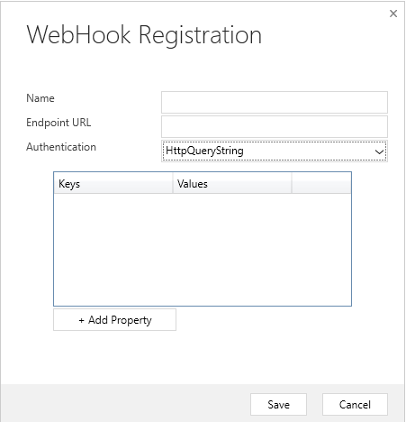

هناك طريقة أخرى لنشر الأحداث من Microsoft Dataverse إلى خدمة خارجية وهي تسجيل الإخطارات عبر الويب. خطاف الويب عبارة عن آلية تستند إلى HTTP لنشر الأحداث إلى أي خدمة تستند إلى واجهة API الويب من اختيارك. تتيح لك هذه الطريقة كتابة التعليمات البرمجية المخصصة لديك والتي تتم استضافتها على خدمات خارجية كنقطة إلى نقطة.

## <a name="webhooks-vs-azure-service-bus"></a>إخطارات الويب مقابل "ناقل خدمة Azure"

عند التفكير في آليات التكامل، لديك بعض الخيارات المتاحة. من المهم أن تضع في اعتبارك عناصر مختلفة عند اختيار طريقة معينة.

يمكنك استخدام "ناقل خدمة Azure" عندما:

- تكون المعالجة غير المتزامنة عالية النطاق / قائمة الانتظار مطلباً.

- تكون هناك حاجة إلى عدة مشتركين لاستهلاك حدث Dataverse معين.

- تريد التحكم في هندسة التكامل الخاصة بك في موقع مركزي.

ضع في اعتبارك استخدام إخطارات الويب عندما:

- مطلوب معالجة متزامنة ضد نظام خارجي كجزء من العملية الخاصة بك (يدعم Dataverse فقط المعالجة غير المتزامنة مقابل "نقاط نهاية ناقل الخدمة").

- يجب أن تحدث العملية الخارجية التي تقوم بها على الفور.

- تريد أن تفشل الحركة بالكامل ما لم تتم معالجة حمولة خطاف الويب بنجاح بواسطة الخدمة الخارجية.

- توجد بالفعل نقطة نهاية لـ API التابعة لجهة خارجية والتي تريد استخدامها لأغراض التكامل.

- مصادقة SAS غير مفضلة و/ أو مجدية (تدعم إخطارات الويب المصادقة من خلال رؤوس المصادقة ومفاتيح معلمات سلسلة الاستعلام).

## <a name="webhook-authentication-options"></a>خيارات مصادقة خطاف الويب

يصف الجدول التالي خيارات المصادقة الثلاثة التي يمكنك استخدامها لاستهلاك رسالة إخطار ويب من نقطة نهاية معينة.

| النوع | الوصف |
|------|-------------|
| HttpHeader | يتضمن زوجاً واحداً أو أكثر من أزواج القيم الأساسية في رأس طلب HTTP. مثال: Key1: Value1, Key2: Value2 |
| WebhookKey | يتضمن سلسلة استعلام باستخدام التعليمات البرمجية كمفتاح وقيمة مطلوبة من قبل نقطة النهاية. عند تسجيل خطاف الويب باستخدام "أداة تسجيل البرنامج المساعد"، أدخل القيمة فقط. مثال: ?code=00000000-0000-0000-0000-000000000001 |
| HttpQueryString | يتضمن زوجاً واحداً أو أكثر من أزواج القيم الأساسية كمعلمات سلسلة الاستعلام. مثال: ?Key1=Value1&Key2=Value2 |

## <a name="webhook-http-headers"></a>عناوين HTTP لخطاف الويب

يعرض الجدول التالي رؤوس HTTP التي تم تمريرها إلى خدمتك كجزء من مكالمة خطاف الويب. يمكنك استخدام هذه الرؤوس كجزء من طريقة المعالجة الخاصة بك إذا كنت تكتب معالج إخطار ويب جديد.

| مفتاح | وصف القيمة |
|-----|-------------------|
| x-request-id | معرف فريد للطلب |
| x-ms-dynamics-organization | اسم المستأجر الذي أرسل الطلب |
| x-ms-dynamics-entity-name | الاسم المنطقي للكيان الذي تم تمريره في بيانات سياق التنفيذ |
| x-ms-dynamics-request-name | اسم الحدث الذي تم تسجيل خطوة خطاف الويب لـ |
| x-ms-correlation-request-id | معرف فريد لتتبع أي نوع من الملحقات. يتم استخدام هذه الخاصية من قبل النظام الأساسي لمنع التكرار الحلقي اللانهائي. في معظم الحالات، يمكن تجاهل هذه الخاصية. يمكن استخدام هذه القيمة عند العمل مع الدعم الفني لأنه يمكن استخدامها للاستعلام عن التتبع عن بُعد لفهم ما حدث أثناء العملية بأكملها. |
| x-ms-dynamics-msg-size-exceeded | يتم إرساله فقط عندما يتجاوز حجم حمولة HTTP 256 كيلو بايت |

## <a name="register-a-webhook-endpoint"></a>تسجيل نقطة نهاية خطاف الويب

يتم إجراء تسجيل نقطة نهاية خطاف الويب بشكل مشابه لتسجيل "نقطة نهاية الخدمة"، باستخدام "أداة تسجيل البرنامج المساعد".

ضمن أداة تسجيل البرنامج المساعد، يمكنك تسجيل إخطار ويب جديد عن طريق تحديد **تسجيل إخطار ويب جديد** ضمن خيار القائمة **تسجيل**.



سيظهر مربع الحوار التالي **تسجيل WebHook**، حيث يمكنك تكوين عنوان URL لنقطة النهاية الخاصة بك، إلى جانب أي خيارات مصادقة.

### <a name="register-with-httpheader-authentication"></a>التسجيل باستخدام مصادقة HTTPHeader

إذا تم تحديد المصادقة **HttpHeader**، ستطالبك الشاشة بإضافة **المفاتيح** و **القيم** التي سيتم تمريرها كجزء من طلب HTTP.
بشكل عام، قد تتضمن المفاتيح والقيم رمزاً مميزاً لحامل OAuth أو تنسيقات مصادقة متنوعة أخرى.



### <a name="register-with-webhookkey-authentication"></a>التسجيل باستخدام مصادقة WebhookKey

إذا تم تعيين **WebhookKey** كأسلوب **مصادقة**، يتم تمرير سلسلة الاستعلام إلى عنوان URL باستخدام المفتاح المعطى بالتنسيق ```?code=[web hook key]```.  تكون هذه الطريقة مفيدة عند استدعاء "وظائف Azure" لأنها تستخدم معلمة التعليمة البرمجية هذه بشكل افتراضي لإجراء المصادقة الخاصة بها.



### <a name="register-with-httpquerystring-authentication"></a>التسجيل باستخدام مصادقة HTTPQueryString

يمكنك تمرير معلمات سلسلة الاستعلام عن طريق تحديد **HttpQueryString** كخيار **مصادقة**. كما هو الحال مع الخيار **HTTPHeader**، فإنه يقدم خياراً لتمرير مجموعة من أزواج المفاتيح / القيمة إلى API للويب الخاصة بك.
يمكنك أيضاً تمرير معلمات إضافية، وحتى تمرير معلمة "التعليمات البرمجية" يدوياً المتوقعة من خلال "وظائف Azure" بهذه الطريقة.


