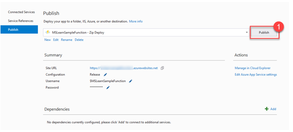

استعرض التمرين السابق كيفية تسجيل خطافات الويب التي تعرض بيانات Microsoft Dataverse لـ "واجهة API" ويب خارجية. ستنشئ في هذا التمرين مثالاً لواجهة API الويب باستخدام "وظائف Azure" لتوضيح كيفية استهلاك حدث Webhook المنشور.

## <a name="azure-functions-vs-plug-ins"></a>وظائف Azure مقابل المكونات الإضافية

توفر "وظائف Microsoft Azure" آلية رائعة للقيام بوحدات عمل صغيرة، على غرار ما قد تستخدمه من أجل المكونات الإضافية في Dataverse. مثل "وظيفة Azure" لتقليل الحمل على مضيف تطبيق Dataverse، قد يكون من المنطقي إلغاء تحميل هذا المنطق في مكون منفصل في العديد من السيناريوهات. لديك إمكانية تشغيل الوظائف بقدرة متزامنة لأن خطافات ويب Dataverse توفر "سياق التنفيذ عن بُعد" للطلب المحدد.

ومع ذلك، لا يتم تشغيل وظائف Azure بشكل صريح ضمن مسار التنفيذ الخاص بـ Dataverse، لذلك إذا كنت بحاجة إلى تحديث البيانات بأكثر الطرق أداءً، مثل التنسيق التلقائي لقيمة سلسلة قبل نشرها إلى Dataverse، فإننا لا نزال نوصي باستخدام مكون إضافي - لأداء هذا النوع من العمليات.

## <a name="write-an-azure-function-that-processes-dataverse-events"></a>اكتب "وظيفة Azure" التي تعالج أحداث Dataverse

لبدء كتابة "وظيفة Azure" التي تعالج أحداث Dataverse، ستستخدم قالب تطوير Visual Studio لعام 2019 لإنشاء "وظيفتك" ونشرها. توفر Visual Studio عددًا من الأدوات المتاحة للمساعدة في تسهيل تطوير Azure. لذا، أنت مطالب بتثبيت "أدوات تطوير Azure" في مثيل 2019 الخاص بـ Visual Studio. يمكنك إضافتها من خلال "مثبت Visual Studio"، إذا لم يكن لديك الميزة مثبتة.

### <a name="create-your-azure-function-project"></a>إنشاء مشروع "وظيفة Azure"

1.  قم بإنشاء مشروع "وظيفة Azure" جديد باستخدام قالب "وظائف Azure". عن طريق إنشاء مشروع جديد ثم إدخال "دالة" في شريط البحث، يمكنك العثور على هذا النموذج.

    

2.  امنح مشروع الدالة اسمًا وصفيًا، ثم حدد **إنشاء**.

    

3.  حدد نوع "وظائف Azure" v2 (.NET Core)‎ وتأكد من تحديد قالب **مشغل Http**. يمكنك تعيين **حساب التخزين** إلى **دون** لأنك لن تستخدم مساحة التخزين لهذا التمرين؛ ومع ذلك، قد تحتاج إليها في سيناريوهات أخرى. قم بتعيين **مستوى المصادقة** إلى **الدالة** ثم تحديد **إنشاء**.

    

    باستخدام التعليمة البرمجية للقالب التالي الموجود في ملف .cs الخاص بالوظيفة، يجب إنشاء مشروعك النموذجي الآن:

```csharp
public static class Function1
    {
        [FunctionName("Function1")]
        public static async Task<IActionResult> Run(
            [HttpTrigger(AuthorizationLevel.Function, "get", "post", Route = null)] HttpRequest req,
            ILogger log)
        {
            log.LogInformation("C# HTTP trigger function processed a request.");

            string name = req.Query["name"];

            string requestBody = await new StreamReader(req.Body).ReadToEndAsync();
            dynamic data = JsonConvert.DeserializeObject(requestBody);
            name = name ?? data?.name;

            return name != null
                ? (ActionResult)new OkObjectResult($"Hello, {name}")
                : new BadRequestObjectResult("Please pass a name on the query string or in the request body");
        }
    }
```

ستستبدل هذه التعليمة البرمجية لاحقًا، ولكن أولاً، ستنشر دالتك للتأكد أن كل شيء يعمل بشكل صحيح.

### <a name="publish-your-azure-function-to-azure"></a>نشر "وظيفة Azure" الخاصة بك إلى Azure

1.  انقر بزر الماوس الأيمن فوق مشروعك وحدد **نشر...** من قائمة السياق لاختبار نشر دالتك إلى Azure App Service.

    

2.  قم بإنشاء هدف نشر جديد إذا لم تكن قد قمت بذلك بالفعل. يمكنك تخطي هذه الخطوة وتحديد خيار **التحديد الحالي** بدلاً من ذلك، إذا كنت ترغب في تحديد خطة خدمة تطبيقات حالية.

    

3.  إذا كنت بصدد إنشاء هدف نشر جديد، فقم بتسمية "خدمة التطبيق" الجديدة الخاصة بك، وتحقق من صحة الحقول **الاشتراك** و **مجموعة الموارد** و **الموقع** و **تخزين Azure**، ثم حدد **إنشاء**.

    

4.  حدد **نشر** لنشر دالتك في Azure، بعد إنشاء ملف تعريف "النشر" الخاص بك. يتم نشر "الدالة" افتراضيًا في وضع التحرير. ستحتاج إلى نشر "الدالة" في وضع "التصحيح"، إذا كنت ترغب في تصحيح أخطاء هذه الدالة (المزيد حول هذا لاحقًا).

    

### <a name="another-method-to-create-azure-functions"></a>أسلوب آخر لإنشاء "وظائف Azure"

إذا كنت تريد إنشاء "دالة Azure" يدويًا دون مساعدة Visual Studio 2019، فيمكنك القيام بذلك من مدخل Azure:

1.  عن طريق تحديد **إنشاء مورد**، سجّل الدخول إلى بيئة Azure الخاصة بك وأنشئ "تطبيق الدالة".

    

2.  لإنشاء "تطبيق وظيفة Azure"، حدد اسمه ومكدس وقت التشغيل الخاص به، ثم تحقق من صحة الحقول **الاشتراك** و **ومجموعة الموارد** و **المنطقة**.

    

> [!NOTE] 
> لا يتناول هذا الدرس تفاصيل إنشاء مجموعة "وظائف Azure" جديدة.

## <a name="update-your-functions-logic-to-interact-with-dataverse-data"></a>تحديث منطق "دالتك" للتفاعل مع بيانات Dataverse

1.  إذا لزم الأمر، قم بتغيير FunctionName الخاص بالدالة واسم الفئة المقابل إلى شيء أكثر أهمية (أي، MSLearnFunction).

2.  انسخ ملف RemoteExecutionContextHelper.cs الموجود في قسم "الموارد" بهذا التمرين والصقه في مشروعك. يحتوي الملف على جزء التعليمة البرمجية المتكررة التالي، والذي سيطبع تفاصيل "سياق التنفيذ البعيد" لرسالة Dataverse:

    ```csharp
    public static string SerializeContext(dynamic context)
    ```

3.  أضف عبارات *الاستخدام* التالية إلى "دالتك":

    ```csharp
    using Newtonsoft.Json.Linq;
    ```

    ```csharp
    using RemoteExecutionContextHelper;
    ```

4.  انسخ جزء التعليمة البرمجية المتكرر التالي والصقه في الأسلوب Run للدالة:

```csharp
log.LogInformation("C# HTTP trigger function processed a request.");

            string queryParams = "";
            foreach (var q in req.Query)
            {
                queryParams += $"Key: {q.Key} Value: {q.Value}\n";
            }


            string requestBody = await new StreamReader(req.Body).ReadToEndAsync();
            dynamic data = JsonConvert.DeserializeObject(requestBody);
            string requestHeader = "";
            foreach (var h in req.Headers)
            {
                requestHeader += $"Key: {h.Key} Value: {h.Value}\n";
            }
            log.LogInformation("Query Parameters:\n" + queryParams);
            log.LogInformation("Request Header: \n" + requestHeader);
            log.LogInformation("Request Body:\n" + requestBody);
            string requestBodyFormatted = JValue.Parse(requestBody).ToString(Formatting.Indented);
            log.LogInformation("Request Body Formatted:\n" + requestBodyFormatted);

            try
            {
                string context = RemoteExecutionContextSerializer.SerializeContext(data);
                log.LogInformation("Context: " + context);

                return (ActionResult)new OkObjectResult(data.InitiatingUserId);
            }
            catch (Exception ex)
            {
                return new BadRequestObjectResult(ex.ToString());
            }
```

5.  أنشئ دالتك وانشرها في Azure بالنقر بزر الماوس الأيمن فوق المشروع ثم تحديد **نشر...**.

6.  تحقق من نشر دالتك بالانتقال إلى مدخل Azure. يمكنك إما تحديدها يدويًا من داخل مجموعة الموارد التي حددتها عند إنشاء الدالة، أو يمكنك البحث عنها بالاسم في مدخل Azure، كما هو موضح في الصورة التالية.

    

## <a name="register-a-dataverse-webhook-that-calls-your-azure-function"></a>تسجيل خطاف ويب Dataverse يستدعي "وظيفة Azure" الخاصة بك

في هذا التمرين، ستستخدم "أداة تسجيل المكوّن الإضافي" لتسجيل خطاف ويب يستدعي "وظيفة Azure" الجديدة.

1.  افتح "أداة تسجيل المكون الإضافي" وقم بتسجيل الدخول إلى بيئة Dataverse الخاصة بك.

2.  قم بتسجيل خطاف ويب جديد عن طريق تحديد **تسجيل خطاف الويب الجديد** ضمن خيار قائمة **التسجيل**.

    

3.  احصل على عنوان URL الخاص بالوظيفة من مدخل Azure عن طريق تحديد الحصول على **عنوان URL للدالة**.

    ­­

4.  الصق القيمة المنسوخة في أحد المحررات النصية، والتي يجب أن تبدو مثل الصورة التالية.

```http
https://[AppServiceUrl].azurewebsites.net/api/MsLearnFunction?code=[WebhookKey]
```

5.  قم بقص قيمة سلسلة استعلام التعليمات البرمجية ولصقها من عنوان URL المنسوخ ووضعها في القسم **القيمة** من سلسلة تسجيل خطاف ويب (تأكد من إزالة القسم **code=**). 

    

6.  سجّل خطوة جديدة ستنشر رسالة عند إنشاء حساب جديد. قم بتسجيل خطوة جديدة عن طريق النقر بزر الماوس الأيمن فوق مجموعة الإخطارات عبر الويب الجديدة ثم تحديد **تسجيل خطوة جديدة**.

    

7.  قم بتكوين الخطوة كما هو موضح في الشكل التالي. نظرًا لأنك ستنشئ خطاف الويب هذا ليتم تشغيله بشكل متزامن، فتأكد تعيين العلم عند تسجيل الخطوة الجديدة.

    

## <a name="test-your-webhook-integration"></a>اختبر تكامل خطاف الويب لديك

1.  لاختبار تكامل "ناقل الخدمة" الخاص بك، انتقل إلى بيئة Dataverse وأنشئ حسابًا.

2.  انتقل إلى دالتك في مدخل Azure واعرض تفاصيل سجل استدعاء دالتك.

    

3.  استعرض كل إدخال في السجل لمعرفة البيانات التي تم تمريرها من خطاف الويب من Dataverse إلى "وظيفة Azure".

    

