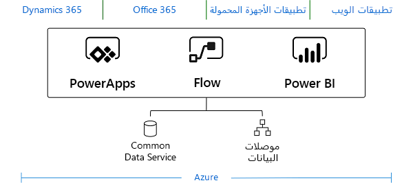

## توسيع النظام الأساسي Microsoft Dataverse

يلزم توسيع النظام الأساسي Dataverse كلما كانت هناك حاجة إلى حدوث مستوى معين من الأتمتة لا تدعمه الميزات الموجودة.
يتم تنفيذ هذه الأنواع من نقاط قابلية التوسعة كتعليمات برمجية من جانب الخادم بشكل متكرر عبر أصل يسمى "مكون إضافي". يمكّن سير العمل وخيارات أخرى المنطق والأتمتة غير المتزامنة، ولكنها لم تكن قادرة على تنفيذ كل ما تقوم به المكونات الإضافية اليوم للقواعد المتزامنة. عندما تتوفر متطلبات العمليات المتزامنة داخل تطبيق يستند إلى النموذج، تستمر الحاجة إلى المكونات الإضافية.

ومع ذلك، يُعد تطوير المكونات الإضافية مهارة أساسية موجودة في ترسانة مطوري PowerApp وهي واحدة من أكثر المهام شيوعاً المطلوبة منا.

## إنشاء تطبيقات تستند إلى النموذج في Dataverse

يتم تخزين كل البيانات ومنطق العمل على مستوى الجدول الذي يحدد تطبيقاً يستند إلى النموذج داخل Dataverse. كذلك الأمر، فإن الطريقة التي نستخدمها لجمع تخصيصات تطبيق يستند إلى النموذج (عبر الحلول) وتوزيعها تقيم أيضاً في Dataverse.

## إنشاء تطبيقات العميل على Dataverse

يعرض Dataverse مجموعة من واجهات API التي يمكنك استخدامها لإنشاء أي شكل من أشكال التطبيقات، سواء تطبيق ويب مخصصاً مكتوباً في ASP.NET أو تطبيق Node.js أو تطبيق Windows أو نوع تطبيق آخر. هناك الكثير من المزايا لاستخدام Dataverse من أجل إنشاء تطبيقك، وقد تم تلخيص البعض منها في القسم التالي.

## مزايا Dataverse 

يأتي Dataverse مزوداً بمجموعة موحدة من الميزات التي تُمكِّنك من إنشاء تعريفات تركز على الأعمال لبيانات مؤسستك ودورات العمل داخل تطبيقات مختلفة. نظراً لتخزين البيانات وبيانات التعريف في السحابة، فمن السهل التعامل مع التطبيقات وإدارتها. هناك أيضاً نموذج أمان مضمن يسمح لك بالتحكم في الوصول إلى الجداول والوظائف لمجموعات مختلفة من الموظفين داخل مؤسستك.

لقد قامت Microsoft بإنشاء مجموعة واسعة من تطبيقات الطرف الأول على Dataverse، بما في ذلك Dynamics 365 Sales وDynamics 365 Customer Service وDynamics 365 Talent. من خلال إنشاء تطبيقات تستند كلها إلى النظام الأساسي Dataverse نفسه، يمكنك التفاعل بسهولة مع البيانات التي أنشأتها تطبيقات أخرى داخل Dataverse.
