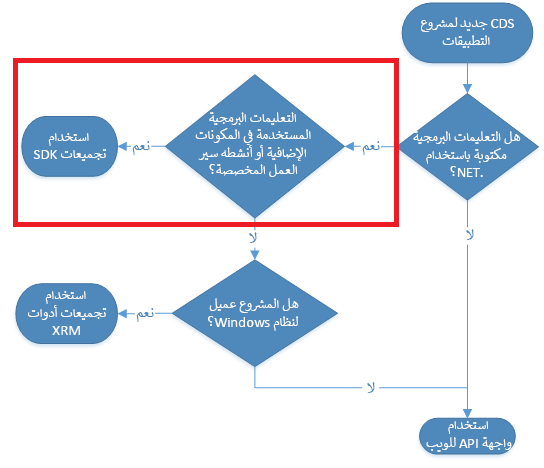
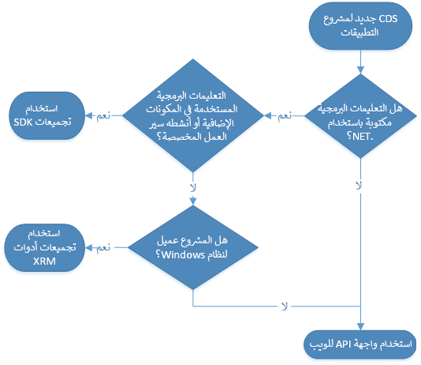

لفهم كيفية توسيع Microsoft Dataverse بشكل أفضل، من المفيد التعرف على بنيته الأساسية. نظراً لأن Dataverse عبارة عن نظام أساسي للبرامج كخدمة، فإن معظم هذه التفاصيل مثل تخزين البيانات الأساسية، يتم استخراجها بنجاح منا كمطورين ويمكننا التركيز على عناصر أكثر إثارة للاهتمام مثل إنشاء منطق عمل مخصص والتكامل مع التطبيقات الأخرى. يوضح الرسم أدناه هذه المكونات الأساسية، والأقسام المميزة هي المناطق التي يمكن لمطوري PowerApp المستند إلى النموذج توسيع التعليمات البرمجية للاستفادة منها.

> [!NOTE]
> تهدف هذه الوحدة إلى أن تكون عرضاً عالي المستوى لهندسة Dataverse. للحصول علي مزيد من التحليل التفصيلي لـ Dataverse، راجع دليل مطور[Dataverse](/power-apps/developer/common-data-service/overview/?azure-portal=true).

### لبيانات التعريف والوعي بالحل

يوفر Dataverse بنية تعتمد على بيانات التعريف لتوفير المرونة لإنشاء جداول مخصصة وتوسيع الجداول الموجودة. باستخدام هذا النهج، يمكننا بعد ذلك نقل تخصيصاتنا بسهولة عبر البيئات عبر حل تعريفي يمكننا الاحتفاظ به كملفات مضغوطة أو استخراجها في ملفات XML عند تطبيق Microsoft's Solution Packager. تعد SolutionPackager هي الأداة المفضلة لضغط واستخراج ملف الحل بحيث يمكنك التحقق منه في مستودع التحكم بالمصادر. لمزيد من المعلومات، راجع [استخدم أداة SolutionPackager لضغط ملف الحل واستخراجه](/dynamics365/customerengagement/on-premises/developer/compress-extract-solution-file-solutionpackager?azure-portal=true).

عند إنشاء جدول مخصص، يتم تخزين بيانات التعريف الخاصة بهذا الجدول وسماته وعلاقاته بالجداول الأخرى ومكونات واجهة المستخدم (مثل النماذج وطرق العرض) كبيانات تعريف في النظام.

يعرض Dataverse أيضاً نقطة نهاية OData V4 RESTful، والمعروفة باسم Web API، والتي يمكن الاستفادة منها لعرض البيانات الأولية ومعالجتها داخل مثيل Dataverse. تتمثل إحدى الآليات الشائعة لتصفح بيانات التعريف للحل في زيادة مستعرض بيانات التعريف. توفر Microsoft هذا كحل يمكنك تثبيته في تطبيقك. تم العثور على الروابط الحالية ضمن وثائق المطور ضمن [Microsoft Docs](/power-apps/developer/common-data-service/browse-your-metadata?azure-portal=true). يمكن تثبيت هذه الأداة في أي PowerApp يستند إلى نموذج مبني على Dataverse. بالإضافة إلى ذلك، [تحتوي XrmToolbox](https://www.xrmtoolbox.com/plugins/MsCrmTools.MetadataBrowser/?azure-portal=true) على أداة مستعرض بيانات تعريف مجتمعية متوفرة.

### تجميعات .NET (المكونات الإضافية)

المكونات الإضافية هي فئات تعليمات برمجية مُدارة يتم تسجيلها للتشغيل عند وقوع أحداث معينة. عند وقوع الحدث، فإنها تمر عبر مسار تنفيذ المكون الإضافي الذي يتكون من ثلاث مراحل: التحقق المسبق، والتشغيل المسبق، والتشغيل اللاحق. عند تسجيل مكون إضافي، يجب عليك اختيار المرحلة التي يجب تشغيل التعليمات البرمجية الخاصة بك فيها. تعتمد المرحلة التي يجب أن تختارها على الغرض من الامتداد. لست\'بحاجة إلى تطبيق منطق الأعمال الخاص بك في خطوة واحدة. 

يمكن أيضاً تكوين المكونات الإضافية بحيث يتم تشغيلها إما بشكل متزامن أو غير متزامن. يتم تنفيذ المكونات الإضافية المتزامنة فوراً وفقاً للمرحلة وأمر التنفيذ، وستنتظر العملية بأكملها حتى تكتمل. يتم تنفيذ المكونات الإضافية غير المتزامنة عبر وظيفة النظام بعد اكتمال العملية، وعلى هذا النحو لا يمكن تسجيلها إلا لمرحلة ما بعد التشغيل.

يمكن أيضاً تطوير المكونات الإضافية وتسجيلها على أنها أنشطة سير عمل مخصصة. أنشطة سير العمل المخصصة هي أداة تسمح للمطورين بإنتاج مكونات قابلة لإعادة الاستخدام يمكن للمسؤول الاستفادة منها لتنفيذ إجراءات لا يوفرها محرر سير العمل الجاهز.

### واجهات API

توفر خدمات الويب واجهة برمجية للتطبيقات والخدمات للوصول إلى بيانات الأعمال ومعلومات المؤسسة وبيانات التعريف المخزنة في Dataverse. تسمى الخدمة الرئيسية للوصول إلى بيانات الأعمال خدمة المؤسسة. يوجد بروتوكولان متاحان لكود التطبيق للوصول إلى هذه الخدمة، ولكل منهما نقطة نهاية الويب الخاصة به: ODATA وSOAP. توفر واجهة API الويب RESTful الوصول إلى بروتوكول ODATA V4 الخاص بخدمة الويب بينما توفر SDK مكتبة من الفئات والطرق للوصول إلى نقطة نهاية SOAP. واجهة API الويب هي نقطة النهاية الأكثر حداثة والمفضلة لكود التطبيق الجديد، في حين أن نقطة نهاية SOAP هي أكثر للتطبيقات القديمة وتطوير نشاط سير العمل المكوّن/المخصص. كل من واجهة API الويب ونقاط نهاية SOAP متكافئة وظيفياً، باستثناء أنه يجب استخدام نقطة نهاية SOAP لتطوير المكونات الإضافية وأنشطة سير العمل المخصصة.

 
