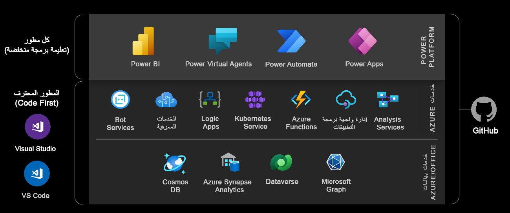

Microsoft Power Platform هو نظام أساسي قليل الأكواد لإنشاء تطبيقات الأعمال بشكلٍ سريع. وهو يتضمن أربع مكونات رئيسية: Power Apps وPower Automate وPower BI وPower Virtual Agents. ويمكن استخدام كل مكون بشكلٍ فردي أو مع بعضها. وعند استخدام المكونات مع بعضها، فهي مصممة للتفاعل مع غيرها لتحقيق أهداف الأعمال أو بناء التحليلات أو أتمتة العمليات أو تطبيقات الإنتاجية المستندة إلى البيانات.

> [!div class="mx-imgBorder"]
> 

يستخدم النظام الأساسي نهجاً قليل الأكواد لإنشاء الحلول بطريقة سريعة. فهو يسمح للجميع في المؤسسة، بداية من العاملين في الخطوط الأمامية إلى المطورين المحترفين، بالمشاركة في إنشاء التطبيقات التي تدفع نتائج الأعمال الإيجابية. يستطيع المطورون العمل بسلاسة مع المنشئين داخل المؤسسة للمساعدة على سد الثغرات والتغلب على التحديات المعقدة باستخدام نموذج قابلية التوسعة الغني الذي توفره مكونات النظام الأساسي. وباستخدام تكامل أصلي مع Azure، يستطيع المطورون أيضاً استخدام مهاراتهم في تطوير السحابة لتوسيع نطاق Microsoft Power Platform. هذا النهج الذي يستهدف تطوير قليل الأكواد عبارة عن وسيلة تحويلية لتحقيق أهداف تطوير التطبيقات داخل المؤسسة بشكلٍ سريع.

ولكي تصبح مطوراً فعالاً في النظام الأساسي، من المهم أن تفهم الأساسيات التي يوفرها النظام الأساسي. وفيما يأتي نظرة عامة عالية المستوى على جميع المكونات الأساسية ونقاط قابلية التوسعة الرئيسية الخاصة بها.

## تطبيقات Power Apps

تُستخدم التطبيقات التي تم إنشاؤها باستخدام Power Apps من جانب المستخدمين عبر أجهزة سطح المكتب أو الأجهزة المحمولة. توجد أنواع مختلفة من Power Apps: اللوحة والمستندة إلى النموذج والمدخل.

**تطبيقات اللوحة** توفر للمنشئ تحكماً كاملاً في محتويات الشاشة مثالية البكسل والتنقل بين شاشات متعددة. تَستخدم تطبيقات اللوحة موصلات للتعامل مع البيانات والخدمات. يمكن تضمين تطبيقات اللوحة في تطبيقات SharePoint وTeams وPower BI وDynamics 365.

**التطبيقات المستندة إلى النموذج** هي تطبيقات تعتمد على البيانات التي تم إنشاؤها استناداً إلى Microsoft Dataverse. يمكن استخدام مصادر البيانات والخدمات الأخرى بواسطة التطبيقات المستندة إلى النموذج عن طريق تضمين تطبيق اللوحة.

تُستخدم **مداخل Power Apps** لإنشاء مواقع ويب موجهة نحو الخارج تسمح للمستخدمين من خارج مؤسسة بتسجيل الدخول باستخدام مجموعة كبيرة من الهويات أو إنشاء وعرض البيانات من Dataverse، أو حتى استعراض المحتوى بدون الإفصاح عن الهوية.

فيما يأتي نقاط التوسعة الرئيسية المتاحة للمطورين من أجل Power Apps:

-   إنشاء عناصر تحكم مرئية مخصصة باستخدام إطار عمل المكون (PCF) Power Apps

-   تنفيذ منطق العمل الخاص بالعميل باستخدام JavaScript وواجهة برمجة تطبيقات (API)‏ العميل

-   إنشاء موصلات مخصصة لمصادر البيانات الخارجية والخدمات باستخدام أدوات مثل دالات Azure وإدارة واجهة برمجة تطبيقات (API)‏ Azure

-   إنشاء موارد ويب HTML

للتعرف على كيفية إنشاء تطبيقات اللوحة، راجع مسار التعليم [إنشاء تطبيق اللوحة في Power Apps](/training/paths/create-powerapps/?azure-portal=true). للحصول على مقدمة عالية المستوى حول إنشاء تطبيقات مستندة إلى النموذج، راجع مسار التعليم [إنشاء تطبيق مستند إلى نموذج في Power Apps](/training/paths/create-app-models-business-processes/?azure-portal=true). للحصول على مقدمة عالية المستوى حول مداخل Power Apps، راجع مسار التعليم [الشروع في العمل باستخدام مداخل Power Apps](/training/paths/get-started-power-apps-portals/?azure-portal=true).

## Power Automate

يستخدم Power Automate لأتمتة المهام وتنسيق الأنشطة عبر الخدمات المختلفة التي تستخدم الموصلات. باستخدام Power Automate، يمكنك إنشاء تدفقات سحابية أو تدفقات سطح المكتب.

**التدفقات السحابية** يمكن تشغيلها يدوياً أو تكوينها بهدف تشغيلها عند حدوث أحداث معينة، مثل عند إنشاء سجل أو جدولة تشغيله في وقت محدد. تم إنشاء Power Automate على أساس Azure Logic Apps ولكنه يوفر تكاملاً فريداً مع Microsoft Power Platform.

**تدفقات سطح المكتب** تستخدم، كما يوحي الاسم، لأتمتة المهام التفاعلية المتكررة على الويب أو سطح المكتب.

فيما يأتي نقاط التوسعة الرئيسية المتاحة للمطورين:

-   إنشاء موصلات مخصصة باستخدام أدوات مثل دالات Azure وإدارة واجهة برمجة تطبيقات (API)‏ Azure

-   استخدام وظائف تعريف سير العمل لإنشاء تعبيرات معقدة

لمعرفة المزيد حول إنشاء تدفقات سحابية باستخدام Power Automate، راجع مسار التعليم [أتمتة عملية أعمال باستخدام Power Automate](/training/paths/automate-process-using-flow/?azure-portal=true). للحصول على مقدمة حول مهام سير عمل سطح المكتب، راجع مسار التعليم [الشروع في العمل مع Power Automate لسطح المكتب](/training/paths/pad-get-started/?azure-portal=true).

## Power BI

إن Power BI هو حل لتحليلات الأعمال\'من Microsoft يوفر أدوات المعلومات المهنية لمؤثرات عرض البيانات لمساعدة المستخدمين على تصور البيانات والرؤى ومشاركتها عبر مؤسساتهم.

فيما يأتي نقاط التوسعة الرئيسية المتاحة للمطورين:

-   يمكن تضمين Power BI في التطبيقات ومواقع الويب والمداخل

-   إنشاء مرئيات مخصصة باستخدام ‏‫عدة تطوير البرامج (SDK) مفتوحة المصدر

-   استخدم واجهة برمجة تطبيقات REST في Power BI لتشغيل عمليات تحديث البيانات التلقائي والزيادة والتحويل والتحجيم التلقائي للموارد وأتمتة إدارة دورة حياة التطبيق (ALM) والمزيد

-   تطوير موصلات Power Query مخصصة للاتصال بالبيانات والوصول إليها من التطبيقات أو الخدمات أو مصادر البيانات الخاصة

للحصول على مقدمة حول كيفية إنشاء تقارير Power BI، راجع مسار التعليم [إنشاء تقارير التحليلات واستخدامها مع Power BI](/training/paths/create-use-analytics-reports-power-bi/?azure-portal=true).

## Power Virtual Agents

يسمح لك Power Virtual Agents بإنشاء روبوتات دردشة قوية يمكنها الإجابة عن أسئلة العملاء أو الموظفين الآخرين أو زوار موقع الويب أو الخدمة. تم إنشاء Power Virtual Agents بالاستناد إلى Microsoft Bot Framework ويوفر تجربة قليلة التعليمات البرمجية لإنشاء روبوتات الدردشة وإدارتها.

فيما يأتي نقاط التوسعة الرئيسية المتاحة للمطورين:

-   بناء مهارات Bot Framework

-   تمديد الروبوتات مع Bot Framework Composer

للحصول على مقدمة حول كيفية إنشاء روبوتات دردشة Power Virtual Agent، راجع مسار التعليم [إنشاء](/training/paths/work-power-virtual-agents/?azure-portal=true) روبوتات دردشة باستخدام Power Virtual Agents.

## الموصلات

الموصلات هي مكون رئيسي يسمح بالوصول إلى البيانات والخدمات. الموصل هو مندوب أو برنامج تضمين حول واجهة برمجة تطبيقات (API)‏ يسمح للخدمة الأساسية بالتحدث إلى Microsoft Power Automate وMicrosoft Power Apps وAzure Logic Apps. ويوفر طريقة للمستخدمين لربط حساباتهم واستخدام مجموعة من الإجراءات والمشغلات المنشأة مسبقاً لبناء تطبيقاتهم وعمليات سير العمل. 

هناك مئات من الموصلات المنشأة مسبقاً للاستخدام في التطبيقات والتدفقات. يمكنك إنشاء موصلات مخصصة لأي واجهة برمجة تطبيقات‏ REST. يمكن للمطورين أيضاً تنفيذ الأكواد التي تحوّل حمولات الطلب والاستجابة خارج نطاق قوالب النهج الحالي. 

يمكنك معرفة المزيد حول الموصلات المخصصة في [وثائق الموصلات](/connectors/?azure-portal=true).

## Dataverse

Dataverse هو مخزن بيانات مقياس السحابة يقوم بالبناء على تقنيات بيانات Microsoft ويتخلص من تعقيد إدارة البيانات من منشئ التطبيق. يتيح لك تخزين البيانات التي تستخدمها تطبيقات الأعمال وإدارتها بشكل آمن. يتم تخزين بيانات الأعمال داخل Dataverse ضمن مجموعة من جداول البيانات. يسمح الأمان المستند إلى الدور للشركات بالتحكم في الوصول إلى جداول البيانات وحتى السجلات الفردية لمختلف المستخدمين داخل مؤسستك. يمكن للمطورين توسيع أو تخصيص وظائف Dataverse عن طريق إضافة منطق عمل مخصص. يمكنك تحديد أعمدة الجداول المحسوبة وقواعد العمل وعمليات سير العمل وتدفقات عمليات الأعمال لضمان جودة البيانات ودفع عمليات الأعمال.

فيما يأتي نقاط التوسعة الرئيسية المتاحة للمطورين:

-   إنشاء مكونات إضافية، مشابهة لمعالجات الأحداث، التي تعمل على تخصيص أو توسيع نطاق معالجة بيانات Dataverse باستخدام منطق عمل مخصص (كود).

-   استخدام خطافات الويب وناقل خدمة Azure للتكامل مع الأنظمة الخارجية.

-   توسيع نطاق واجهة برمجة تطبيقات (API)‏ Dataverse مع واجهة برمجة التطبيقات (API)‏ المخصصة لك والتي تنفذ منطق العمل الخاص بك.

-   استخدام الجداول الافتراضية لدمج البيانات المخزنة في أنظمة خارجية في Dataverse دون تكرار البيانات

لإلقاء نظرة متعمقة على Common Data Service، راجع وحدة [الشروع في العمل باستخدام Dataverse](/training/modules/get-started-with-powerapps-common-data-service/?azure-portal=true).

## Common Data Model

Common Data Model هو تعريف قياسي مفتوح المصدر للكيانات التي تمثل المفاهيم والأنشطة شائعة الاستخدام. عند الإنشاء باستخدام تطبيق Dataverse، يتم توفير مجموعة أساسية من الكيانات التي يمكن لمنشئي التطبيقات إضافة كياناتهم المخصصة الخاصة إليها لدعم سيناريوهات أعمال محددة.

فيما يأتي نقاط التوسعة الرئيسية المتاحة للمطورين:

-   استخدم مكتبة Common Data Model للعمل مع البيانات المخزنة في Azure Data Lake.

لمعرفة المزيد حول كيفية استخدام Common Data Model، راجع [وثائق Common Data Model](/common-data-model/schema/core/applicationCommon/overview/?azure-portal=true).
