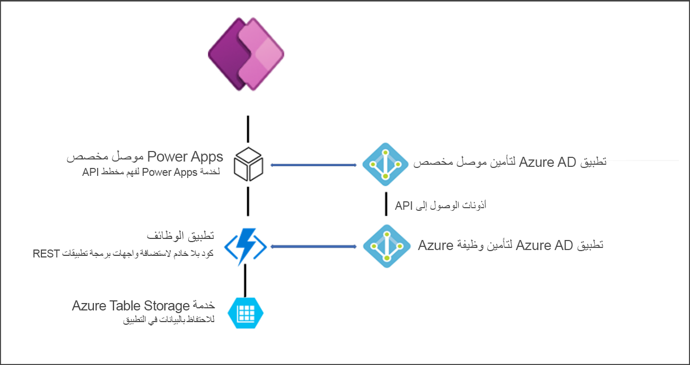

توفر خدمات Azure السحابية ثروة من الوظائف وتمكن مطوري Microsoft Power Platform من تسخير إمكاناتها من خلال نقاط قابلية التوسعة المختلفة. تستعرض هذه الوحدة بعض تقنيات Azure في سياق كيفية تشغيل، أو ربما تشغيل، دور في تنفيذ Microsoft Power Platform المركز. يتضمن Azure العديد من الخدمات، ويجب أن يكون جميع مطوري Microsoft Power Platform على دراية بما يقدمه Azure. للحصول على نظرة عامة على جميع تقنيات Azure، راجع [موقع Azure على الويب](https://azure.microsoft.com/?azure-portal=true). لمزيد من التدريب المتعمق الذي سيعدك لخوض [اختبار أساسيات Microsoft Azure](/certifications/exams/az-900/?azure-portal=true)، فكر في إكمال مسار تعليم أساسيات [Azure](/training/paths/azure-fundamentals/?azure-portal=true).

يجب أن يصبح المطورون على دراية بقدرات التعليمات البرمجية المنخفضة لـ Microsoft Power Platform، حتى لا يعيدوا بناء شيء يقوم به بالفعل بشكل جيد. إذا كنت قادماً من خلفية مطور Azure، فقد يكون من السهل البدء بمكون Azure بدلاً من مكون Microsoft Power Platform. على سبيل المثال، إذا طُلب منك إنشاء دردشة آلية، فقد تنظر أولاً إلى Azure Bot Framework. بصفتك مطوراً يركز على Microsoft Power Platform، يمكنك أولاً البحث عن Power Virtual Agents لتنفيذ الدردشة الآلية. ثم استخدم مهارة Azure Bot Framework لزيادة قدرات الدردشة الآلية لـ Power Virtual Agent الذي قمت بإنشائه. باستخدام هذا الأسلوب، يتم إنشاء الحلول باستخدام التطوير السريع للتطبيقات في Microsoft Power Platform ولكن لا تزال تستفيد من التخصيصات العميقة الممكنة من خلال تضمين خدمات Azure والتعليمات البرمجية المخصصة.

## Azure Functions

[Azure Functions](https://azure.microsoft.com/services/functions/?azure-portal=true) عبارة عن نقطة نهاية القابلية للتوسعة معتمدة لـ Power Platform. يتيح لك استخراج منطق مخصص إلى وظيفة Azure إلغاء تحميل المنطق المعقد خارج تطبيق المعاملات الخاص بك، وبالتالي توفير تجربة مستخدم أكثر استقراراً وفعالية. يمكن أيضاً استخدام وظائف Azure لإنشاء واجهات برمجة التطبيقات التي يتم عرضها لموصل Microsoft Power Platform مخصص. كموصل مخصص، يمكن بسهولة استدعاء منطق عمل Azure Function من التطبيقات والتدفقات. يوضح المخطط التالي أحد التطبيقات باستخدام Azure Function من تطبيق لوحة Power Apps.

> [!div class="mx-imgBorder"]
> 

## API Management

[تتيح لك Azure API Management](https://azure.microsoft.com/services/api-management/?azure-portal=true) إدارة واجهات برمجة التطبيقات عبر السحب والأماكن المحلية. بالإضافة إلى ذلك، يمكن لإدارة واجهة برمجة تطبيقات (API)‏ تصدير تعريفات واجهة برمجة تطبيقات (API)‏ مباشرةً إلى Microsoft Power Platform. عند تصديرها، يتم تكوين واجهة برمجة تطبيقات (API)‏ كموصل مخصص متوفر في Power Apps وكذلك Power Automate. يوضح الفيديو التالي كيفية إنشاء موصل مخصص.

> [!VIDEO https://www.microsoft.com/videoplayer/embed/RE4XUuO]

## ناقل الخدمة

[ناقل خدمة Azure](https://azure.microsoft.com/services/service-bus/?azure-portal=true) هو إطار عمل موثوق للمراسلة كخدمة (MaaS) يتيح المراسلة في الوقت الفعلي غير المتزامن عبر الأنظمة. في حالات استخدام محددة، تعد هذه ميزة قيّمة توفر القدرة على التكامل مع كل من الأنظمة السحابية والمحلية بطريقة موزعة بدون خادم.

يمكن للمطورين تكوين Microsoft Dataverse لتوزيع الأحداث إلى قوائم الانتظار ومواضيع ناقل خدمة Azure. يمكن توزيع الأحداث تلقائياً على تعديلات بيانات Dataverse أو عند الطلب من منطق المطور المخصص. 

يمكن أن يقوم ناقل الخدمة بتخزين الرسالة إلى أن يصبح الطرف المستهلك جاهزاً لتلقي الرسائل التي تسمح لك بتصميم الحلول التي تعتمد الأقل اعتمادية.

## شبكة الأحداث

[‎شبكة الأحداث](https://azure.microsoft.com/services/event-grid/?azure-portal=true) هي خدمة فردية مُدارة بالكامل لإدارة التوجيه لجميع الأحداث من أي مصدر ولأي وجهة. فهي تبسط تطوير التطبيقات المستندة إلى الأحداث وإنشاء سير عمل بدون خادم. يمكن استخدام شبكة الأحداث لتوجيه الأحداث بين Microsoft Power Platform وخدمات Azure الأخرى مثل Azure Functions، على سبيل المثال.

## Logic apps

[Logic Apps](https://azure.microsoft.com/services/logic-apps/?azure-portal=true) هي خدمة سحابية تساعدك على تنظيم المهام وعمليات الأعمال وسير العمل وتنفيذها تلقائياً عندما تحتاج إلى دمج التطبيقات والبيانات والأنظمة والخدمات عبر المؤسسات أو المؤسسات.

يحتوي Microsoft Power Platform على خدمة Power Automate المبنية على Logic Apps وتتضمن التكامل مع Power Apps وكذلك Dataverse. سيجد المطورون المطلعون على Logic Apps أن Power Automate مألوفاً أيضاً.

يمكن أن تكون Logic Apps مفيدة كجزء من حل Microsoft Power Platform عندما تحتاج الأتمتة إلى دعم غير متوفر في Power Automate؛ على سبيل المثال، لاستخدام حزمة تكامل المؤسسات أو موصلات SOAP. بالمقارنة مع Power Automate، تقدم Logic Apps نموذجاً مختلفاً للتوزيع والاستهلاك يمكن أن يكون أكثر كفاءة في سيناريوهات معينة.

## الخدمات المعرفية

[Azure Cognitive Services](https://azure.microsoft.com/services/cognitive-services/?azure-portal=true) هي عائلة من واجهات برمجة تطبيقات الذكاء الاصطناعي والمعرفي للمساعدة على بناء تطبيقات ذكية. يحتوي Microsoft Power Platform على خدمة AI Builder التي تنفذ خيار تعليمات برمجية منخفضة لبعض واجهات برمجة التطبيقات. تعمل خدمة AI Builder على تمكين مجموعة أوسع من منشئي التطبيقات لتنفيذ المعالجة الذكية. يمكن للمطورين المساعدة على زيادة حلول Microsoft Power Platform باستخدام Azure Cognitive Services عندما تصبح متطلبات الحل أو الاستخدام في غاية التعقيد بالنسبة إلى AI Builder أو تحتاج إلى API‏ لا توفرها خدمة AI Builder.

تتضمن Azure Cognitive Services واجهات برمجة التطبيقات ومجموعات تطوير البرامج (SDK) والخدمات المتوفرة لمساعدة المطورين على إضافة ميزات معرفية إلى تطبيقاتهم. يتيح إطار القابلية للتوسعة لـ Power Platform للمستخدمين دمج هذه الميزات في التطبيقات والتدفقات. يمكن تصنيف كتالوج الخدمات داخل Azure Cognitive Services إلى خمس ركائز رئيسية: الرؤية والكلام واللغة والبحث على الويب والقرار.

لمزيد من التدريب المتعمق حول كيفية استخدام بعض ميزات الخدمات المعرفية، راجع مختلف [وحدات التعلم ومسارات التعليم المتوفرة التي تم وضع علامة عليها مع منتج الخدمات](/training/browse/?products=azure-cognitive-services) المعرفية. لمزيد من المعلومات، راجع [وثائق Azure Cognitive Services](/azure/cognitive-services/?azure-portal=true).

## خدمة روبوت Azure

[توفر خدمة روبوت Azure](https://azure.microsoft.com/services/bot-services/?azure-portal=true) إطاراً يمكنك من خلاله إنشاء واختبار وتوزيع وإدارة الروبوتات الذكية كلها في مكان واحد. في كثير من الأحيان، تلعب الروبوتات دور الخدمة الذاتية للعملاء، وهو سيناريو شائع في تطبيق القناة متعددة الاتجاهات لـ Customer Service الخاص بـ Dynamics 365. تتوفر العديد من التطبيقات الأخرى لخدمة روبوت Azure، حيث يمكنك تحويل المهام البسيطة والمتكررة مثل جمع معلومات الملف الشخصي إلى إطار تفاعلي للأسئلة والأجوبة. لمزيد من المعلومات، راجع [وحدات تعلم خدمة روبوت Azure النمطية](/training/browse/?products=azure-bot-service&azure-portal=true) وكذلك [وثائق خدمة روبوت Azure](/azure/bot-service/?azure-portal=true).

يمكن للمطورين أيضا بناء مهارات Azure Bot Framework التي يمكن استخدامها مع Power Virtual Agents لتنفيذ معالجة التعليمات البرمجية المخصصة في روبوتات المحادثة ذات التعليمات البرمجية Power Virtual Agents المنخفضة. على سبيل المثال، يمكن للمهارة المخصصة استخدام سلسلة من الحوارات المخصصة للحصول على تفاعل أكثر تعقيداً مع مستخدم الروبوت مما هو ممكن مع مواضيع Power Virtual Agent.

## Azure Data Lake وتحليلات Azure Synapse

تدعم بيانات Microsoft Power Platform بيانات [Azure Data Lake storage](https://azure.microsoft.com/services/storage/data-lake-storage/?azure-portal=true) مع Microsoft Dataverse وإطار عمل Common Data Model. يتيح الإنشاء على Microsoft Power Platform سيناريوهات التحليلات المعقدة حيث يمكنك استخدام أدوات البيانات الضخمة الصناعية مثل Power BI أو Azure HDInsight أو Azure Synapse.

تعتمد خدمة Azure Synapse Link for Dataverse الكتابة الأولية والتزايدية لبيانات الجدول وبيانات التعريف. يتم إرسال أي تغييرات في البيانات أو بيانات تعريف في Dataverse تلقائياً إلى مستودع بيانات تعريف Azure Synapse وAzure Data Lake، بناءً على التكوين، دون أي إجراء إضافي. وهذه عملية إرسال، بدلاً من السحب. يتم إرسال التغييرات إلى الوجهة دون الحاجة إلى إعداد فواصل زمنية للتحديث.

لمزيد من المعلومات، راجع [ما المقصود بـ Azure Synapse Link for Dataverse](/power-apps/maker/data-platform/export-to-data-lake/?azure-portal=true).

## Azure SQL Database

تم إنشاء Dataverse على رأس محرك [Azure SQL Database](https://azure.microsoft.com/services/sql-database/?azure-portal=true) ويتضمن اتصال بيانات SQL الذي يوفر وصولاً للقراءة فقط إلى بيانات الجدول لبيئة Dataverse الهدف. يمكن لمطوري SQL Server ذوي الخبرة استخدام التكنولوجيا المألوفة لتكون على الفور أكثر إنتاجية مع Dataverse. 

يمكن لكلٍّ من Power Apps وPower Automate العمل مع البيانات في Azure SQL عبر موصل Azure SQL.

## الخدمات الأخرى

يتضمن Azure العديد من الخدمات الأخرى التي يمكن استخدامها لتوسيع وظائف Power Platform عند الحاجة. تتضمن أمثلة الخدمات الأخرى المستخدمة بشكل متكرر ما يلي:

- خدمة التطبيقات لتطبيقات السحابة للويب والهاتف المحمول

- إدارة الهوية باستخدام Azure Active Directory وكذلك Azure AD B2C

- IoT للتكامل مع حلول Microsoft Power Platform مثل Dynamics 365 Field Service

- DevOps بأدوات موثوقة للتسليم المستمر

- أدوات المطورين

يجب أن يكون مطورو Microsoft Power Platform على دراية بقدرات Azure للمساعدة على بناء وتوسيع حلول Microsoft Power Platform الفعالة.
