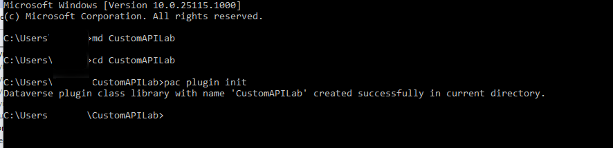

في هذا التمرين، ستقوم بإنشاء واجهة API مخصصة في Dataverse لتنفيذ بعض المنطق المخصص. بعد ذلك، ستستخدم واجهة API المخصصة من خطوة في تدفق Power Automate.

> [!IMPORTANT]
> استخدم بيئة اختبار مع توفير Microsoft Dataverse. وإذا لم يتوفر لديك، يمكنك الاشتراك في خطة المجتمع [هنا](https://powerapps.microsoft.com/communityplan/?azure-portal=true).

## المهمة 1: إنشاء مشروع واجهة API المخصصة

1.  تنزيل وتثبيت [Power Platform CLI](https://aka.ms/PowerAppsCLI/?azure-portal=true).

1.  قم بتشغيل الملف powerapps-cli لبدء التثبيت.

1.  استخدم معالج الإعداد لإكمال الإعداد وحدد **إنهاء**.

1.  افتح **موجه الأوامر**.

1.  شغّل الأمر التالي لإنشاء مجلد جديد يسمى **CustomAPILab**.

    `md CustomAPILab`

1.  قم بتغيير الدليل إلى المجلد الذي قمت بإنشائه.

    `cd CustomAPILab`

1.  من المفترض أن تكون الآن في المجلد CustomAPIlAB. شغّل الأمر أدناه لتهيئة مكتبة فئات جديدة للمكون الإضافي Dataverse.

    `pac plugin init`

1.  يجب أن يكون إنشاء مكتبة فئات المكون الإضافي Dataverse ناجحًا.

    > [!div class="mx-imgBorder"]
    > 

1.  شغّل الأمر أدناه لفتح المشروع في Visual Studio.

    `start CustomAPILab.csproj`

1. من المفترض أن يفتح المشروع في Visual Studio.

1. انقر بزر الماوس الأيمن فوق ملف Plugin1.cs لـ **MatchPlugin.cs**.

1. حدد **نعم** لإعادة تسمية حوار ملف.

1. انقر بزر الماوس الأيمن فوق المشروع CustomAPILab وحدد **إدارة حزم NuGet**.

1. ابحث عن **System.Text.RegularExpressions** وحدد **تثبيت**.

    > [!div class="mx-imgBorder"]
    > 

1. افتح الملف **MatchPlugin.cs**.

1. أضف العبارة التالية أدناه.

    `using System.Text.RegularExpressions;`

1. أضف الأسطر التالية داخل أسلوب ExecuteCdsPlugin وبعد سطر السياق var. تحصل هذه الأسطر على القيمة من معلمات الإدخال التي تمّ تمريرها على استدعاء واجهة API المخصصة.

    `string input = (string)context.InputParameters["StringIn"];`

    `string pattern = (string)context.InputParameters["Pattern"];`

1. قم بإضافة السطر التالي لاحقًا لاستدعاء طريقة Regex.Match.

    `var result = Regex.Match(input, pattern);`

1. وأخيرًا، قم بإضافة السطر التالي لتعيين معلمة الإخراج باعتبارها "مطابقة".

    `context.OutputParameters["Matched"] = result.Success;`

1. يجب أن تبدو طريقة التنفيذ الخاصة بك الآن كالتالي.

    > [!div class="mx-imgBorder"]
    > 

1. حدد **بناء > بناء حل**.

1. يجب أن يتم بناء المشروع بنجاح.

## المهمة 2: تسجيل المكون الإضافي لواجهة API المخصصة

1.  إذا لم تكن أداة **PluginRegistration** مُثبّتة لديك، فاتبع [هذه الإرشادات](\power-apps\developer\data-platform\download-tools-nuget\?azure-portal=true) لتنزيل أدوات SDK وتثبيتها بما في ذلك **PluginRegistration**.

1.  ابدأ تشغيل أداة **PluginRegistration**.

1.  حدد **+ إنشاء اتصال جديد**.

1.  حدد **Office 365**، وقدم بيانات اعتمادك، ثم حدد **تسجيل الدخول**.

1.  اختر **تسجيل | تسجيل تجميع جديد**.

    > [!div class="mx-imgBorder"]
    > 

1.  حدد ... ثم تصفح إلى المجلد **CustomAPILab\\bin\\Debug\\net462**.

1.  حدد **CustomAPILab.dll**.

1.  ثم حدد **موافق**.

    > [!div class="mx-imgBorder"]
    > 

1.  حدد **تسجيل المكونات الإضافية المُحددة**.

1. حدد **موافق** في رسالة النجاح. المكون الإضافي الخاص بك جاهز للاتصال بواجهة API المخصصة التي سنقوم بإنشائها في المهمة التالية.

## المهمة 3: إنشاء واجهة API المخصصة

1.  انتقل إلى [Power Apps Maker Portal](https://make.powerapps.com/?azure-portal=true) وتأكد من وجودك في البيئة الصحيحة.

1.  حدد "الحلول: في جزء التنقل الأيمن.

1.  حدد **+ حل جديد**.

1.  أدخل **معمل واجهة API مخصصة** في اسم العرض.

1.  حدد **ناشر CDS الافتراضي** في القائمة المنسدلة "الناشر".

1.  حدد **إنشاء**. يؤدي هذا إلى إنشاء حل مُخصص يشتمل على مكوناتنا.

1.  في قائمة الحلول حدد اسم العرض **معمل واجهة API مخصصة** لفتحه.

1.  حدد **+** **جديد | المزيد | أخرى | API مخصصة**

1.  أدخل المعلومات التالية:

    - **الاسم الفريد:** contoso_match

    - **الاسم**: تطابق

    - **اسم العرض:** تطابق

    - **الوصف**: تطابق سلسلة

    - **نوع الربط**: عمومي

1. في "نوع المكون الإضافي" حدد رمز البحث وحدد موقع المكون الإضافي.

    > [!div class="mx-imgBorder"]
    > 

1. حدد **حفظ وإغلاق**.

1. حدِّد **تم**.

1. حدد **+** **جديد | المزيد | أخرى | معلمة طلب واجهة API المخصصة**.

1. بالنسبة لـ **واجهة API المخصصة**، حدد الرمز **بحث** وحدد **مطابقة** (واجهة API المخصصة الخاصة بك).

1. أدخل **StringIn** للاسم الفريد، والاسم، واسم العرض، والوصف من أجل البساطة.

1. حدد **سلسلة** للنوع.

1. حدد **حفظ وإغلاق**.

1. حدِّد **تم**.

1. كرر الخطوات **13-18** وأضف **معلمة طلب واجهة API مخصصة** أخرى باسم **النمط**.

1. حدد **جديد | المزيد | أخرى | خاصية استجابة واجهة API المخصصة**.

1. بالنسبة لـ **واجهة API المخصصة**، حدد الرمز **بحث** وحدد **مطابقة** (واجهة API المخصصة الخاصة بك).

1. أدخل **تمت المطابقة** **للاسم الفريد**، و **الاسم، واسم العرض** و **الوصف** من أجل البساطة.

1. حدد **منطقة** لـ **النوع**.

1. حدد **حفظ وإغلاق**.

1. يجب أن تبدو قائمة مكون الحل لديك كالتالي.

    > [!div class="mx-imgBorder"]
    > 

## المهمة 4: استخدام واجهة API مخصصة من Power Automate

1.  في الحل حدد **+ جديد | التنفيذ التلقائي | Cloud Flow | فوري**.

    > [!div class="mx-imgBorder"]
    > 

1.  أدخل **مطابقة السلسلة** للاسم Flow، ثم حدد المشغّل **تشغيل تدفق يدويًا**، وحدد **إنشاء**.

1.  حدد **+ خطوة جديدة**.

1.  ابحث عن التنفيذ واختر **تنفيذ إجراء غير مرتبط**.

    > [!div class="mx-imgBorder"]
    > 

1.  في قائمة "اسم الإجراء"، حدد **contoso_match**.

1.  أدخل أي عنوان بريد إلكتروني صالح في **StringIn**.

1.  أدخل التعبير العادي التالي في "النمط". هذا هو نمط بسيط للبريد الإلكتروني. يُمكنك الحصول على أمثلة أخرى [هنا](https://regexlib.com/DisplayPatterns.aspx/?azure-portal=true).

    `^\w+@[a-zA-Z_]+?\.[a-zA-Z]{2,3}$`

1.  يجب أن يبدو التدفق الخاص بك كالتالي.

    > [!div class="mx-imgBorder"]
    > 

1.  حدد **حفظ**.

1. بعد اكتمال الحفظ، حدد **اختبار**.

1. حدد **يدويًا** ثم حدد **اختبار**.

1. حدد **تشغيل التدفق**.

1. حدِّد **تم**.

1. بعد اكتمال التدفق، حدد **تنفيذ إجراء غير مرتبط** للتوسيع ورؤية النتائج.

    > [!div class="mx-imgBorder"]
    > 

لقد أكملت الآن إنشاء إجراء مخصص واستخدامه من سير عمل Power Automate. يتوفر الآن إجراء واجهة API المخصصة contoso_match أيضا للاستدعاء مباشرة باستخدام واجهة API للنظام الأساسي.
