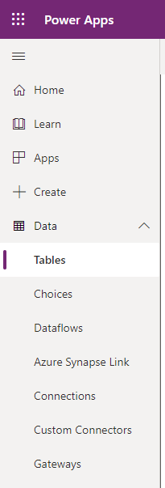

اعتادت الجداول نمذجة بيانات الأعمال وإدارتها. عند تطوير أحد التطبيقات، يمكنك استخدام الجداول القياسية أو الجداول المخصصة أو كليهما. يوفر Dataverse جداول قياسية بصورة افتراضية. تم تصميمها، وفقاً لأفضل الممارسات، لرصد أكثر المفاهيم والسيناريوهات شيوعاً داخل أي مؤسسة.
يحتوي Microsoft Dataverse على بعض الخيارات لعرض البيانات في الجداول.

لعرض البيانات في أحد الجداول، اتبع الخطوات التالية:

1.  قم بتسجيل الدخول إلى [مدخل Power Apps](https://make.powerapps.com/).

1.  في الجزء الأيسر، قم بتمديد **البيانات** وحدد **الجداول**.

    

1.  حدد الجدول المرتبط بالبيانات التي تريد عرضها.

1.  حدد **بيانات** من القائمة الموجودة أعلى الشاشة.

1.  بعد تنشيط شاشة البيانات، لاحظ الخيار في القائمة العلوية المسمى **تحرير البيانات في Excel**. إذا حددت هذا الخيار، يمكنك العمل مع جميع البيانات المخزنة في هذا الجدول باستخدام Microsoft Excel. يتم استكشاف هذه العملية بمزيد من التفصيل في الوحدة 5 من هذه الوحدة. 

    

>[!NOTE]
>إذا لم يكن لديك إذن بتحرير البيانات في الجدول المحدد، فلن يظهر خيار **تحرير البيانات في Excel**.