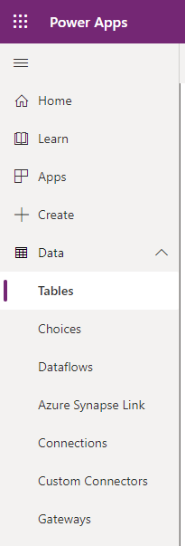
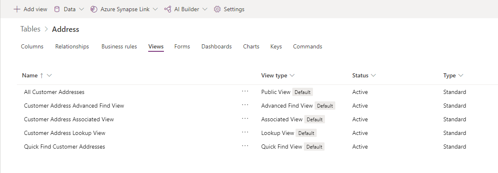
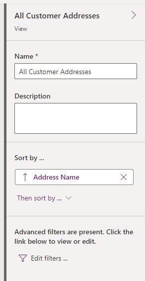
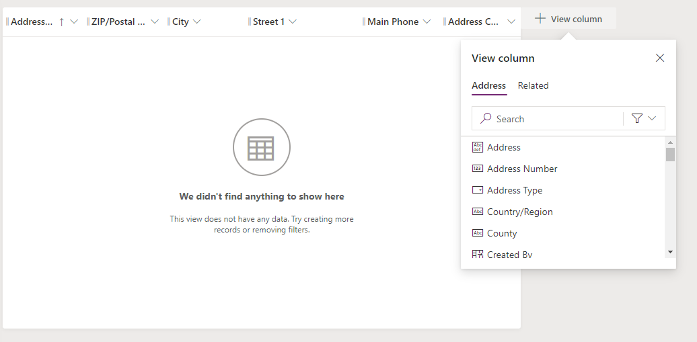

اتبع هذه الخطوات لإنشاء طرق عرض البيانات وحفظها في جدول:

1.  قم بتسجيل الدخول إلى [مدخل Power Apps](https://make.powerapps.com/).

1.  في الجزء الأيسر، قم بتمديد **البيانات** وحدد **الجداول**. حدد الجدول المرتبط بالبيانات التي تريد عرضها.

    

1.  حدد **طرق العرض** في القائمة أعلى الشاشة.

    

يؤدي تحديد **طرق العرض** إلى فتح قائمة بعروض البيانات المرتبطة بالجدول. يمكنك فتح طريقة عرض موجودة أو إنشاء طريقة عرض جديدة. 

## فتح طرق العرض الموجودة

لفتح طريقة عرض موجودة، اتبع الخطوات السابقة، وحدد اسم العرض الذي تريد رؤيته، وسيتم فتح العرض. قد تلاحظ أنه تم تطبيق عامل تصفية على البيانات التي يتم عرضها في طريقة العرض. يمكنك تغيير عامل التصفية وعرض بيانات مختلفة عن طريق تحديد رابط **تحرير عوامل التصفية** في الجزء الأيمن وضبط كيفية تصفية البيانات في العرض الحالي.

يمكنك أيضاً تغيير ترتيب فرز البيانات التي يتم عرضها عن طريق تحديد الخيار **ثم الفرز حسب** على الجانب الأيمن من الشاشة.

يمكنك أيضاً إضافة المزيد من الأعمدة إلى طريقة العرض عن طريق تحديد **+ عرض العمود** في الجزء العلوي من طريقة العرض، حيث سيكون لديك خيار إضافة أعمدة إضافية. 

## إنشاء طريقة عرض جديدة

لإنشاء طريقة عرض جديدة للبيانات في جدول، اتبع الخطوات التالية:

1.  قم بتسجيل الدخول إلى [مدخل Power Apps](https://make.powerapps.com/).

1.  في الجزء الأيسر، قم بتمديد **البيانات** وحدد **الجداول**.

    

1.  حدد الجدول المرتبط بالبيانات التي تريد عرضها.

1.  حدد **طرق العرض** في القائمة أعلى الشاشة.

1.  حدد **إضافة طريقة عرض** في القائمة العلوية.

    

1.  أدخل **اسماً** و **وصفاً** لطريقة العرض وحدد الزر **إنشاء**.

    

1.  حدد الأعمدة وخيارات الفرز والتصفية المطلوبة. حدد **حفظ** ثم **انشر** في أعلى يمين الشاشة. 
