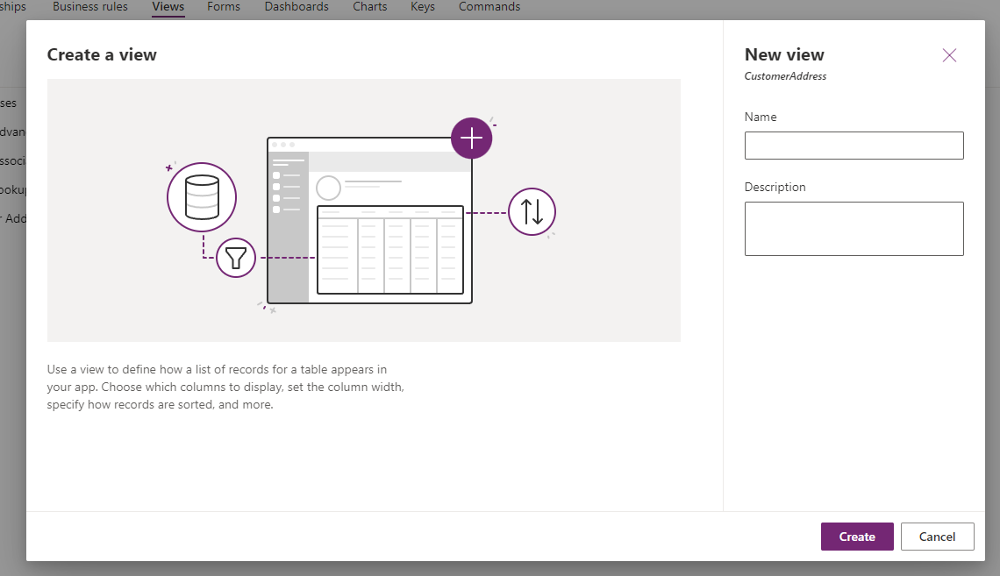

باستخدام Power Apps، يصبح من السهل تعديل وإنشاء طرق عرض باستخدام بيانات الجدول. اتبع هذه الخطوات لإنشاء طرق عرض البيانات وحفظها في جدول:

1. إذا لم تكن موجودًا بالفعل، فابدأ وسجل الدخول إلَى مدخل Power Apps.

1. في الجزء الأيسر، قم بتوسيع **Dataverse** وتحديد **الجداول**. حدد الجدول المرتبط بالبيانات التي تريد عرضها. سترى شاشة محرر الجداول مع الأجزاء الخمسة. ابحث عن **جزء تجارب** البيانات.

1. ضمن جزء **تجارب البيانات** ، حدد طرق **العرض**.

    > [!div class="mx-imgBorder"]
    > 

يؤدي تحديد **طرق العرض** إلَى فتح قائمة بعروض البيانات المرتبطة بالجدول. يمكنك فتح طريقة عرض موجودة أو إنشاء طريقة عرض جديدة.

## فتح طرق العرض الموجودة

لفتح طريقة عرض موجودة، من قائمة طرق العرض الحالية، حدد اسم العرض الذي تريد رؤيته، وسيفتح **محرر العرض**.

> [!div class="mx-imgBorder"]
> 

على الجانب الأيسر من **محرر العرض** ، لاحظ قائمة بأعمدة الجدول المتاحة التي يمكن إضافتها إلَى طريقة العرض. يمكن إضافتها عن طريق السحب والإفلات في جزء معاينة العرض في وسط الشاشة. يمكنك إدراجها بين الأعمدة الموجودة عن طريق سحبها إلَى المكان المناسب في الرأس.

لاحظ جزء الخصائص عَلى الجانب الأيمن من الشاشة الذي يعرض **اسم** العرض، ويحتوي عَلى **مساحة للوصف** وخيارات لفرز العرض في القائمة المنسدلة **فرز حسب** (لاحظ أنه يمكنك الفرز حسب أعمدة متعددة عن طريق تحديد **ثم فرز حسب** زر لاختيار عمود آخر). يمكنك أيضًا اختيار تصفية العرض الخاص بك عن طريق تحديد الخيارات المتاحة في الحقل **تصفية حسب** ، وخيار **تحرير عوامل التصفية** أدناه.

لا تنس حفظ أي تغييرات أجريتها عَلى طريقة العرض الخاصة بك عن طريق تحديد الزر **حفظ** في أعلى يمين شريط الأوامر. يوجد بالقرب من زر **النشر** الذي له الوظيفة المزدوجة للحفظ والنشر. النشر يجعل طريقة العرض هذه قابلة للاستهلاك من قبل مستخدمي الجدول الآخرين.

أخيرًا، إذا قررت عدم وجود عمود جدول تحتاجه لطريقة العرض هذه، يمكنك تحديد زر **+ عمود جدول جديد** أسفل حقل **البحث** في جزء **أعمدة** الجدول.

> [!div class="mx-imgBorder"]
> 

## قم بإنشاء طريقة عرض جديدة

إذا كنت تريد إنشاء طريقة عرض جديدة تمامًا (بدلاً من تعديل طريقة عرض موجودة)، فاتبع الخطوات التالية:

1. ارجع إلَى الجدول الذي ترغب في إنشاء عرض فيه.

1. في جزء **تجارب البيانات** ، حدد **طرق العرض**.

1. Power Apps ينقلك إلَى شاشة تعرض **طرق العرض** المتاحة. في شريط الأوامر في الجزء العلوي، حدد **+ طريقة عرض** جديدة. ستظهر نافذة منبثقة **لإنشاء عرض** في منتصف الشاشة.

    > [!div class="mx-imgBorder"]
    > 

1. أدخل **اسمًا** و **وصفًا** لطريقة العرض وحدد الزر **إنشاء**.

1. قم بسحب الأعمدة وإفلاتها في طريقة العرض الخاصة بك، وإعادة الترتيب عن طريق السحب والإفلات في رأس العرض، وحدد أي خيارات فرز وتصفية مطلوبة. حدد **نشر** في الجزء العلوي الأيسر من الشاشة عندما تكون مستعدًا لإتاحة طريقة العرض هذه لجدولك.

لقد اختبرت الآن مدى سهولة تعديل طريقة عرض جدول موجودة أو إنشاء عرض خاص بك باستخدام Power Apps المحرر.
