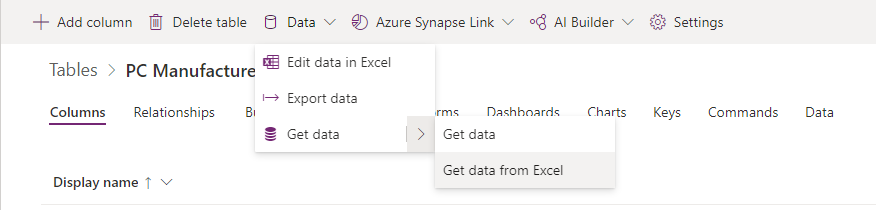
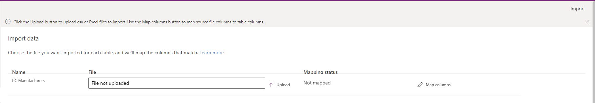

يحتوي كل جدول على أعمدة مطلوبة يجب أن تكون موجودة في ملف الإدخال الخاص بك. نوصي بإنشاء قالب. أولاً، قم بتصدير البيانات من الجدول. استخدم الملف نفس (بعد تعديله باستخدام بياناتك) لاستيراد البيانات إلى الجدول. 

يوفر هذا القالب عادةً الوقت والجهد. ولن تضطر إلى حساب الأعمدة المطلوبة لكل جدول. إذا لم تكن على دراية بكيفية تصدير البيانات من جدول، فإن الدرس التالي يناقش الخطوات الضرورية في هذه العملية.

لتحميل البيانات في جدول، استخدم الخطوات التالية:

1.  قم بتجهيز قالب ملف.

    1.  قم بتصدير بيانات الجدول إلى ملف CSV.

    1.  قم بتعريف خطة للتأكد من أن البيانات فريدة. استخدم إما المفاتيح الأساسية أو المفاتيح البديلة.

    1.  تأكد من أن البيانات فريدة قبل استيرادها إلى جدول.

1.  نسخ البيانات من Microsoft Excel أو ملف CSV إلى القالب الذي قمت بإنشائه.

1.  قم باستيراد البيانات إلى جدول.

    1.  قم بتسجيل الدخول إلى [مدخل Power Apps](https://make.powerapps.com/).

    1.  في الجزء الأيسر، قم بتمديد **البيانات** وحدد **الجداول**.

        

    1.  حدد الجدول الذي تريد استيراد البيانات إليه.

    1.  تحديد **البيانات**. حدد السهم بجوار **الحصول على البيانات** وحدد **الحصول على البيانات من Excel**.

        

    1.  في شاشة **استيراد البيانات**، اختر ما إذا كنت تريد استيراد بيانات من ملف Excel أو ملف CSV.

        

    1.  حدد **تحميل**.

    1.  اختر **الملف**. اتبع المطالبات لتحميل الملف.

    1.  بعد تحميل الملف وكانت حالة التعيين باللون الأخضر، حدد **استيراد** في الركن الأيمن العلوي.

    1.  يمكنك استخدام Excel لإضافة البيانات أو تحديثها أو حذفها وإصلاح أيه أخطاء تخطيط.

بعد انتهاء الاستيراد بنجاح، سترى العدد الإجمالي للإدخالات والتحديثات التي تمت. 
