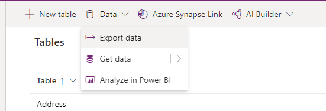

إذا كنت ستقوم باستيراد البيانات إلَى جدول، فتذكر أن كل جدول يتطلب أعمدة يجب أن تكون موجودة، ويجب عليك إضافتها إلَى ملف الإدخال الخاص بك، إذا لم تكن موجودة فيه. نوصي بإنشاء قالب. أولاً، قم بتصدير البيانات من الجدول. يمكنك بعد ذلك استخدام نفس الملف (المعدل بالبيانات الخاصة بك) لاستيراد البيانات إلَى الجدول.

عادةً ما يوفر هذا القالب الوقت والجهد، لأنك في الأساس لن تضطر إلَى حساب الأعمدة المطلوبة لكل جدول. إذا لم تكن عَلى دراية بكيفية تصدير البيانات من جدول، فإن الدرس التالي يناقش الخطوات الضرورية في هذه العملية. نقطة البداية هي محرر Power Apps الجدول الخاص بك.

استخدم الخطوات التالية لتحميل البيانات في جدول:

1. تحضير قالب الملف.

    1. قم بتصدير الجدول عن طريق تحديد الزر **"تصدير"** من شريط الأوامر ثم **تصدير البيانات** من القائمة المنسدلة التالية.

       > [!div class="mx-imgBorder"]
       > 

    1. في جزء **تصدير البيانات** المنبثقة، حدد **تنزيل البيانات المصدرة**. بمجرد أن تبدأ هذه العملية، تحتاج إلَى التحقق من تنزيلات المستعرض الخاص بك للعثور عَلى ملف Microsoft Excel القيم المفصولة بفواصل والذي سيكون له اسم الجدول الذي قمت بتصديره.

       > [!div class="mx-imgBorder"]
       > 

       > [!TIP]
       > حتى يكون نقل بياناتك أمرًا سهلاً وسلسًا، استخرج / انسخ البيانات التي تم تصديرها إلَى OneDrive بيئة Microsoft التي تعمل بها.

    1. بالنسبة للبيانات التي ستقوم باستيرادها، تأكد من أنها فريدة قبل استيرادها إلَى Dataverse جدول.

1. انسخ البيانات من ملفك Microsoft Excel أو ملف CSV إلَى النموذج الذي أنشأته واحفظ الملف، مما يضمن تطابق أعمدتك.

1. استيراد البيانات إلَى جدول.

    1. ارجع إلَى Power Apps شاشة تحرير الجداول وتأكد من أنك حددت الجدول الذي تريد استيراد البيانات إليه.

    1. من شريط الأوامر، حدد **استيراد البيانات** و **استيرادها**.

       > [!div class="mx-imgBorder"]
       > 

    1. سيتم فتح نوافذ **اختيار مصدر البيانات**. اختر **مصنف Excel**.

       > [!div class="mx-imgBorder"]
       > 

    1. في النافذة المنبثقة **الاتصال بمصدر البيانات** ، حدد **تصفح OneDrive**.

       > [!div class="mx-imgBorder"]
       > 

    1. حدد الملف من القائمة المنبثقة **اختر ملفًا** ثم اضغط عَلى الزر **تحديد**.

    1. ستعود تلقائيًا إلَى النافذة المنبثقة **الاتصال بمصدر البيانات**. قد تتم مطالبتك ببيانات **اعتماد الاتصال** الخاصة بك، وسترى مسار الملف ممتلئًا بالرابط إلَى المستند الخاص بك. حدد **التالي** في أسفل يمين النافذة.

    1. تنبثق نافذة **اختيار البيانات** لتمكينك من اختيار المصنف بخانة اختيار، وتعطيك معاينة للبيانات الجديدة في ملفك لاستيرادها. حدد **التالي** في الركن الأيمن السفلي من النافذة للمتابعة.

       > [!div class="mx-imgBorder"]
       > 

    1. في هذه المرحلة، **Power Query** يتم تشكيل بياناتك تلقائيًا لجعلها جاهزة للاستيراد. حدد **التالي** لمتابعة الاستيراد.

       > [!div class="mx-imgBorder"]
       > 

    1. تظهر تلقائيًا النافذة المنبثقة لـ **جداول الخريطة**. ضمن **تحميل الإعدادات**، حدد **تحميل إلَى الجدول الحالي**، وابحث عن الجدول الوجهة بتحديد القائمة المنسدلة لـ **جدول الوجهة**. عند تحديد الجدول الخاص بك، سيظهر *اسم عرض الجدول* اسم الجدول الخاص بك. ضمن *تعيين العمود* ، حدد **الخريطة التلقائية**. نظرًا لأنك تستخدم نموذجًا تم إنشاؤه من المصدر، Power Query فلن تواجه مشكلة في مطابقة الأعمدة. بعد الانتهاء، حدد **التالي**.

       > [!div class="mx-imgBorder"]
       > 

    1. تظهر نافذة **تحديث الإعدادات**. اترك الإعدادات الافتراضية في مكانها **للتحديث يدويًا** واترك مربع الاختيار الموجود بجوار **إرسال إشعار فشل التحديث إلَى مالك تدفق البيانات** غير محدد. حدد **نشر**.

    1. نظرًا لأنك Power Query قمت بالفعل بتشكيل البيانات، فقد تمت إضافة بياناتك إلَى جدولك وفقًا لكيفية تنسيق جدولك وفرزه. إذا لم يظهر في **الجداول - الأعمدة والبيانات**، يمكنك تصفية طريقة العرض أو تحديد الزر **"تعديل"** حتى تتمكن من رؤية المزيد من الأعمدة. لاحظ كيف تلقائيًا يتم ملء أعمدة النظام عند الاستيراد بهذه الطريقة.

       > [!div class="mx-imgBorder"]
       > 

باستخدام هذه التقنية لتصدير بياناتك كقالب، وتخزينها في نفس البيئة عبر OneDrive، وإضافة البيانات لاستيرادها، واستيرادها مرة أخرى إلَى Dataverse جدولك، يمكنك بسهولة استيراد البيانات إلَى جدولك.
