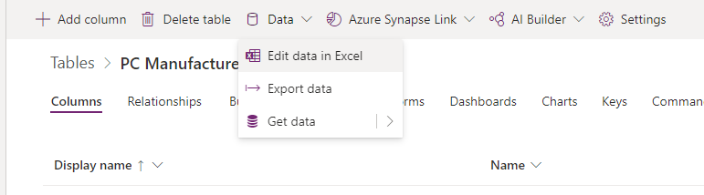
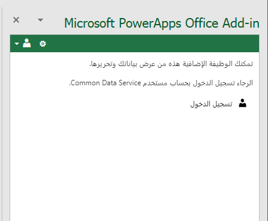

قد يساعدك Microsoft Dataverse في إضافة البيانات أو تحديثها أو حذفها في جدول باستخدام ميزة وظيفة Microsoft Excel الإضافية. 

1.  قم بتسجيل الدخول إلى [مدخل Power Apps](https://make.powerapps.com/).

1.  في الجزء الأيسر، قم بتمديد **البيانات** وحدد **الجداول**.

    

1.  حدد الجدول المرتبط بالبيانات التي تريد تحريرها.

1.  حدد الزر **تحرير البيانات في Excel** في القائمة العليا.
    
    

1.  قم بتسجيل الدخول إلى Dataverse باستخدام وظيفة Excel الإضافية الموجودة في الجزء الأيسر.

        

يمكنك الآن استخدام Excel لإضافة البيانات أو تحديثها أو حذفها باستخدام الزرين **جديد** و **نشر** في وظائف Excel الإضافية.

> [!TIP]
> لحذف البيانات، احذف صفًا واحدًا أو أكثر في جدول البيانات ثم حدد **نشر**. لتحرير البيانات، ما عليك سوى تحرير أي قيمة في جدول البيانات، ثم تحديد **نشر**. 
