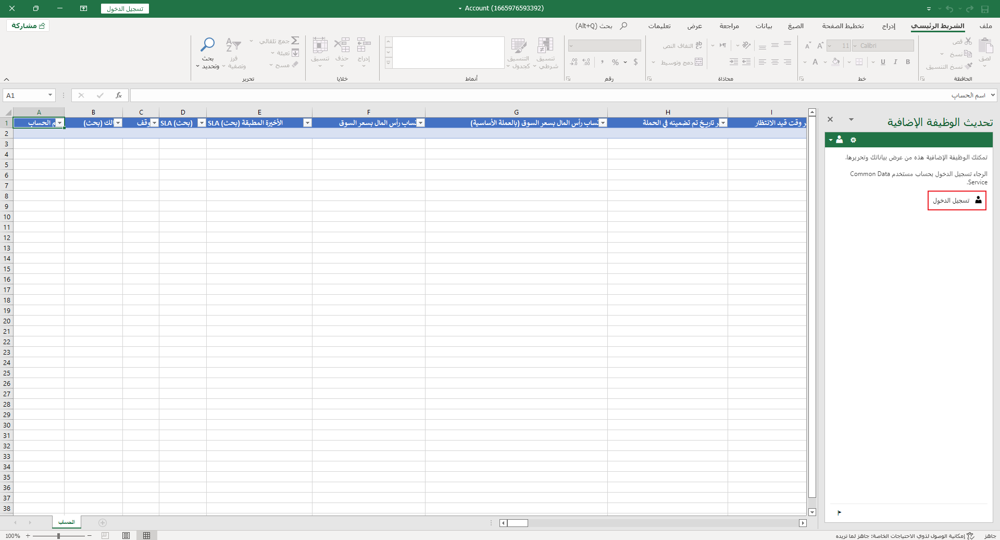
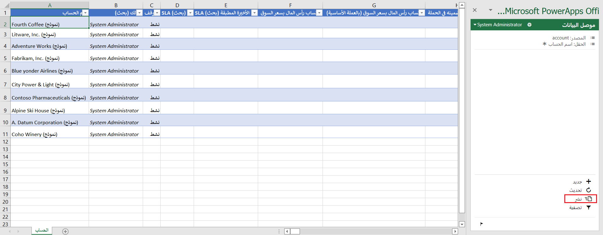

Microsoft Dataverse يمكن أن تساعدك في إضافة البيانات في جدول أو تحديثها أو حذفها باستخدام ميزة Microsoft Power Apps Office Add-in لبرنامج Excel. دعونا نتعرف عَلى كيفية القيام بذلك.

1. قم بتسجيل الدخول إلى مدخل Power Apps.

1. في جزء التنقل الأيسر، قم بتوسيع **Dataverse** ثم حدد **الجداول**.

    > [!div class="mx-imgBorder"]
    > 

1. حدد الجدول المرتبط بالبيانات التي تريد تحريرها.

1. حدد زر **تحرير** في شريط الأوامر ثم **تحرير البيانات في Excel** من القائمة المنسدلة.

    > [!div class="mx-imgBorder"]
    > 

1. Power Apps سيقوم بتنزيل الملف في **تنزيلات** مستعرضك حيث يمكنك بعد ذلك فتح الملف إما في Excel عبر الإنترنت أو في تطبيق Excel. عند فتح الملف، سيُطلب منك **تسجيل الدخول** لتمكين Microsoft PowerApps الوظيفة الإضافية لـ Office.  لا يتم عرض أي من البيانات الخاصة بك. حدد **تسجيل الدخول**.

    > [!div class="mx-imgBorder"]
    > 

1. بعد لحظات قليلة، ستظهر بياناتك في جدول البيانات، ويمكنك الآن استخدام Excel لإضافة البيانات أو تحديثها أو حذفها باستخدام الأزرار الموجودة في جزء الوظيفة الإضافية. يحفظ الزر **"نشر"** تغييراتك.

    > [!div class="mx-imgBorder"]
    > 

إذا عدت إلَى جدولك في Power Apps (قد تحتاج إلَى تحديث طريقة عرضك)، يمكنك عرض التغييرات التي نشرتها من Excel.

> [!TIP]
> لحذف البيانات، احذف صفًا واحدًا أو أكثر في جدول البيانات ثم حدد **نشر**. لتحرير البيانات، ما عليك سوى تحرير أي قيمة في جدول البيانات، ثم تحديد **نشر**.
