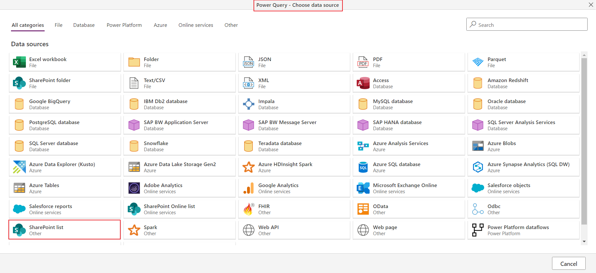
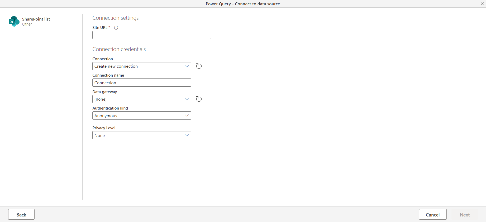
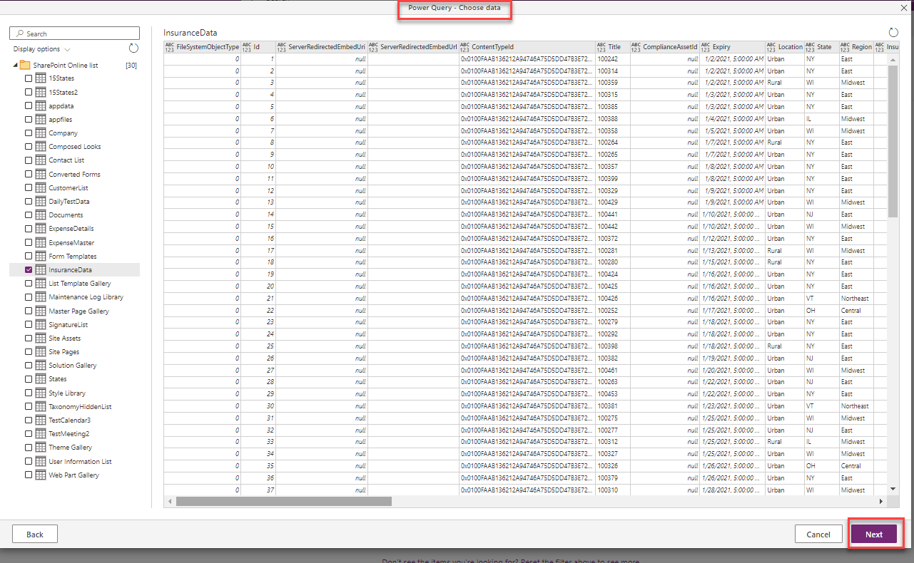
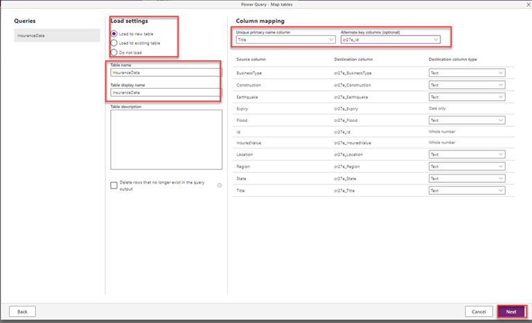

تدفق البيانات هو مجموعة من الجداول التي يتم إنشاؤها وإدارتها في بيئات ضمن خدمة Power Apps. يمكنك إضافة جداول وتحريرها في تدفق البيانات، وإدارة جداول تحديث البيانات، مباشرةً من البيئة التي تم إنشاء تدفق البيانات فيها.

بمجرد إنشاء تدفق البيانات في مدخل Power Apps الإلكتروني، يمكنك الحصول عَلى البيانات منه باستخدام Dataverse الموصل. أو باستخدام Power BI Desktop موصل Dataflow، بناءً عَلى الوجهة التي اخترتها عند إنشاء تدفق البيانات.

توجد ثلاث خطوات أساسية لاستخدام تدفق البيانات:

1. اكتب تدفق البيانات في بوابة Power Apps. يمكنك تحديد الوجهة لتحميل بيانات الإخراج إليها، والمصدر للحصول عَلى البيانات منه، وPower Query الخطوات اللازمة لتحويل البيانات باستخدام أدوات Microsoft المصممة لجعل القيام بذلك أمرًا سهلاً.

1. جدول تشغيل تدفق البيانات. هذا الإعداد هو التكرار الذي يجب أن يقوم Power Platform Dataflow بتحديث البيانات التي سيقوم تدفق بياناتك بتحميلها وتحويلها.

1. استخدم البيانات التي قمت بتحميلها إلَى التخزين الوجهة. يمكنك إنشاء التطبيقات والتدفقات Power BI والتقارير ولوحات المعلومات. أو اتصل مباشرة بمجلد Common Data Model الخاص بتدفق البيانات في مستودع مؤسستك باستخدام خدمات بيانات Azure، مثل Azure Data Factory. أو يمكنك استخدام Azure Databricks أو أي خدمة أخرى تدعم معيار مجلد Common Data Model.

## إنشاء تدفق البيانات

يتم إنشاء تدفقات البيانات في بيئة واحدة حتى تتمكن من رؤيتها وإدارتها من تلك البيئة فقط. إذا أراد أي مستخدم الحصول عَلى بيانات من تدفقات البيانات هذه، فيجب أن يكون لديه حق الوصول إلَى البيئة التي تم فيها إنشاء تدفقات البيانات.

1. قم بتسجيل الدخول إلى مدخل Power Apps.

1. تحديد بيئة.

1. في الجزء الأيسر، قم بتوسيع **Dataverse** ثم حدد **الجداول**.

    > [!div class="mx-imgBorder"]
    > 

1. من شريط الأوامر في الأعلى، حدد **استيراد** ثم **استيراد البيانات**.

1. من نافذة اختيار مصدر Power Query البيانات، حدد **SharePoint قائمة**.

    > [!div class="mx-imgBorder"]
    > 

1. بعد تحديد مصدر بيانات، ستتم مطالبتك بتوفير إعدادات الاتصال SharePoint لقائمتك، بما في ذلك **عنوان URL** الخاص بالموقع وحساب بيانات **اعتماد الاتصال** لاستخدامهما عند الاتصال بمصدر البيانات. بمجرد إدخال إعداداتك، سيتم طي بيانات **اعتماد الاتصال** إلَى عنصر واحد يعرض الاتصال، وسيتم الكشف عن الزر **التالي** في الزاوية اليمنى السفلية من النافذة. حدد **التالي** للمتابعة.

    > [!div class="mx-imgBorder"]
    > 

1. قد يستغرق الأمر بضع لحظات، ولكن بمجرد الاتصال، يمكنك تحديد SharePoint القائمة لاستخدامها في جدولك. يمكنك تحديد القوائم من اللوحة الجانبية الموجودة عَلى اليسار لمعاينتها. (ملاحظة: لست بحاجة إلَى تحديد خانة الاختيار.) في هذه المرحلة، سيتم الكشف عن زر **التالي**. للمتابعة حدد **التالي**.

    > [!div class="mx-imgBorder"]
    > 

1. الآن بعد أن حددت البيانات المراد استخدامها في الجدول، يمكنك استخدام **Power Query محرر تدفق البيانات** لتشكيل تلك البيانات أو تحويلها إلَى التنسيق اللازم للاستخدام في تدفق البيانات.

    في المثال أدناه، قمت بإزالة الأعمدة والأعمدة غير الضرورية بأسماء وبيانات متطابقة أو متشابهة. عندما تكون راضيًا عن التغييرات التي أجريتها، حدد **التالي**.

    > [!div class="mx-imgBorder"]
    > 

    تظهر نافذة **جداول الخريطة** حيث تتم مطالبتك باختيار **إعدادات التحميل** و **تعيين العمود**.

    > [!div class="mx-imgBorder"]
    > 

1. في حالتنا، سنختار **التحميل إلَى جدول جديد**.

1. ضمن **إعدادات التحميل** أيضًا، يمكنك توفير **اسم جدول** و **وصف جدول**، ولكن ستلاحظ أنه يقوم Power Query تلقائيًا باستيراد اسم SharePoint قائمتك.

1. يساعد وجود عمود مفتاح أساسي في الكيان في تجنب التكرارات في صفوف البيانات. عمود المفتاح الأساسي هو عمود فريد وحتمي لصف البيانات في الكيان. ضمن **تعيين العمود**، من **عمود الاسم الأساسي الفريد**، يمكنك إنشاء اسم أساسي أو السماح Power Query باستخدام عمود *مُنشأ تلقائيًا* (الإعداد الافتراضي).

    في مثال الصورة أدناه، اخترنا **Machine** كعمود الاسم الأساسي.

1. ضمن قسم **نوع عمود الوجهة** ، تحقق من صحة نوع عمود الوجهة.

    > [!div class="mx-imgBorder"]
    > 

    بمجرد أن تكون راضيًا عن التحديدات، فأنت جاهز للخطوة التالية، وهي تحديد تكرار تحديث تدفق البيانات. حدد **التالي** للمتابعة.

    تظهر نافذة **تحديث الإعدادات** مما يتيح لك خيار جدولة تكرار التحديث لكل مصدر من مصادر البيانات المتصلة.

    تستخدم Dataflows عملية تحديث البيانات للحفاظ عَلى تحديث بيانات وجهتك من المصدر. يمكنك اختيار تحديث تدفق البيانات يدويًا أو تلقائيًا في فاصل زمني مجدول من اختيارك. إذا حددت **التحديث تلقائيًا**، فستتوفر لديك خيارات لتحديد معدل تكرار التحديث أو الجدول الزمني. لاحظ كيف يمكنك إرسال إشعار فشل في حالة فشل التحديث.

    > [!div class="mx-imgBorder"]
    > 

1. في حالتنا أدناه، سنقوم **بالتحديث يدويًا**.

    يمكنك أيضًا اختيار ما إذا كنت تريد النشر الآن أو النشر لاحقًا.

1. حدد **نشر**.

    > [!NOTE]
    > إذا قمت بتحديد شارة الرتبة السفلية عَلى الجانب الأيمن من زر **النشر** ، يمكنك **النشر لاحقًا** واختيار الوقت الذي تريد القيام بذلك.

    > [!div class="mx-imgBorder"]
    > 

1. بمجرد نشر الجدول، سيكون متاحًا في جداولنا. إذا قمت بالانتقال إلَى Dataverse جداولك، فستتمكن من رؤية الجدول الذي قمت بإنشائه أو تعيين البيانات إليه. افتح الجدول للتأكد من استيراد البيانات بشكل صحيح.

يعد استيراد البيانات وتحديثها من مصدر بيانات آخر طريقة ممتازة لدمج بياناتك فيها Dataverse وللحفاظ عَلى بياناتك الحالية.
