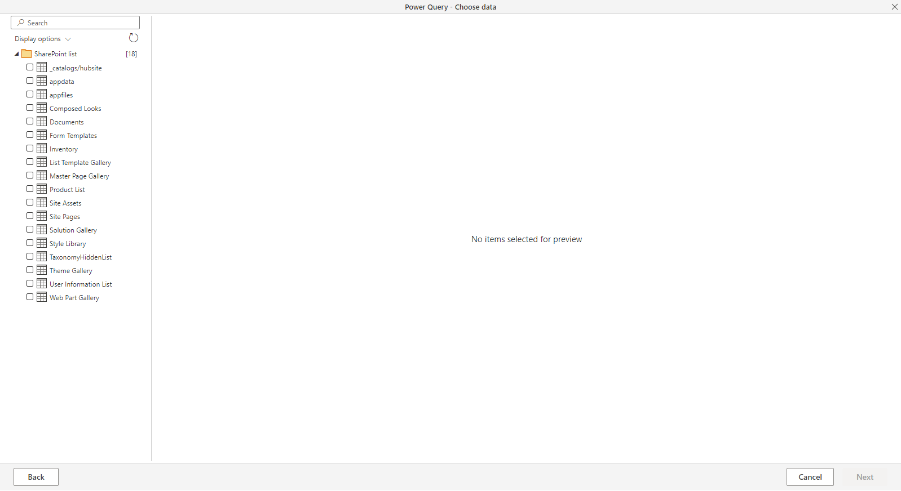
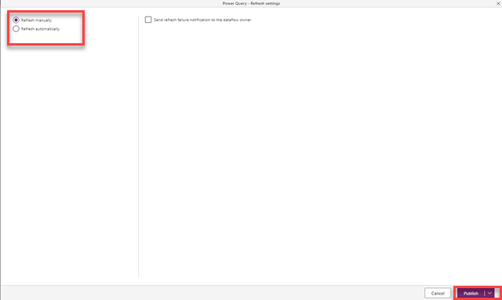

تدفق البيانات هو مجموعة من الجداول التي يتم إنشاؤها وإدارتها في بيئات ضمن خدمة Power Apps. يمكنك إضافة جداول وتحريرها في تدفق البيانات، وإدارة جداول تحديث البيانات، مباشرةً من البيئة التي تم إنشاء تدفق البيانات فيها.

بمجرد إنشاء تدفق بيانات في بوابة Power Apps، يمكنك الحصول على البيانات منها باستخدام موصل Dataverse أو موصل Power BI Desktop لتدفق البيانات استناداً إلى الوجهة التي اخترتها عند إنشاء تدفق البيانات.

توجد ثلاث خطوات أساسية لاستخدام تدفق البيانات:

1. اكتب تدفق البيانات في بوابة Power Apps. لقد قمت بتحديد الوجهة لتحميل بيانات الإخراج إلى المصدر للحصول على البيانات من خطوات Power Query لتحويل البيانات باستخدام أدوات Microsoft التي تم تصميمها لإجراء ذلك مباشرةً.

1. تم تشغيل جدولة تدفق البيانات. هذا هو معدل التكرار الذي يجب أن يقوم فيه تدفق بيانات Power Platform بتحديث البيانات التي سيقوم تدفق بياناتك بتحميلها وتحويلها.

1. استخدم البيانات التي قمت بتحميلها إلى وجهة التخزين. يمكنك إنشاء تطبيقات وتدفقات وتقارير Power BI ولوحات معلومات أو الاتصال مباشرةً بمجلد Common Data Model لتدفق البيانات في مستودع مؤسستك باستخدام خدمات بيانات Azure مثل Azure Data Factory أو Azure Databricks أو أي خدمة أخرى تدعم معيار مجلد Common Data Model.

## إنشاء تدفق بيانات
يتم إنشاء تدفقات البيانات في بيئة واحدة، وهذا يعني أنك سوف تكون قادراً على رؤيتها وإدارتها فقط من تلك البيئة. وإذا أراد أي مستخدم الحصول على البيانات من تدفقات البيانات هذه، يجب أن يتمكن من الوصول إلى البيئة التي تم إنشاء تدفقات البيانات فيها.

1.  سجِّل الدخول إلى مدخل Power Apps.

1.  قم بتحديد بيئة.

1.  في الجزء الأيسر، قم بتوسيع **Dataverse** وحدد **جداول**.

1. من القائمة العلوية، حدد **البيانات**.

1. حدد **الحصول على البيانات**.

1. من نافذة Power Query، حدد **قائمة SharePoint**.

    > [!div class="mx-imgBorder"]
    > 

1. بعد تحديد مصدر بيانات، ستتم مطالبتك بتوفير إعدادات الاتصال، بما في ذلك الحساب الذي سيتم استخدامه عند الاتصال بمصدر البيانات. حدد **التالي**.

    > [!div class="mx-imgBorder"]
    > 

1. بمجرد الاتصال، يمكنك تحديد البيانات لاستخدامها في الجدول الخاص بك. عند اختيار البيانات والمصدر، ستقوم خدمة تدفق بيانات Power Platform بإعادة الاتصال بمصدر البيانات من أجل الحفاظ على تحديث البيانات في تدفق البيانات الخاص بك، على معدل التكرار الذي تحدده لاحقاً في عملية الإعداد. حدد **التالي**.

    > [!div class="mx-imgBorder"]
    > 

1. والآن بعد أن قمت بتحديد البيانات لاستخدامها في الجدول، يمكنك استخدام **محرر تدفق بيانات Power Query** لتشكيل تلك البيانات أو تحويلها إلى التنسيق الضروري للاستخدام في تدفق البيانات.

    في المثال الخاص بي، لقد قمت بإزالة الأعمدة غير الضرورية. عند الانتهاء، حدد **التالي**.

    > [!div class="mx-imgBorder"]
    > 

    الآن، سيُطلب منك تعيين بياناتك، يمكنك تعيينها إلى جدول جديد أو تحميلها إلى جدول موجود أو عدم تحميلها.

1. في حالتنا، سوف نختار **تحميل البيانات في جدول جديد**. 

1. ضمن اسم الجدول، قم بتحديد اسم للجدول. يمكنك أيضاً توفير وصف الجدول.

    يساعد وجود عمود مفتاح أساسي في الكيان على تجنب التكرارات في صفوف البيانات. عمود المفتاح الأساسي هو عمود فريد وحتمي لصف البيانات في الكيان. 

1. ضمن تعيين العمود، من **عمود الاسم الأساسي الفريد**، حدد اسماً أساسياً. يمكنك أيضاً تحديد حقول المفتاح البديل، إذا أردت.

    في حالتنا، سنختار العنوان وسنحدد عمود المعرّف كمفتاح بديل.

1. ضمن **نوع عمود الوجهة**، تحقق من صحة نوع عمود الوجهة.

    > [!div class="mx-imgBorder"]
    > 

    بعد الانتهاء من التحديدات واكتمال الجدول وإعدادات البيانات الخاصة به، تكون مستعداً للخطوة التالية، وهي تحديد معدل تكرار تحديث تدفق البيانات. حدد **التالي**.
    
    بعد تحديد الجداول، ستحتاج إلى جدولة معدل تكرار التحديث لكل مصدر من مصادر البيانات المتصلة.
    
    تستخدم تدفقات البيانات عملية تحديث البيانات لتحديث البيانات بصفة مستمرة. يمكنك اختيار تحديث تدفق البيانات يدوياً أو تلقائياً ضمن فاصل زمني مجدول من اختيارك. 

1. في حالتنا، حدد **التحديث يدوياً**.

    يمكنك أيضاً تحديد ما إذا كنت تريد النشر الآن أو النشر لاحقاً.

1. حدد **نشر**.

    > [!div class="mx-imgBorder"]
    > 

1. لقد أصبح تدفق البيانات الخاص بك محدثاً الآن، ومتاحاً في قسم تدفقات البيانات.

1. إذا قمت بالانتقال إلى جداول Dataverse، سترى الجدول الذي نقوم بتعيين البيانات عليه. وبعد ذلك يمكنك التحقق من البيانات الخاصة بك في علامة تبويب البيانات كما هو موضح أدناه. 

