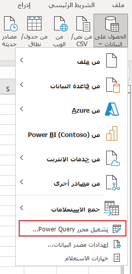
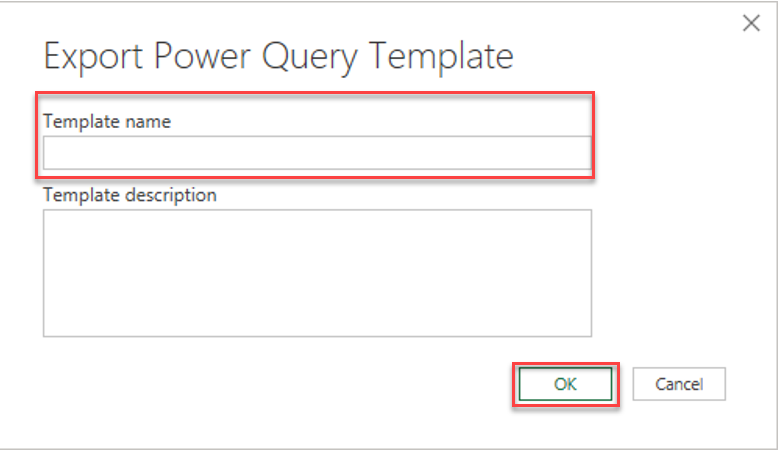

يمكنك إنشاء تدفقات بيانات Microsoft Power Platform من الاستعلامات في المصنفات Microsoft Excel. يمكنك الاستفادة من تدفقات البيانات المدعومة من السحابة التي تقوم بتحديث البيانات ومعالجتها على فترات منتظمة بدلاً من إجراء هذه العمليات يدويًا في Excel.

قد يكون العمل مع مجموعات البيانات الكبيرة أو الاستعلامات طويلة الأمد مرهقًا. في كل مرة يتعين عليك فيها تشغيل تحديث البيانات يدويًا في Excel، فإنه يأخذ موارد من جهاز الكمبيوتر الخاص بك، وعليك الانتظار حتى يتم إجراء الحساب للحصول على أحدث البيانات. يعد نقل عمليات البيانات هذه إلى تدفق بيانات Power Platform طريقة فعالة لتحرير موارد الكمبيوتر الخاص بك ولإتاحة أحدث البيانات بسهولة لتستهلكها في Excel.

## تصدير الاستعلامات في Excel إلى قالب Power Query

>[!NOTE]
>يتوفر تصدير القوالب التالية لمستخدمي Office Insider فقط.

تتمثل الخطوة الأولى في إنشاء قالب Power Query باستخدام استعلاماتك في Excel.

1. ابدأ تشغيل Power Query محرر من **علامة تبويب** البيانات > **الحصول على بيانات** > **تشغيل Power Query محرر**.

    > [!div class="mx-imgBorder"]
    > 

1. بمجرد تحميل Power Query، حدد الملف > **تصدير قالب**.

    > [!div class="mx-imgBorder"]
    > 

1. قم بتسميه القالب الخاص بك وإضافة وصف، وحدد **موافق**.

    > [!div class="mx-imgBorder"]
    > 

## إنشاء تدفق بيانات Power Platform من قالب Power Query

1. قم بتسجيل الدخول إلى مدخل Power Apps.

1. تحديد بيئة.

1. في جزء التنقل الأيمن، حدد **Dataverse** > **تدفقات البيانات**.

1. من شريط الأدوات، حدد **تدفقات البيانات الجديدة** > **استيراد قالب**.

    > [!div class="mx-imgBorder"]
    > 

1. حدد قالب Power Query الذي قمت بإنشائه مسبقاً. سيتم ملء اسم تدفق البيانات مع اسم القالب المقدم. بمجرد الانتهاء من شاشة إنشاء تدفق البيانات، حدد **التالي** لرؤية استعلاماتك من Excel في محرر الاستعلام.

1. من الآن، اتبع الخطوات الموجودة في الفصل السابق حول إنشاء تدفق البيانات وعملية التكوين حتى تتمكن من إجراء المزيد من التحويل لبياناتك، وتعيين جداول التحديث في تدفق البيانات، وأي عملية تدفق بيانات أخرى ممكنة.
