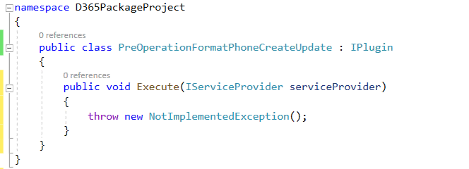
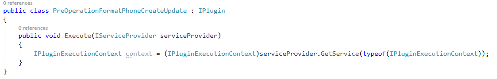
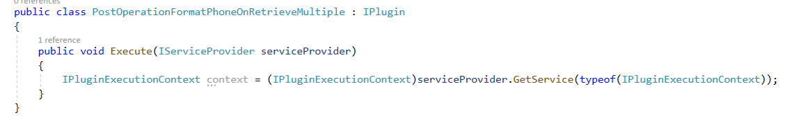

تحتاج المؤسسة في هذا السيناريو إلى التأكد من إدخال بيانات رقم الهاتف بتنسيقٍ متسق. وتحقيقاً لذلك الهدف، يتعين إنشاء مكون إضافي لتشغيل الإنشاء/التحديث الذي يعمل على إزالة جميع الأحرف غير الرقمية من رقم الهاتف قبل الحفظ إلى Common Data Service. وبعد ذلك، يتعين إنشاء مكون إضافي آخر والذي سيتم تشغيله على رسائل Retrieve وRetrieveMultiple‬ في "جهة الاتصال" لإعادة تنسيق رقم الهاتف ليتضمن الأقواس والشُرط، وذلك في حالة وجود البيانات. 

## <a name="exercise-1-createupdate-plug-in"></a>التمرين الأول: إنشاء/تحديث المكون الإضافي 

ستنشئ في ذلك التمرين مكوناً إضافياً والذي يتم تشغيله عند الإنشاء والتحديث. وسيعمل هذا المكون الإضافي على إزالة الأحرف غير الرقمية من رقم الهاتف.

يتألف كل تمرين من سيناريو وأهداف تعليمية. يصف السيناريو الغرض من التمارين، بينما يتم سرد الأهداف وتحتوي على نقاط.

> [!NOTE]
> وفي حال عدم توفر أدوات Dynamics 365 SDK، راجع [تنزيل الأدوات من NuGet](/dynamics365/customerengagement/on-premises/developer/download-tools-nuget) لتنزيلها.

### <a name="task-1-create-a-plug-in"></a>المهمة الأولى: إنشاء مكون إضافي

1.  قم بتشغيل Visual Studio 2019.

2.  حدد **ملف > جديد > مشروع**.

3.  حدد **مكتبة الفئات (NET Framework.)** وحدد **التالي**.

    > 

4.  أدخل عبارة **D365PackageProject** لـ **اسم المشروع**، وحدد موقعًا لحفظ المشروع، وحدد **.NET Framework 4.6.2** لـ **إطار العمل**، ثم حدد **إنشاء**.

    > 

5.  انقر بزر الماوس الأيمن على المشروع وحدد **إدارة حزم NuGet**.

    > 

6.  حدد علامة التبويب **استعراض**، وابحث عن **microsoft.crmsdk.coreassemblies** وحددها، ثم حدد **تثبيت**.

    > 

7.  اقرأ شروط الترخيص ثم حدد **قبول** عند موافقتك.

8.  أغلق مدير حزم NuGet.

9.  انقر بزر الماوس الأيمن فوق **Class1.cs** و **حذف**.

    > 

10. انقر بزر الماوس الأيمن فوق المشروع، ثم حدد **إضافة > فئة**.

11. ابدأ تسمية الفئة الجديدة **PreOperationFormatPhoneCreateUpdate** وحدد **إضافة**.

    > 

12. أضف عبارات الاستخدام إلى الفئة الجديدة كما يلي:

    ```c#
    using Microsoft.Xrm.Sdk;
    
    using System.Text.RegularExpressions;
    ```

13. جعل الفئة عامة وتنفيذ واجهة **IPlugin**.

    > 

14. ابدأ تنفيذ عضو الواجهة.

    > 

    من المفترض أن تبدو فئتك الآن مثل الصورة التالية.

    > 

### <a name="task-2-format-a-phone-number"></a>المهمة الثانية: تنسيق رقم الهاتف

1.  احصل على سياق التنفيذ من موفر الخدمة. استبدل الاستثناء الموجود في الأسلوب Execute بجزء التعليمة البرمجية المتكررة التالي.

    ```c#
    IPluginExecutionContext context =
    (IPluginExecutionContext)serviceProvider.GetService(typeof(IPluginExecutionContext));
    ```

    > 

2.  تحقق من صحة معلمة إدخال الهدف. أضف القصاصة البرمجية التالية إلى الأسلوب Execute.

    ```c#
    if (!context.InputParameters.ContainsKey("Target"))
    
    throw new InvalidPluginExecutionException("No target found");
    ```

3.  أضف القصاصة البرمجية التالية إلى الأسلوب Execute. سيحصل جزء التعليمة البرمجية المتكررة ذلك على الكيان الهدف من معلمة الإدخال، وبعد ذلك يتم التحقق مما إذا كانت سماته تحتوي على "الهاتف الأول" ("هاتف العمل الخاص بجهات الاتصال" و"الهاتف الخاص بالحسابات") من عدمه.

    ```c#
    var entity = context.InputParameters["Target"] as Entity;
    
    if (!entity.Attributes.Contains("telephone1"))
    
    return;
    ```

4.  أضف جزء التعليمة البرمجية المتكررة التالي إلى الدالة Execute. سيزيل جزء التعليمة البرمجية المتكررة هذا جميع الأحرف غير الرقمية من رقم الهاتف الذي قدمه المستخدم.

    ```c#
    string phoneNumber = (string)entity["telephone1"];
    
    var formattedNumber = Regex.Replace(phoneNumber, @"[^\d]", "");
    ```

5.  ابدأ تعيين "الهاتف الأول" إلى رقم هاتف منسق. أضف القصاصة البرمجية التالية إلى الأسلوب Execute.

    ```c#
    entity["telephone1"] = formattedNumber;
    ```
    سيبدو الأسلوب Execute الآن مثل الصورة التالية.

      > 

7.  انقر بزر الماوس الأيمن على المشروع وحدد **خصائص**.

    > 

8.  حدد علامة تبويب **التوقيع** وحدد **ملف مفتاح جديد**.

    > 

9.  أدخل **contoso.snk** في حقل **اسم ملف المفتاح**، وامسح خانة الاختيار **حماية ملف مفتاحي بكلمة مرور**، ثم حدد **موافق**.

    > 

10. أغلق علامة التبويب **الخصائص**.

11. قم ببناء المشروع وتأكد من نجاح البناء.

### <a name="task-3-register-a-plug-in-and-steps"></a>المهمة الثالثة: تسجيل مكون إضافي والخطوات

> [!NOTE]
> وفي حال عدم توفر أدوات Dynamics 365 SDK، راجع [تنزيل الأدوات من NuGet](/dynamics365/customerengagement/on-premises/developer/download-tools-nuget) لتنزيلها.

1.  ابدأ تشغيل أداة تسجيل المكونات الإضافية الموجودة في مجلد Dynamics 365 SDK.

    > 

2.  حدد **إنشاء اتصال جديد**.

    > 

3.  حدد **Microsoft 365**، وحدد خانة الاختيار **‬‏‫إظهار الخيارات المتقدمة**، وابدأ توفير بيانات اعتمادك، ثم حدد **تسجيل الدخول**.

    > 

4.  حدد **تسجيل** ثم حدد **تسجيل تجميع جديد**.

    > 

5.  حدد **استعراض**.

    > 

6.  استعرض لتصل إلى مجلد **الحاوية > تصحيح الأخطاء** في مكتبة الفئات التي أنشأتها، وحدد **D365PackageProject**، ثم حدد **فتح**.

    > 

7.  حدد **تسجيل المكونات الإضافية المُحددة**.

    > 

8.  حدد **موافق**.

    > 

9.  ابدأ توسيع التجميع المسجل حديثاً.

    > 

10. انقر بزر الماوس الأيمن فوق المكون الإضافي وحدد **تسجيل خطوة جديدة**.

    > 

11. حدد **إنشاء** لـ **الرسالة** وحدد **جهة اتصال** لـ **الكيان الأساسي**.

    > 

12. حدد **PreOperation** لـ **مرحلة تنفيذ ‏‫البنية الأساسية لبرنامج ربط العمليات التجارية للحدث‬** ثم حدد **تسجيل خطوة جديدة**.

    > 

13. انقر بزر الماوس الأيمن فوق المكون الإضافي وحدد **تسجيل خطوة جديدة** مرةً أخرى.

    > 

14. حدد **تحديث** لـ **الرسالة**، وحدد **جهة الاتصال** لـ **الكيان الأساسي**، ثم حدد البحث في **السمات**.

    > 

15. ابدأ إلغاء تحديد خانة الاختيار **تحديد الكل**، وحدد خانة الاختيار **هاتف العمل**، ثم حدد **موافق**.

    > 

16. حدد **PreOperation** لـ **مرحلة تنفيذ ‏‫البنية الأساسية لبرنامج ربط العمليات التجارية للحدث‬** ثم حدد **تسجيل خطوة جديدة**.

    > 

### <a name="task-4-test-a-plug-in"></a>المهمة الرابعة: اختبار مكون إضافي

1.  انتقل إلى مجلد **Dynamics 365** وقم بالتبديل إلى تطبيق **مركز CRM‬**.

    > 

2.  حدد **جهات الاتصال** ثم حدد **+ جديد**.

    > 

3.  أدخل **اختبار** لـ **الاسم الأول** و **جهة اتصال** لـ **اسم العائلة** و **(123)-555-0100** لـ **هاتف العمل**، ثم حدد **حفظ**.

    > 

    يجب حفظ السجل، ويجب أن يظهر **هاتف العمل** القيم الرقمية فقط.

    > 

5.  ابدأ تغيير **هاتف العمل** إلى **001-123-555-0100** وانتظر بضع ثوانٍ.

    > 

    يجب تحديث السجل، ويجب أن يظهر **هاتف العمل** القيم الرقمية فقط.

    > 

## <a name="exercise-2-createretrieve-multiple-plug-ins"></a>التمرين الثاني: إنشاء/استرداد مكونات إضافية متعددة 

ستنشئ في ذلك التمرين مكوناً إضافياً والذي يتم تشغيله عند الاسترداد والاسترداد المتعدد. سيضيف هذا المكون الإضافي الأقواس والشُرط إلى أرقام الهواتف.

يتألف كل تمرين من سيناريو وأهداف تعليمية. يصف السيناريو الغرض من التمارين، بينما يتم سرد الأهداف وتحتوي على نقاط.

### <a name="task-1-create-a-plug-in"></a>المهمة الأولى: إنشاء مكون إضافي

1.  ابدأ تشغيل Visual Studio.

2.  افتح المشروع الذي أنشأته في التمرين الأول.

3.  انقر بزر الماوس الأيمن فوق مشروع وحدد **إضافة > فئة**.

    > 

4.  في حقل **الاسم** أدخل **PostOperationFormatPhoneOnRetrieveMultiple** للفئة ثم حدد **إضافة**.

    > 

5.  أضف عبارات الاستخدام إلى الفئة الجديدة كما يلي:

    ```c#
    using Microsoft.Xrm.Sdk;
    ```

6.  جعل الفئة عامة وتنفيذ واجهة **IPlugin**.

    > 

7.  ابدأ تنفيذ عضو الواجهة.

    > 

    من المفترض أن تبدو فئتك الآن مثل الصورة التالية.

    > 

### <a name="task-2-format-phone-number-for-retrieve"></a>المهمة الثانية: تنسيق رقم الهاتف للاسترداد

1.  احصل على سياق التنفيذ من موفر الخدمة. استبدل الاستثناء الموجود في الأسلوب Execute بجزء التعليمة البرمجية المتكررة التالي.

    ```c#
    IPluginExecutionContext context =
    (IPluginExecutionContext)serviceProvider.GetService(typeof(IPluginExecutionContext));
    ```

    > 

2.  تحقق من ترميز الاسم بـ Retrieve أو RetrieveMultiple. أضف القصاصة البرمجية التالية إلى الأسلوب Execute.

    ```c#
    if (context.MessageName.Equals("Retrieve"))
    
    {
    
    }
    
    else if(context.MessageName.Equals("RetrieveMultiple"))
    
    {
    
    }
    ```

3.  تحقق مما إذا كانت معلمات الإخراج تحتوي على كيان أعمال وأنه نوع كيان من عدمه. ألصق جزء التعليمة البرمجية المتكررة التالي داخل الشرط `if` retrieve.

    ```c#
    if (!(context.OutputParameters.Contains("BusinessEntity") && context.OutputParameters["BusinessEntity"] is Entity)
    throw new InvalidPluginExecutionException("No business entity found"));
    ```

4.  احصل على الكيان وتحقق مما إذا كان يحتوي على الحقل telephone1 من عدمه. أضف جزء التعليمة البرمجية المتكررة التالي داخل الشرط `if` retrieve.

    ```c#
    var entity = (Entity)context.OutputParameters["BusinessEntity"]
    
    if (!entity.Attributes.Contains("telephone1"))
    
    return;
    ```

5.  أضف جزء التعليمة البرمجية المتكررة التالي إلى الشرط `if retrieve`. سيحاول جزء التعليمة البرمجية المتكررة هذا تحليل telephone1 بشكلٍ *طويل* وسيتم إرجاعه إذا لم تنجح عملية التحليل.

    ```
    if (!long.TryParse(entity["telephone1"].ToString(), out long
    phoneNumber))
    
    return;
    ```

    > 

6.  ابدأ تنسيق رقم الهاتف بإضافة الأقواس والشُرط. أضف جزء التعليمة البرمجية المتكررة التالي داخل الشرط `if retrieve`.

    ```
    var formattedNumber = String.Format("{0:(###) ###-####}",
    phoneNumber);
    
    entity["telephone1"] = formattedNumber;
    ```

    سيبدو جزء استرداد الأسلوب Execute الآن مثل الصورة التالية.

    > 

### <a name="task-3-format-phone-number-for-retrieve-multiple&quot;></a>المهمة الثالثة: تنسيق رقم الهاتف للاسترداد المتعدد

1.  أضف جزء التعليمة البرمجية المتكررة التالي إلى داخل شرط `retrieve multiple`.
    سيتحقق جزء التعليمة البرمجية المتكررة هذا مما إذا كانت معلمات الإخراج تحتوي على BusinessEntityCollection وإذا كانت من نوع EntityCollection.

    ```c#
    if (!(context.OutputParameters.Contains(&quot;BusinessEntityCollection") &&
    context.OutputParameters["BusinessEntityCollection"] is
    EntityCollection))
    
    throw new InvalidPluginExecutionException("No business entity
    collection found");
    ```

    > 

2.  احصل على مجموعة الكيانات من معلمات الإخراج. أضف جزء التعليمة البرمجية المتكررة التالي داخل الشرط `retrieve multiple`.

    ```c#
    var entityCollection =
    (EntityCollection)context.OutputParameters["BusinessEntityCollection"];
    ```

3.  ابدأ التكرار من خلال كل كيان في مجموعة الكيانات.

    ```c#
    foreach (var entity in entityCollection.Entities)
    
    {
    
    }
    ```

    > 

4.  أضف جزء التعليمة البرمجية المتكررة التالي داخل الشرط `foreach`. سيفعل جزء التعليمة البرمجية المتكررة ذلك نفس الشيء الذي يفعله الشرط `retrieve`.

    ```c#
    if (!entity.Attributes.Contains("telephone1"))
    
    return;
    
    if (long.TryParse(entity["telephone1"].ToString(), out long
    phoneNumber))
    
    {
    
    var formattedNumber = String.Format("{0:(###) ###-####}",
    phoneNumber);
    
    entity["telephone1"] = formattedNumber;
    
    }
    ```

    سيبدو جزء `retrieve multiple` للأسلوب Execute الآن مثل الصورة التالية.

    > 

6.  أعد إنشاء المشروع وتأكد من نجاح الإنشاء.

### <a name="task-4-update-plug-in-assembly-and-register-steps"></a>المهمة الرابعة: تحديث تجميع مكون إضافي وخطوات التسجيل

1.  أبدا تشغيل أداة تسجيل المكونات الإضافي وحدد **إنشاء اتصال جديد**.

    > 

2.  حدد **Microsoft 365**، وقدم بيانات اعتمادك، ثم حدد **تسجيل الدخول**.

3.  حدد التجميع الذي سجلته في التمرين الأول ثم حدد **تحديث**.

    > 

4.  حدد **استعراض**.

    > 

5.  استعرض للوصول إلى مجلد تصحيح الأخطاء لمشروعك، وحدد **D365PackageProject.dll** ثم حدد **فتح**.

    > 

6.  حدد المكونات الإضافية ثم حدد **تحديث المكونات الإضافية المُحددة**.

    > 

7.  حدد **موافق**.

    > 

8.  انقر بزر الماوس الأيمن فوق المكون الإضافي الجديد وحدد **تسجيل خطوة جديدة**.

    > 

9.  حدد **Retrieve** لـ **الرسالة** وحدد **جهة الاتصال** لـ **الكيان الأساسي**، ثم حدد **PostOperation** لـ **مرحلة تنفيذ ‏‫البنية الأساسية لبرنامج ربط العمليات التجارية للحدث**. تأكد من تحديد **متزامن‬** لـ **وضع التنفيذ** ثم حدد **تسجيل خطوة جديدة**.

    > 

10. انقر بزر الماوس الأيمن فوق المكون الإضافي وحدد **تسجيل خطوة جديدة** مرةً أخرى.

    > 

11. حدد **RetrieveMultiple** لـ **الرسالة** وحدد **جهة الاتصال** لـ **الكيان الأساسي**، ثم حدد **PostOperation** لـ **مرحلة تنفيذ ‏‫البنية الأساسية لبرنامج ربط العمليات التجارية للحدث**. تأكد من تحديد **متزامن‬** لـ **وضع التنفيذ**، ثم حدد **تسجيل خطوة جديدة**.

    > 

### <a name="task-5-test-the-plug-in"></a>المهمة الخامسة: اختبار المكون الإضافي

1.  انتقل إلى تطبيق **مركز CRM** وحدد **جهات الاتصال**.

    > 

2.  لن تتغير السجلات الموجودة التي لم تُحفظ بالتنسيق الجديد بسبب الشُرط. حدد **جديد**.

    > 

3.  اعمل على توفير المعلومات التالية ثم حدد **حفظ**.

    > 

    يجب حفظ السجل، كما يجب تطبيق التنسيق الجديد على المكون الإضافي.

    > 

5.  حدد **جهات الاتصال** مرةً أخرى.

    يجب أن يظهر السجل الذي أنشأته بالتنسيق الجديد.

    > 

7.  حدد إحدى جهات الاتصال الموجودة وافتحها.

    > 

8.  ابدأ تحرير **هاتف العمل** على النحو التالي:

    > 

9.  يجب حفظ السجل من خلال الحفظ التلقائي ويجب تطبيق التنسيق الجديد. حدد **جهات الاتصال** مرة أخرى.

    > 

    سيحصل الهاتف الذي جرى تحريره على التنسيق الجديد.

    > 
 
