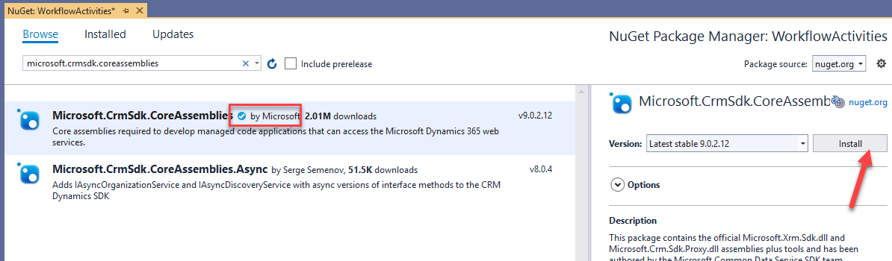
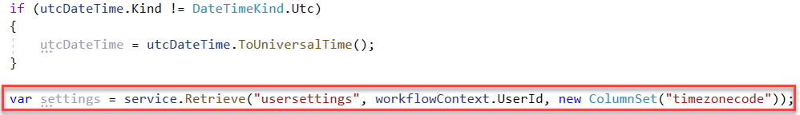
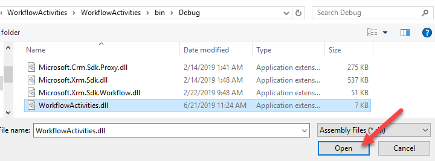
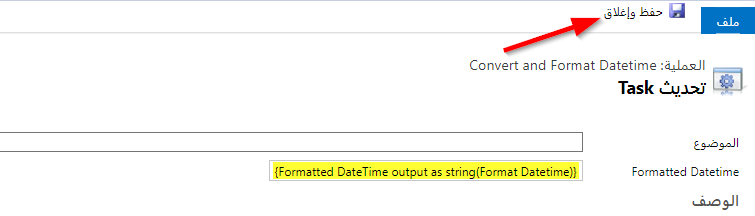
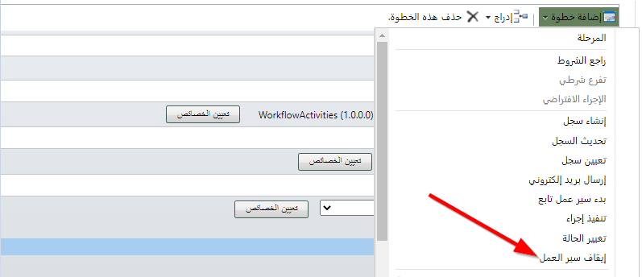

بشكل متكرر، يلزم إجراء تنسيق التاريخ على بيانات Microsoft Dataverse. بينما يعرض Power Automate بعض الميزات حول هذه العملية، فقد يكون من المناسب أحيانًا إنتاج ملحقات سير عمل مخصصة لتحقيق هذا الهدف (على سبيل المثال، إذا كان المنطق يحتاج إلى التشغيل بشكل متزامن داخل بيئتك).

## <a name="exercise-1-create-a-custom-activity"></a>التمرين 1: إنشاء نشاط مخصص 

ستنشئ في هذا التمرين نشاطًا مخصصًا من شأنه تحويل التاريخ والوقت إلى التوقيت المحلي للمستخدم، وتنسيقه كـالتالي: "الاثنين، 25 ديسمبر 2019"، ونشر القيمة المنسقة كسلسلة إلى مستهلك النشاط المخصص.

يتألف كل تمرين من سيناريو وأهداف تعليمية. يصف السيناريو الغرض من التمارين، بينما يتم سرد الأهداف وتحتوي على نقاط.

### <a name="task-1-create-a-custom-activity"></a>المهمة 1: إنشاء نشاط مخصص

1.  قم بتشغيل Visual Studio 2019.

2.  حدد **ملف > جديد > مشروع**.

3.  حدد **مكتبة الفئة (NET Framework.)** ثم حدد **التالي**.

    > 

4.  أدخل **WorkflowActivities** في حقل **اسم المشروع**، وحدد **.NET Framework 4.6.2** في القائمة المنسدلة **إطار العمل**، ثم حدد **إنشاء**.

    > 

5.  انقر بزر الماوس الأيمن على **Class1.cs** ثم حدد **حذف**.

    > 

6.  انقر بزر الماوس الأيمن على المشروع وحدد **إدارة حزم NuGet**.

    > 

7.  حدد علامة التبويب **استعراض**، وابحث عن **Microsoft.CRMSDK.CoreAssemblies** وحددها، ثم حدد **تثبيت**.

    > 

8.  حدد **أوافق** إذا وافقت على البنود.

9.  ابحث عن **Microsoft.CRMSDK.Workflow** وحدده ثم حدد **تثبيت**.

    > 

10. حدد **أوافق** إذا وافقت على البنود.

11. انقر بزر الماوس الأيمن على المشروع، وحدد **إضافة**، ثم حدد **الفئة**.

    > 

12. أدخل **ConvertFormatDatetime** في حقل **الاسم** ثم حدد **إضافة**.

    > 

13. قم بإضافة عبارات الاستخدام إلى الفئة كما يلي ثم اجعلها عامة.

    ```c#
    using Microsoft.Crm.Sdk.Messages;
    
    using Microsoft.Xrm.Sdk;
    
    using Microsoft.Xrm.Sdk.Query;
    
    using Microsoft.Xrm.Sdk.Workflow;
    
    using System.Activities;
    ```

    > 

14. استورد من **CodeActivity** ونفِّذ العضو التجريدي.
    سيمنع هذا الإجراء الأسلوب Execute للفئة الموروثة.

    > 

15. أضف القصاصة البرمجية التالي إلى الفئة. سيؤدي ذلك إلى إضافة وسيطة إدخال مطلوبة من النوع DateTime ووسيطة إخراج من النوع String.

    ```
    [RequiredArgument]
    
    [Input("DateTime input")]
    
    public InArgument<DateTime> DateToEvaluate { get; set; }
    
    [Output("Formatted DateTime output as string")]
    
    public OutArgument<String> ForammtedDateTimeOutput { get; set; }
    ```

    > 

16. استبدل NotImplementedException بالقصاصة البرمجية التالية.
 
    ```c#
    IWorkflowContext workflowContext =
    context.GetExtension<IWorkflowContext>();
    
    IOrganizationServiceFactory serviceFactory =
    context.GetExtension<IOrganizationServiceFactory>();
    
    IOrganizationService service =
    serviceFactory.CreateOrganizationService(workflowContext.UserId);
    ```

    > 

17. احصل على تاريخ ووقت الإدخال. أضف القصاصة البرمجية التالية إلى الأسلوب Execute.

    ```c#
    DateTime utcDateTime = this.DateToEvaluate.Get(context);
    ```

18. تحقق مما إذا كان تاريخ ووقت الإدخال هو **UTC**، إذا لم يكن كذلك، فقم بتحويله إلى **UTC**. أضف القصاصة البرمجية التالية إلى الأسلوب Execute.

    ```c#
    if (utcDateTime.Kind != DateTimeKind.Utc)
    
    {
    
        utcDateTime = utcDateTime.ToUniversalTime();
    
    }
    ```

    يجب أن يبدو الأسلوب Execute الخاص بك للتنفيذ الآن مثل الصورة التالية.

    > 

### <a name="task-2-get-user-settings-and-convert-datetime-to-user-local-datetime&quot;></a>المهمة 2: الحصول على إعدادات المستخدم وتحويل التاريخ والوقت إلى التاريخ والوقت المحلي للمستخدم

1.  احصل على TimeZoneCode للمستخدم لكيان إعدادات المستخدم. أضف القصاصة البرمجية التالية إلى الأسلوب Execute.

    ```c#
    var settings = service.Retrieve(&quot;usersettings&quot;,
    workflowContext.UserId, new ColumnSet(&quot;timezonecode") );
    ```

    > 

2.  قم بإنشاء طلب تغيير المنطقة الزمنية عن طريق توفير الوقت **Utc** الذي حصلت عليه من الإدخال و **TimeZoneCode** من إعدادات المستخدم.

    ```c#
    LocalTimeFromUtcTimeRequest timeZoneChangeRequest = new
    LocalTimeFromUtcTimeRequest()
    
    {
    
    UtcTime = utcDateTime,
    
    TimeZoneCode = int.Parse(settings["timezonecode"].ToString())
    
    };
    ```

    > 

3.  قم بتشغيل طلب تغيير المنطقة الزمنية.

    ```c#
    LocalTimeFromUtcTimeResponse timeZoneResponse =
    service.Execute(timeZoneChangeRequest) as LocalTimeFromUtcTimeResponse;
    ```

4.  قم بتنسيق **LocalTime** من استجابة المنطقة الزمنية وتعيينها إلى إخراج النشاط.

    ```c#
    this.ForammtedDateTimeOutput.Set(context, String.Format("{0:f}",
    timeZoneResponse.LocalTime));
    ```

    من المفترض أن تبدو فئتك الآن مثل الصورة التالية.

    > 

6.  انقر بزر الماوس الأيمن على المشروع وحدد **خصائص**.

    > 

7.  حدد علامة التبويب **التوقيع** وحدد خانة الاختيار **التوقيع على التجميع**، وحدد **جديد** في القائمة المنسدلة **اختر ملف مفتاح اسم قوي**.

    > 

8.  أدخل **contoso.snk** في حقل **اسم ملف المفتاح**، وامسح خانة الاختيار **حماية ملف مفتاحي بكلمة مرور**، ثم حدد **موافق**.

    > 

9.  قم ببناء المشروع وتأكد من نجاح البناء.

## <a name="exercise-2-register-and-consume"></a>تمرين 2: تسجيل واستهلاك 

ستقوم في هذا التمرين بتسجيل نشاط سير العمل، وإنشاء حل وإعداده، وإنشاء سير عمل، ثم اختبار سير العمل والنشاط المخصص.

### <a name="task-1-register-the-workflow-activity"></a>المهمة 1: تسجيل نشاط سير العمل

1. انتقل إلى مجلد Dynamics 365 SDK الخاص بك وافتح المجلد **PluginRegistration**.

2. انقر نقرًا مزدوجًا على **PluginRegistration.exe**.

    > 

3. حدد **إنشاء اتصال جديد**.

    > 

4. حدد **Microsoft 365**، وقدم بيانات اعتمادك، ثم حدد **تسجيل الدخول**.

5. حدد **تسجيل** ثم حدد **تسجيل تجميع جديد**.

    > 

6. حدد **استعراض**.

    > 

7. استعرض للوصول إلى مجلد تصحيح الأخطاء لمشروعك **WorkflowActivities**، وحدد **WorkflowActivities.dll**، ثم حدد **فتح**.

    > 

8. حدد **تسجيل المكونات الإضافية المُحددة**.

    > 

9. حدد **موافق**.

    > 

### <a name="task-2-create-and-prepare-a-solution"></a>المهمة 2: إنشاء حل وإعداده

1.  انتقل إلى [https://make.powerapps.com](https://make.powerapps.com/?azure-portal=true) وتأكد من عدم تحديد البيئة الافتراضية.

2.  حدد **الحلول** ثم حدد **حل جديد**.

    > 

3.  أدخل **Contoso WFA** في الحقل **‏‫اسم العرض**، وأدخل **ContosoWFA** في حقل **الاسم**، ثم حدد القائمة المنسدلة **الناشر**.

    > 

4.  حدد **+ الناشر**.

    > 

5.  أدخل **Contoso** في الحقل **‏‫اسم العرض**، وأدخل **contoso** في حقل **البادئة**، ثم حدد **حفظ وإغلاق**.

    > 

6.  حدد القائمة المنسدلة **الناشر** مرة أخرى وحدد الناشر الذي قمت بإنشائه.

    > 

7.  أدخل **1.0.0.0** في حقل **الإصدار** ثم حدد **إنشاء**.

    > 

8.  افتح الحل الذي قمت بإنشائه.

    > 

9.  حدد **إضافة موجود**، ثم حدد **كيان**.

    > 

10. ستستخدم الكيان **مهمة** لنص نشاط سير العمل. حدد **مهمة**، ثم حدد **التالي**.

    > 

11. حدد الخيار **تحديد المكونات**.

    > 

12. حدد علامة التبويب **نماذج**، ثم حدد النموذج **مهمة**، ثم حدد **إضافة**.

    > 

13. حدد **إضافة** مرة أخرى.

    > 

14. حدد لفتح كيان **المهمة** الذي قمت توا بإضافته إلى حلك.

    > 

15. حدد علامة التبويب **الحقول** ثم حدد **+ إضافة حقل**.

    > 

16. أدخل **التاريخ والوقت المنسق** في حقل **اسم العرض**، حدد **نص** من القائمة المنسدلة **نوع البيانات**، ثم حدد **تم**.

    > 

17. حدد الزر **حفظ كيان**.

    > 

18. حدد علامة التبويب **نماذج**، ثم حدد لفتح نموذج **المهمة**.

    > 

19. اسحب حقل **الوقت والتاريخ المنسق** إلى النموذج ثم قم بوضعه أسفل حقل **الموضوع**.

    > 

20. حدد **حفظ**.

    > 

21. حدد **نشر** وانتظر حتى اكتمال النشر.

22. أغلق علامة تبويب أو نافذة متصفح محرر النماذج.

23. حدد **تم**.

    > 

### <a name="task-3-create-a-workflow"></a>المهمة 3: إنشاء سير العمل

1.  حدد **حلول** وافتح الحل الذي قمت بإنشائه.

    > 

2.  حدد الزر علامة الحذف (**...**) وحدد **التبديل إلى الكلاسيكي**.

    > 

3.  حدد **العملية** ثم حدد **جديد**.

    > 

4.  أدخل **تحويل وتنسيق التاريخ والوقت** في حقل **اسم العملية**، وحدد **سير العمل** من القائمة المنسدلة **الفئة**، وحدد **المهمة** من القائمة المنسدلة **الكيان**، وامسح خانة الاختيار **تشغيل سير العمل هذا في الخلفية (مستحسن)**، ثم حدد **موافق**.

    > 

5.  حدد خانة الاختيار **كعملية حسب الطلب** وحدد **المؤسسة** من القائمة المنسدلة **النطاق**.

    > 

6.  حدد **إضافة خطوة** ثم حدد **‏‫التحقق من الشرط**.

    > 

7.  أدخل **تحقق ما إذا كان تاريخ الاستحقاق يحتوي على قيمة** كوصف ثم حدد **تكوين**.

    > 

8.  قم بتعيين الشرط كما هو موضح في الصورة التالية ثم حدد **حفظ وإغلاق**.

    > 

9.  حدد أدناه عبارة الشرط.

    > 

10. حدد **إضافة خطوة** ثم حدد **نشاط سير العمل المخصص** الذي قمت بإنشائه.

    > 

11. قم بتوفير وصف ثم حدد **تعيين الخصائص**.

    > 

12. حدد حقل **القيمة**، ثم حدد **تاريخ الاستحقاق**، ثم حدد **إضافة**.

    > 

13. حدد **موافق**.

    > 

14. حدد **حفظ وإغلاق**.

    > 
15. حدد الخطوة التي قمت بإضافتها، ثم حدد **إضافة خطوة**، ثم حدد **تحديث السجل**.

    > 

16. قم بتوفير وصفًا، وتأكد من تحديد **المهمة** للكيان في القائمة المنسدلة **تحديث**، ثم حدد **تعيين الخصائص**.

    > 

17. حدد الحقل **التاريخ والوقت المنسق**، وحدد **تنسيق التاريخ والوقت** من القائمة المنسدلة **البحث عن**، ثم حدد **إضافة**.

    > 

18. حدد **موافق**.

    > 

19. حدد **حفظ وإغلاق**.

    > 

20. حدد الخطوة التي قمت بإضافتها، ثم حدد **إضافة خطوة**، ثم حدد **إيقاف سير العمل**.

    > 

21. حدد خطوة الشرط، وحدد **إضافة خطوة**، ثم حدد **الإجراء الافتراضي**.

    > 

22. حدد أسفل **خلاف ذلك**، ثم حدد **إضافة خطوة**، ثم حدد **إيقاف سير العمل**.

    > 

23. يجب أن يبدو سير عملك الآن مثل الصورة التالية. حدد **حفظ**.

    > 

24. حدد **تنشيط**.

25. تأكيد التنشيط.

26. حدد **إغلاق**.

    > 

27. حدد **نشر كل التخصيصات** وانتظر حتى يكتمل النشر.

    > 

28. أغلق النافذة **مستكشف الحلول**.

### <a name="task-4-test-the-workflow-and-custom-activity"></a>المهمة 4: اختبار سير العمل والنشاط المخصص

1.  انتقل إلى [https://make.powerapps.com](https://make.powerapps.com/?azure-portal=true) وتأكد من أنك لست في البيئة الافتراضية.

2.  حدد **التطبيقات** وحدد لفتح تطبيق **مركز CRM**.

    > 

3.  حدد **الأنشطة**، ثم حدد **المهمة**.

    > 

4.  أدخل **اختبار المهمة** لـ **الموضوع**، وحدد تاريخ ووقت **الاستحقاق**، ثم حدد **حفظ**.

    > 

5.  يجب تشغيل نشاط سير العمل المخصص وتعبئة الحقل **التاريخ والوقت المنسق**. يجب أن تكون قيمتا تاريخ **الاستحقاق** و **التاريخ والوقت المنسق** متطابقتين.

    > 

6.  حدد **الإعدادات** ثم حدد **إعدادات التخصيص**.

    > 

7.  قم بتغيير **المنطقة الزمنية** إلى منطقة أخرى ثم حدد **موافق**.

    > 

8.  يجب إعادة تحميل المهمة. يجب أن تتغير قيمة الحقل **تاريخ الاستحقاق** إلى المنطقة الزمنية المحددة تلقائيًا، ولكن يجب ألا تتغير قيمة **التاريخ والوقت المنسق**.

    > 

9.  حدد **سير العمل** ثم حدد سير العمل الذي قمت بإنشائه.

    > 

10. حدد **موافق**.

    > 

11. حدد **تحديث**.

    > 

    يجب أن تكون قيمتا تاريخ **الاستحقاق** و **التاريخ والوقت المنسق** متطابقتين.

    > 
 
