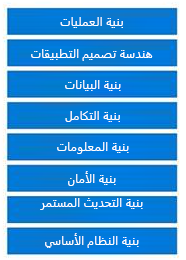

يشكّل اقتراح الحل المرحلة التالية المنطقية في المشروع. في هذه المرحلة، ليس لديك على الأرجح تفاصيل كافية لتخطيط المتطلبات طويلة الأجل. ومع ذلك، يمكنك بناء إثبات مبدأ أو بعض تطبيقات إثبات المبدأ.

وبينما تتصوّر الحلول، تذكّر الأنظمة والتطبيقات الموجودة والتي لن تتغيّر. علاوةً على ذلك، عليك تحديد إن كان هناك قيود يجب التغلب عليها، أو نظام قديم لا يمكنك تجنبه أو لوائح يجب الامتثال لها.

### التخصيص في مقابل الامتداد

أثناء مرحلة ما قبل البيع، يمكنك إنشاء حل يتطلب عدة تخصيصات و/أو ملحقات تتلاءم مع متطلبات العميل. ومع ذلك، فإن التخصيصات و/أو الملحقات الكثيرة قد تتحوّل إلى مشكلة تقنية يتعين عليك حلها لاحقاً وبإمكانها أن تؤدي في أغلب الأحيان إلى عدم رضا العملاء. تؤدي التخصيصات إلى زيادة إجمالي تكلفة الملكية، وبالتالي من الضروري تعيين سابقة في هذه المرحلة مع التوضيح أنه، في ضوء  
"التكلفة الفعلية"، ستساعد العميل على القيام بالخيارات المناسبة حول كيفية المضي قدماً مع متطلب معين. عادةً، عندما تشرح مقاربة جاهزة أبسط (وأقل تكلفة)، سيقدر العملاء صدقك.
كما يمكنك إنشاء بعض القواعد حول عملية اتخاذ القرارات المتعلقة بإجراء التخصيصات. على سبيل المثال، إذا كان تكوين إحدى الميزات ستستغرق أكثر من يومين أو إذا كانت هذه الميزة تتطلب كتابة تعليمات برمجية، فيجب الموافقة عليها من قبل CTO. ستؤدي مقاربة من هذا النوع إلى بناء ثقة أكبر بينك وبين العميل.

> [!VIDEO https://www.microsoft.com/videoplayer/embed/RE4o9Lf]

قد يأخذ مهندس الحلول زمام المبادرة (أو على الأقل يشارك) في توثيق متطلبات العملاء. ويجب أن يبدأ التوثيق باكراً في العملية. أحد المستندات هو برنامج عمل الحل. وبحسب مواصفات الحل، سيعالج برنامج العمل جوانب كثيرة من الحل. على سبيل المثال، سيكون لمشروع بناء نموذجي برنامج عمل يتناول الكهرباء والسباكة والأحمال والكثير من جوانب البناء الأخرى. تتضمن هندسة حلول Dynamics 365 أيضاً مجموعة من برامج العمل المهمة الضرورية لنجاح تقديم الحل الأمثل لعملائك.

سيقضي مهندس الحلول الكثير من الوقت في تطوير برنامج عمل الحل من خلال معالجة المعلومات التي يتم تلقيها أثناء مرحلة الاكتشاف لإنتاج مجموعة من المخططات والتأكيد الهندسي. تشكّل المخططات والتأكيدات برنامج عمل الحل الذي سيتم تسليمه.

كما تبيّنه الصورة التالية، يجب أن يتضمن مستند برنامج العمل الهندسات الملائمة لاحتياجات العميل.

يناقش القسم المتبقي من هذه الوحدة النمطية الموضوعات التالية:

-   تحديد مكونات الحل

-   تطوير إثبات المبدأ والتحقق من صحته

-   تحديد مكونات جهة خارجية محتملة

-   التعرف على نقاط القوة ونقاط الضعف في حل

## تقديم عميلك

تشير هذه الوحدة النمطية إلى العميل Woodgrove Bank، وتتعلق التمارين والمناقشات خلال الدرس بهذا العميل وكيف يمكنك مساعدته.

يملك Woodgrove Bank مكاتب في 14 ولاية أمريكية بالإضافة إلى مكتب في المملكة المتحدة وآخر في ألمانيا. ويُعد Woodgrove Bank موفراً عالمياً رائداً للخدمات المالية مع التركيز على الإقراض التجاري والاستثمارات. يعمل المستخدمون الإداريون في المكتب ولا يتنقلون أبداً. ومع ذلك، يجب أن يكون جميع المدراء من المستوى المتوسط ​​قادرين على العمل من مكاتبهم المنزلية أو أثناء تواجدهم في الموقع مع أحد العملاء. يشعر الفريق في Woodgrove بأنه غارق في أنظمته المتباينة؛ لذلك، فهو يبحث عن حل يربط بياناته بطريقة تعزز النجاح المالي ورضا العملاء. من خلال عملية نشر داخلية فقط، سيكون لدى بنك Woodgrove Bank مخاوف تنظيمية أقل؛ ومع ذلك، سيكون لكل فريق داخل البنك مسؤولياته الخاصة.

يصف الجدول التالي الفرق الموجهة نحو العملاء في Woodgrove Bank.

| الفريق                                      | الوصف                                                                                                                                                                                                                                                        |
|-------------------------------------------|--------------------------------------------------------------------------------------------------------------------------------------------------------------------------------------------------------------------------------------------------------------------|
| نمو الأعمال وإدارة الأصول      | الحسابات التجارية التي تقل فيها قيمة الحركات السنوية عن مليار دولار. يشير النمو في هذا المعنى إلى القروض المستخدمة لإعادة الاستثمار في الشركة.  يشارك هؤلاء العملاء مجموعة من مدراء الحسابات؛ لا يتم تعيينهم إلى فرد واحد.              |
| Fortune 500                               | تم تعيين مدير حسابات أول لكل عميل في هذا القسم كجهة اتصال رئيسية لجميع الأمور البنكية الهامه.  بعد إدارة إحدى الشركات في هذا القسم، تبقى فيه، حتى لو غادرت قائمة Fortune 500.                                        |
| إدارة محافظ المجموعة                | يقوم هذا الفريق بإدارة الحسابات الأصلية/التابعة للشركات التي لديها مؤسسات متعددة تحت مظلة مشتركة.                                                                                                                                                         |
| تطوير الأعمال الجديدة                  | يعمل هذا القسم على التسويق للأعمال الجديدة بشكل أساسي. وعنما يصبح أحد الحسابات مؤهلاً ونشطاً، ينتقل إلى فريق الإدارة المناسب.                                                                                                                    |
| القطاع العام/الحكومة/التعليم العالي | يُعد Woodgrove جهة الإقراض المفضلة للعديد من الحكومات ذات السيادة في جميع أنحاء العالم وكذلك الجامعات الخاصة.  ويميل هذا الفريق أيضاً إلى عدد قليل من المؤسسات غير الربحية ذات الحجم الكبير التي يخدمها البنك.                                                              |
| إقراض المستهلك                          | هذا الفريق هو الأصغر لأن Woodgrove يركز على المنتجات التجارية. ومع ذلك، تتوفر قروض المستهلكين الكبيرة الحجم كبيرة على أساس كل حالة على حدة.  لا يتم الإعلان عن هذا الفريق لدى العملاء المتوقعين الخارجيين، ولكن يتم استخدامه في الغالب من قبل المدراء التنفيذيين للعملاء من الشركات. |
| مدراء العلاقات                     | يتكون هذا الفريق من أعضاء من كل الفرق الأخرى، وهذا ما يضمن الحصول على تجربة متناسقة لأن الحسابات قد تتنقل بين الفرق وتتفاعل بطرق أخرى.  يؤسس هذا الفريق أيضاً أفضل الممارسات للمستخدمين.                                                |
| مركز الاتصال للتصعيد                    | يدير البنك مركز اتصال على مدار الساعة والأسبوع والسنة. يعمل في هذا المركز فريق مكون من خمسة أشخاص مدير واحد وأربعة من ممثلي خدمة العملاء (CSR) في كل من شيكاغو وفرانكفورت، بالإضافة إلى فريقين في مركز يستند إلى مصادر خارجية في مانيلا (الفلبين) يعملان في نوبة عمل باكرة ومتأخرة لتغطية منطقة آسيا والمحيط الهادئ.             |

بالإضافة إلى هذه الفرق، توجد لدى Woodgrove Bank مجموعة قياسية من C-Suite Executives الذين يشاركون في العمليات البنكية الشاملة ويدعمون الفرق حسب الحاجة.

يأمل Woodgrove Bank أن يكون النظام الجديد في مرحلة تجريبية حتى يتمكن المدير التنفيذي من تقديم النتائج الأولية إلى الاجتماع العام السنوي (AGM) في غضون أربعة أشهر.

