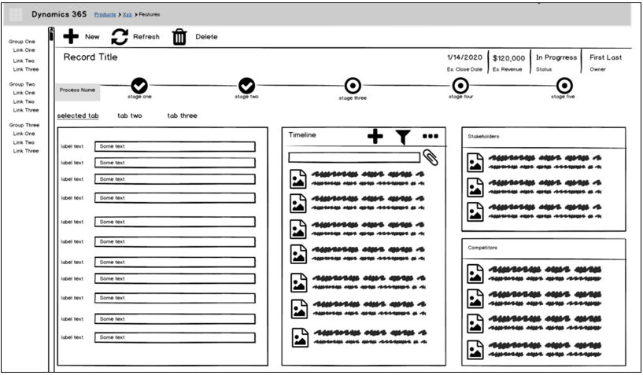
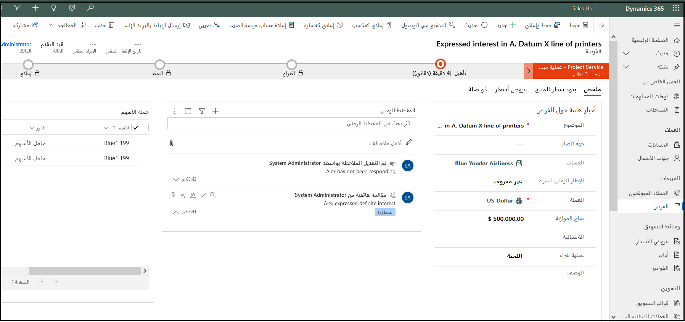

أثناء عملية الاكتشاف، يجب أن تبدأ بعض أفكار الحلول في أن تصبح واضحة. تناقش هذه الوحدة كيفية تحديد مكونات الحل التي قد تشكل الحل المقترح للعميل. نظراً لأن هذه لا تزال مرحلة ما قبل البيع للمشروع، فإن هدفك هو أن توضح للعميل الشكل الذي سيبدو عليه الحل المقترح بعد بنائه ثم شرح كيف سيلبي الحل أهدافه. إنه أيضاً وقت مناسب لبدء التفكير في خارطة طريق المنتج وحول كيفية تنفيذ المكونات لإظهار قيمة سريعة عبر التكرارات.

### الخريطة تحتاج إلى وظائف

من خلال اجتماعاتك مع العميل، يجب أن تكون قد استوعبت احتياجاته الأساسية. لتحديد المكونات، يجب التفكير في هذه الاحتياجات على مستوى عالٍ ومطابقتها مع تطبيقات Dynamics 365 الحالية، أو تطبيق Microsoft Power Platform المخصص، أو في بعض الحالات، بالتطوير المخصص.
بالنسبة للمشاريع الأكبر حجماً، قد تحتاج إلى التعيين إلى تطبيقات متعددة أو الفئات الثلاث جميعها.

ليست كل المشاريع تبدأ من البداية. العديد منها لديها أنظمة قائمة وتقوم ببساطة بتعزيز أو تكامل مع ما هو موجود بالفعل. على سبيل المثال، قد يكون لدى العميل Dynamics 365 Customer Service ويقوم بإضافة بعض ميزات القناة الشاملة لتلبية حاجة محددة.

قد يتم تعيين بعض الاحتياجات إلى أكثر من تطبيق واحد. قد تجد أن خرائط جانب المبيعات إلى Dynamics 365 Sales، مع تعقب العمولة والدفع من التحسينات على تطبيق Dynamics 365 Finance الحالي.

كن حذراً بشأن تعيين أو اقتراح أن يستبدل العميل أو يضيف تطبيقاً آخر يكرر شيئاً لديه بالفعل. قد تكون تساعد العميل لهذا السبب، وهو أمر مقبول. ومع ذلك، إذا كان العميل لديه بالفعل نظام ERP غير تابع لـ Microsoft، واقترحت إضافة Dynamics 365 Finance لأنه يجعل نشر الحل أسهل، فلن يتم قبول اقتراحك بشكل جيد.

بالنسبة لمكونات الحل الرئيسية، نوصي بتسليط الضوء على مكان استخدام الوظائف الجاهزة وحيث تكون الجوانب المخصصة مطلوبة. على سبيل المثال، يجب أن تحدد ما إذا كنت تستخدم ميزات مبيعات قياسية لكل شيء باستثناء مكون المنتج.
بعد ذلك، بالنسبة لمكون المنتج، يمكنك إبراز الحل المقترح، على سبيل المثال، وجود PowerApp مخصص مضمن في التطبيق أو ربما تقديم حل مُكوِّن تابع لجهة خارجية.

### استخدام الصور لشرح الأفكار المعقدة

يمكنك إنشاء رسم تخطيطي/صورة من صفحة واحدة تصف الحل بطريقة يسهل فهمها. قم بتضمين الأشخاص المختلفين الذين يتفاعلون مع النظام بحيث يكون من الواضح كيف سيتم استخدام الحل من قبل أشخاص مختلفين. تجنب إضافة الكثير من التفاصيل، مما قد يجعل من الصعب النظر إلى الرسم التخطيطي/الصورة وقد يؤدي إلى تعقيد أفكارك بشكل مفرط. إذا حافظت على رسمك التوضيحي موجزاً ​​ومصقولاً، فسيصبح نقطة مرجعية للمناقشات المستقبلية وسوف يميزك خلال المنافسة. في الأماكن التي يلزم فيها مزيد من التفاصيل، يمكنك إنشاء مخططات ذات صلة يمكن أن تركز على مناطق معينة.

### نمذجة البيانات

تحدث نمذجة البيانات الرسمية كجزء من تصميم الحل وعادةً بعد إبرام العقد. ومع ذلك، خلال مرحلة ما قبل البيع، يتم وضع تصور لنمذجة البيانات عالية المستوى باستمرار لتحديد الأجزاء الكبيرة من البيانات والمكان الذي قد تنتمي إليه. إذا تم إثبات المفهوم، فغالباً ما يتم استخدام هذا الجهد لوضع نموذج أولي لما يتم عرضه للعميل. يتم أيضاً نقل رؤى نموذج البيانات هذه إلى عملية التصميم لبدء عملية التفكير في نمذجة البيانات.
ضع في اعتبارك وجود نموذج بيانات تفصيلي وملخص لمشاركته. سيتم استخدام النموذج التفصيلي من قبل أولئك الذين يصممون ويبنون النظام.
ستتم مشاركة نموذج الملخص مع حملة الأسهم الذين يحتاجون إلى فهم الحل ولكنهم لا يحتاجون إلى تفاصيل محددة.

### عملية النمذجة

أثناء الاكتشاف، يجب أن تكون قد تعرفت أيضاً على العمليات الرئيسية للعميل.
عندما تقترح حلاً، من الضروري أن تكون قادراً على سرد قصة عن كيفية تحقيق الحل المقترح للعمليات التجارية الرئيسية الخاصة به بشكل أساسي.

في بعض الحالات، قد تكون عمليتك المقترحة مشابهة للعملية الحالية للعميل؛ ومع ذلك، في كثير من الأحيان، سوف تختلف. أثناء تحديدك لمكونات الحل، يعد إبراز الاختلافات الرئيسية أمراً مهماً ويجب أن يتضمن كيفية تحقيق تغييرات العملية المقترحة للأهداف المحددة، مثل حل الحالات بشكل أسرع بنسبة 20 في المائة مع إبقاء العملاء أكثر إطلاعاً.

### تجربة المستخدم

سيركز العملاء دائماً على تجربة المستخدم. أثناء الاكتشاف، يجب أن تكون قد التقطت تفاصيل مثل ما إذا كان المستخدمون دائماً متنقلين، أو في بعض الأحيان يتجولون، أو لا يتنقلون مطلقاً، أو غير ذلك من احتياجات تجربة المستخدم الفريدة.
أثناء تحديد مكونات الحل المقترحة، من المهم تعيين هذه الاحتياجات. عند الضرورة، يجب توضيح هذه المكونات بإثبات مفهوم أو إطار سلكي يوضح الحل الذي تقترحه.

قد تتضمن الإطارات السلكية العناصر التالية:

-   النماذج الأساسية

-   لوحات المعلومات

-   تجربة الهاتف المحمول

-   الرسوم المرئية (على سبيل المثال، Power BI)

تعرض الصورة التالية مثالاً للإطار السلكي والنموذج الفعلي الذي ستنشئه من الإطار السلكي.

### ‏‫عمليات تكامل‬

لا توجد معظم الحلول بمعزل عن غيرها وتعتمد على عمليات تكامل داخلية أو خارجية. كجزء من تحديد مكونات الحل، يجب أن تكون قادراً على تمييز كيفية التعامل مع عمليات الدمج هذه. قد تتضمن هذه العملية تحديد الأدوات أو الخدمات التي سيتم استخدامها لإكمال عمليات الدمج. في حل متعدد الأنظمة، تحتاج إلى تحديد حدود واضحة حيث ينتهي أحد الأنظمة ويبدأ نظام آخر. تصبح هذه الحدود "عقوداً" بين المسؤولين عن بنائها وصيانتها. ركز على ما يحدث على هذه الحدود وحاول أن تحدد بوضوح من تقع على عاتقه مسؤولية بناء واجهات ومن سيستهلكها. هذا التوضيح مهم بشكل خاص عند مشاركة موردي الطرف الثالث أو فرق التطوير الداخلية.

### خيارات النشر

توفر Microsoft نموذجاً يستند إلى الاشتراك لـ Microsoft Dynamics 365.
باستخدام هذا الخيار، يمكنك الوصول إلى Dynamics 365 من السحابة دون الحاجة إلى مزيد من الاستثمار في أجهزة شبكة تكنولوجيا المعلومات وترخيص البرامج. لا يلزم نشر التطبيق محلياً، وسيتمكن المستخدمون من الوصول إلى Dynamics 365 من مستعرضات متعددة. يمكن أن يكون هذا الوصول أمراً بالغ الأهمية للموظفين عن بُعد أو خارج الموقع الذين يحتاجون إلى وصول سهل.

ومع ذلك، يمكن نشر Dynamics 365 Finance وDynamics 365 Supply Chain Management (المعروف سابقاً باسم Dynamics 365 Finance and Operations) محلياً، مما يعني أنه يمكن للمؤسسة نشر التطبيقات محلياً.

بالنسبة لتطبيقات Dynamics 365 التالية، يجب عليك استخدام Lifecycle Services للنشر:

-   Dynamics 365 Finance

-   Dynamics 365 Supply Chain Management

-   Dynamics 365 Commerce

بالنسبة لتطبيقات الأعمال Dynamics 365 الأخرى، مثل القائمة التالية، ستكون عمليات التوزيع الأساسية عبر الإنترنت باستخدام مجموعة بيئات تطوير واختبار وإنتاج قياسية:

-   Dynamics 365 Sales

-   Dynamics 365 Customer Service

-   Dynamics 365 Marketing

-   Dynamics 365 Field Service

يمكنك أيضاً إنشاء بيئة تجريبية ومنحها ممارسة عملية، مما سيسمح لك بإعداد نظامك وتشغيله في غضون أيام بدلاً من أسابيع أو شهور. لم تعد مضطراً إلى التعامل مع الصيانة المستمرة للخادم أو رسوم الترخيص. بالإضافة إلى ذلك، يمكنك شراء تراخيص المستخدم الخاصة بك مباشرة عبر الإنترنت دون المرور بمورد، ويمكنك إضافة المزيد من المستخدمين عبر الإنترنت حسب حاجتك إليهم ومع نمو عملك.

تقدم تطبيقات الأعمال Dynamics 365 أنواعاً متعددة من البيئات.
يشير نوع البيئة إلى الغرض ويحدد خصائص البيئة:

-   **‏‫إصدار تجريبي** - تدعم البيئات التجريبية احتياجات الاختبار على المدى القصير ويتم تنظيفها تلقائياً بعد فترة قصيرة من الوقت.

-   **بيئة الاختبار المعزولة** - هي بيئات غير إنتاجية، وعند اقترانها بمثيل قاعدة بيانات Microsoft Dataverse تقدم ميزات مثل إعادة التعيين.

-   **الإنتاج** - يُستخدم للعمل الدائم في المؤسسة. يمكن إنشاؤها وامتلاكها بواسطة مسؤول أو أي شخص مرخص له باستخدام ترخيص Power Apps.

-   **افتراضي‬** - بيئة تشغيل غير مخصصة. سيكون لكل مستأجر بيئة افتراضية يتم إنشاؤها تلقائياً.

-   **المطور** - تم إنشاء بيئات المطورين بواسطة مستخدمين لديهم ترخيص Community Plan. يتم استخدامها فقط من قبل المالك. المشاركة مع مستخدمين آخرين غير ممكنة في هذه البيئات.

### Microsoft Dynamics ‏Lifecycle Services 

تساعدك Microsoft Dynamics ‏Lifecycle Services على إدارة دورة حياة التطبيق لتطبيقات Microsoft Dynamics ‏365 Finance وMicrosoft Dynamics 365 Supply Chain Management. إن Lifecycle Services عبارة مدخل تعاون يستند إلى Microsoft Azure ويوفر بيئة ومجموعة من الخدمات التي يتم تحديثها بانتظام. توفر هذه البوابة مساحة عمل تعاونية يمكن للعملاء وشركائهم استخدامها لإدارة مشاريع Finance وSupply Chain Management. تدعمك Lifecycle Services من مرحلة ما قبل البيع إلى مرحلة التنفيذ ثم إلى بيئة التشغيل، إما على السحابة أو في أماكن العمل. باستخدام قوائم المراجعة والأدوات، تساعدك Lifecycle Services في إدارة المشروع، بما في ذلك توفير منهجيات مسبقة الإنشاء للمساعدة على التنفيذ.

تدعم Lifecycle Services قدراً أكبر من القدرة على التنبؤ والتعاون والإجراءات الهيكلية لإدارة التطبيق. الهدف من Lifecycle Services هو التحرك نحو تطبيقات يمكن التنبؤ بها وقابلة للتكرار وعالية الجودة من خلال تبسيط عملية التنفيذ وتوحيدها.

### الخطوات التالية

سيساعدك تحديد مكونات الحل الرئيسية على تحديد خطواتك التالية. على سبيل المثال، يمكنك تحديد خطواتك التالية بناءً على ما إذا كان لديك حلول جاهزة للعرض التجريبي تحتاج إلى تخصيصها للعميل أو إذا كنت تقوم ببناء دليل جديد على المفهوم/النموذج الأولي.

الهدف من هذه العملية ليس إنشاء تصميم مفصل للحل الكامل. تذكر، هذا لا يزال قبل البيع. تريد أن تكون قادراً على سرد قصة كيف سيتعامل اقتراحك مع احتياجات عميلك وأن يكون لديك ما يكفي من الحل المحدد. سيساعدك وجود هذه المعلومات على تحديد أي سعر يجب القيام به حتى تتمكن من الوصول إلى عقد موقّع ثم المضي قدماً في بناء الحل.

## تدريب: تحديد الاستخدامات الشائعة بين فرق Woodgrove Bank

راجع ملف تعريف عملاء Woodgrove Bank، وتحديداً الفرق التي تواجه العملاء والتي تم وصفها. حدد الموضوعات المشتركة في الفرق. حدد ما إذا كانت أي فرق تتداخل في الوظائف المطلوبة. قم بتقييم ما إذا كان أي فريق فردي مختلفاً تماماً عن الآخرين بحيث يتطلب حلاً منفصلاً.
