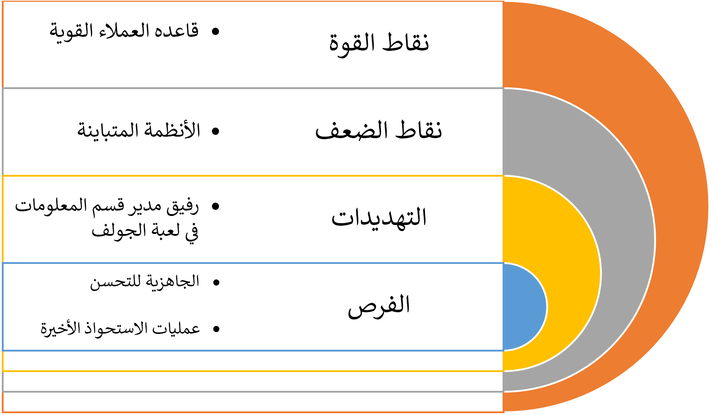

أحد التحديات التي يواجهها مهندس الحلول هو أن يصبح قريباً جداً من الحل الذي اقترحه أو صممه بحيث لا يعكس نقاط قوته وضعفه. لذا، عند وضع النقاط الرئيسية أثناء المشروع، من الجيد التوقف مؤقتاً وتقييم ما تقوم بتصميمه. من الناحية المثالية، ينبغي عليك  
طلب المساعدة من مهندس حلول آخر في عملية التقييم، وعلى الأرجح، قد يطلب منك أن تفعل نفس الشيء معه.

### معالجة أهداف المؤسسة

لا ينبغي أن تكون الأهداف الرئيسية للمشروع واسعة النطاق بحيث لا يمكنك إجراء فحوصات فردية للتأكد من أنك تقوم على معالجتها. كما يجب أن تفكر في مدى نجاحك في معالجة الأهداف، والتأكد من عدم إضافة المزيد من المعلومات لتسليط الضوء بشكل أفضل على كيفية تلبية حلك لاحتياجات العميل. قد يكون لدى مهندس حلول آخر من حين لآخر حل بديل إبداعي يستحق التضمين، أو قد يكون قادراً على تحديد ما إذا كنت قد قمت بتضمين عناصر لا تُفيد أهدافك وبالتالي فهي غير ضرورية.

### زيادة الحل للمشكلة

بشكل دوري، يحب مهندسو الحلول حل المشكلات المتعلقة بالحلول (التطبيقات) بالطريقة التي يرتاحون لها. راجع مكونات الحل المقترحة للتأكد من أنك لم تقترح تطبيقاً أو حلاً تم إنشاؤه مسبقاً غير متناسب مع الاحتياجات.

### تخصيص تطبيق مقابل استخدام تطبيق تم إنشاؤه مسبقاً

إذا كانت لديك أجزاء أكبر من الحل تم تحديدها كمكونات مخصصة، فحدد ما إذا كانت أي أجزاء قد تكون مناسبة بشكل أفضل لتطبيق Dynamics 365 أو AppSource موجود.
خلال الإطار الزمني المسبق لما قبل البيع على وجه الخصوص، يعد اقتراح حل مع عدد قليل من الخيارات طريقة ممتازة للتحدث من خلال الجوانب الإيجابية والسلبية لكل نهج مع العميل.

### مقارنة الحل المقترح مع المنافسة

في حين أنه قد يكون من الأفضل أن تكون الشريك الوحيد الذي يُطلب منه اقتراح حل، فمن المحتمل أنه يتم تقييم العديد من الخيارات في وقت واحد. أثناء مراجعة ما قبل البيع للحل المقترح، ضع في اعتبارك تحليل كيفية مقارنة حلك بحلول الآخرين. يُحتمل أن تواجه منافسة من الآخرين الذين يقترحون حلول Microsoft ومن البائعين المنافسين المماثلين أيضاً. كن مستعداً للأسئلة حول منافسيك ويُعد إعداد أعضاء فريق المبيعات الآخرين لكيفية مقارنة حلك بحلول المنافسين أمراً مفيداً.

### فرص المؤسسة

أثناء مرحلة الاكتشاف، يُحتمل أن يشارك عميلك بعض التحديات التنظيمية الأخرى. عندما يكون الحل المقترح مناسباً، راجع هذه التحديات لتحديد ما إذا كان يمكن إضافة أي منها إلى نطاق اقتراحك باعتباره مكاسب سهلة.

### إعادة بناء نظام غير ذي صلة 

تحتاج المؤسسات في بعض الأحيان إلى الانتقال من الأنظمة القديمة القائمة إلى تقنيات أكثر حداثة. ومع التغييرات الحالية في التقنيات، والتقدم السريع في الذكاء الاصطناعي، والسرعة العالية، والسعة المتزايدة، يُعد التقدم إلى نظام حديث تغييراً مهماً يمكن إعادة تخيله. قم بتقييم اقتراحك للتأكد من أنك لم تقم عن غير قصد بإعادة بناء نظام قديم يحاول عميلك الابتعاد عنه.

### تحليل SWOT

ستشارك بشكل دوري أثناء المشروع في إنشاء تحليل نقاط القوه والضعف والفرص والتهديدات (SWOT). يمكن أن يكون هذا التحليل مفصلاً أو موجزاً. بعد الانتهاء عن قصد من بعض هذه التحليلات، يمكنك الاحتفاظ بقائمة ذهنية لكل من هذه العمليات أثناء تقدم المشروع.

قد يشبه تحليل SWOT الموجز لبنك Woodgrove المثال التالي: 

يمكنك استخدام المعرفة التي اكتسبتها من تحليل SWOT للمساعدة في توجيه مشروعك وقراراتك للحصول على أفضل النتائج.

## تمرين: تحديد المخاطر التي يتعرض لها بنك Woodgrove

بمجرد متابعة التعرف على المزيد حول بنك Woodgrove، تظهر بعض المخاطر. راجع جميع المخاطر التي حددتها حتى الآن بخصوص بنك Woodgrove وحدد الحل الذي يحتاجون إليه.

### ضع قائمة بخمسة مخاطر على الأقل تواجه بنك Woodgrove مع تنفيذ حل ناجح

فكر في الأسئلة التالية، والتي يمكن أن تساعد في ابتكار أفكار لقائمة المخاطر الخمسة:

-   هل لهذا المشروع أي مخاطر غير ملموسة؟

-   ما هي المنافسة المباشرة أو غير المباشرة التي يواجهها بنك Woodgrove؟

-   هل تمتلك شركتك المهارات اللازمة لإكمال المهمة لبنك Woodgrove؟

-   هل الجدول الزمني واقعي؟

-   هل الميزانية واقعية؟
