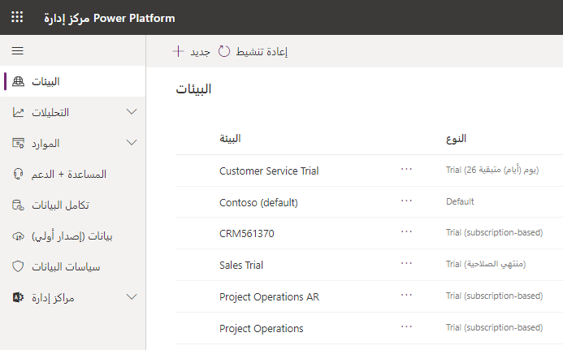
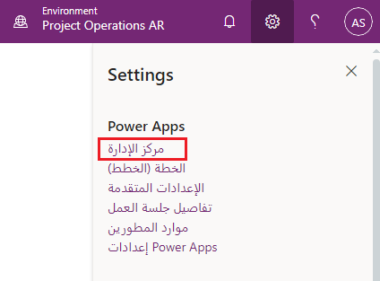

تتوفر معظم الإعدادات الإدارية التي تحتاج إليها في مدخل مسؤول Microsoft Power Platform. يجب عليك دائماً التحقق من الإعدادات الإدارية كخطوة أولى عندما تسعى إلى إدارة Dataverse.

تم تجميع الإعدادات في الفئات الواسعة التالية. ويمكن الوصول اليها من خلال تحديد الارتباط على الجانب الأيمن من المدخل.

-   **البيئات** - يسرد هذا القسم جميع مثيلات Microsoft Dataverse.

-   **التحليلات** - يقدم لك هذا القسم معلومات تحليلية حول بياناتك وتطبيقاتك ومهام سير عمل في جميع مثيلات Microsoft Dataverse. وهو يعرض معلومات مثل المستخدمين النشطاء وعمليات التشغيل والاستخدام ومعلومات الموقع.
-   **الموارد** - يوفر هذا القسم ارتباطات إلى أجزاء مفيدة من Microsoft Power Platform. يمكنك عرض السعة وإضافتها إلى بيئاتك، وعرض تطبيقات Dynamics 365 ومعلومات حول المداخل.

- **المساعدة + الدعم** - يمنحك هذا القسم طريقة سهلة لتلقي الدعم من Microsoft لأي احتياجات قد تكون لديك.

-   **تكامل البيانات** - يتيح لك هذا القسم إنشاء اتصالات محددة مسبقاً أو إضافتها ثم مراقبة هذه الاتصالات بين Dataverse ومصادر البيانات الأخرى مثل Salesforce أو SQL Server.

- **البيانات** - يوفر هذا القسم إمكانية الوصول إلى بوابة البيانات الداخلية، التي تعمل كجسر، مما يوفر عملية النقل السريع والآمن للبيانات بين البيانات المحلية وPower BI وPower Automate والتطبيقات المنطقية وPower Apps.
   
-   **سياسات البيانات** - يتيح لك هذا القسم إعداد سياسات لتقييد موصلات البيانات التي يمكن استخدامها مع Dataverse للحد من البيانات التي يمكن أن تتدفق إلى جداول Dataverse أو خارجها.

- **مراكز المسؤولين** - يقدم لك هذا القسم ارتباطات إلى مراكز مسؤولي Microsoft Power Platform.

> 

من خلال الخطوات التالية، خصص بعض الوقت لاستكشاف الخيارات المختلفة من خلال استعراض مركز المسؤولين وفتح كل قسم يظهر على الجانب الأيمن من المدخل.

1.  سجّل دخولك إلى [Power Apps](http://www.powerapps.com).

1.  حدد **مركز المسؤولين** تحت أيقونة الترس.

    > [!TIP]
    > يمكنك الانتقال مباشرةً إلى مركز مسؤولي Microsoft Power Platform على <https://admin.powerplatform.microsoft.com> ثم تسجيل الدخول.

    > 

1.  حدد الخيارات التي تظهر في الجانب الأيمن من مدخل مركز المسؤولين.
