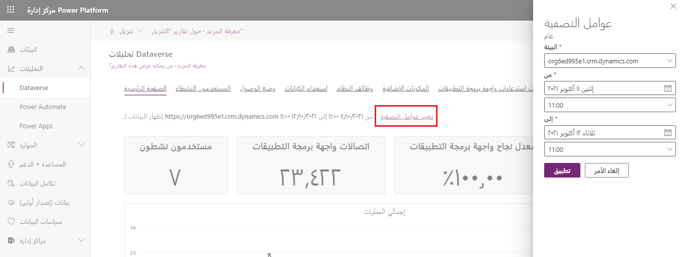

يتوفر مدخل الإدارة الثاني الذي يعرض بيانات الاستخدام في مدخل مسؤول Microsoft Power Platform المسمى مركز إدارة Microsoft Power Platform، والذي يتضمن تحليلات مثل التخزين والاستخدام والإعدادات لبوابات البريد.

### الإعدادات

1.  قم بتسجيل الدخول إلى [Microsoft Power Platform](https://admin.powerplatform.microsoft.com) مركز الإدارة.

2.  حدد **البيئات** على الجانب الأيسر من المدخل.

3.  حدد البيئة التي تريد إدارتها.

4.  حدد زر **الإعدادات**.

### التحليلات

1.  قم بتسجيل الدخول إلى مدخل مركز إدارة [Microsoft Power Platform](https://admin.powerplatform.microsoft.com) مركز الإدارة.

2.  حدد **تحليلات > Microsoft Dataverse** على الجانب الأيسر من المدخل.

3.  حدد أياً من خيارات القائمة ضمن **التحليلات**، بما في ذلك استخدام البيانات واستخدام الكيان والعديد من المقاييس الأخرى.

> [!TIP]
> يمكنك تغيير مثيل قاعدة البيانات (مصدر المقاييس المعروضة) عن طريق تحديد الارتباط التشعبي **تغيير عوامل التصفية**، كما هو موضح في لقطة الشاشة التالية.

> 
