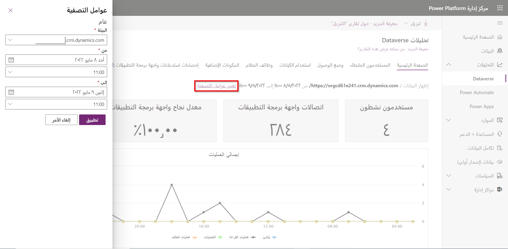

كما ذكرنا سابقاً، يوفر مركز مسؤولي Power Platform أدوات متنوعة يمكن للمسؤولين استخدامها لإدارة مستأجري Power Platform الخاصين بهم. أحد المجالات الرئيسية المتوفرة هو **التحليلات**. يوفر لك القدرة على عرض المعلومات المهمة المتعلقة بجميع البيئات والتطبيقات وعمليات التشغيل التلقائي. يتضمن ثلاثة خيارات:

-   **Dataverse:** يوفر تحليلاً للتفاصيل المهمة المتعلقة بمثيلات Dataverse المختلفة التي تم نشرها في بيئتك مثل المستخدمين النشطين ومكالمات واجهة API واستخدام صندوق البريد والمزيد.

-   **Power Apps:** يوفر تحليلاً متعلقاً بمعلومات أداء Power Apps، مثل مواقع التطبيقات وتفاصيل الموصلات والمزيد.

-   **Power Automate:** يوفر التحليل المتعلق بتدفقات Power Automate، مثل الاستخدام ومعلومات الخطأ وتفاصيل الموصل.

**العمل مع التحليلات**

يمكن للتقارير التحليلية فقط عرض البيانات المتعلقة ببيئة واحدة في كل مرة. يمكنك تغيير البيئة التي تريد العمل بها عن طريق تحديد الارتباط التشعبي لتغيير عوامل التصفية، كما هو موضح في لقطة الشاشة التالية.

بناءً على الخيار الذي حددته، سيكون لديك خيارات مختلفة متاحة في التقرير. على سبيل المثال، عند تحديد Dataverse، سيكون لديك علامات التبويب التالية:

-   **الصفحة الرئيسية:** لوحة معلومات افتراضية توفر معلومات عن عدد مستخدمي Dataverse النشطين، واستخدام التخزين، واستخدام API، ومكالمات المكونات الإضافية، والمزيد.

-   **المستخدمون النشطون:** يوفر معلومات حول عدد مستخدمي Dataverse النشطين، واستخدام التخزين، ومهام سير العمل الأكثر نشاطاً، والمزيد.

-   **وضع الوصول:** يوفر معلومات تتعلق بكيفية وصول المستخدمين إلى البيئة، مثل نوع المتصفح ونوع نظام التشغيل ونوع الجهاز والمزيد.

-   **استخدام الكيان:** يوفر معلومات حول جداول Dataverse الأكثر استخداماً في البيئة.

-   **وظائف النظام:** يوفر معلومات يمكن استخدامها لاستكشاف أخطاء سير العمل وإصلاحها.

-   **المكونات الإضافية:** يوفر المعلومات التي يمكن استخدامها لمراقبة المكونات الإضافية واستكشاف الأخطاء وإصلاحها.

-   **إحصاءات اتصالات واجهة برمجة التطبيقات:** يوفر المعلومات التي يمكن استخدامها لمراقبة واستكشاف أخطاء مكالمات API.

-   **استخدام صندوق البريد:** يوفر المعلومات المتعلقة بصناديق البريد الإلكتروني المختلفة التي يتم استخدامها في البيئة.

يمكنك معرفة المزيد حول العمل مع الخيارات التحليلية المختلفة المتاحة هنا:

-   [تحليلات Dataverse](/power-platform/admin/analytics-common-data-service)

-   [تحليلات Power Apps](/power-platform/admin/analytics-powerapps)

-   [تحليلات Power Automate](/power-platform/admin/analytics-flow)
