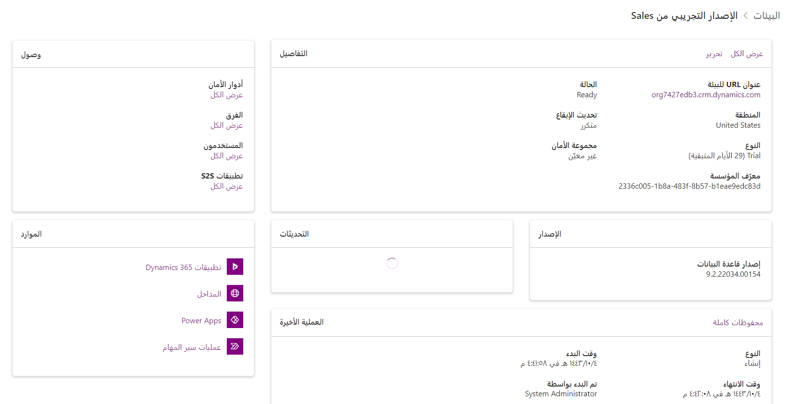
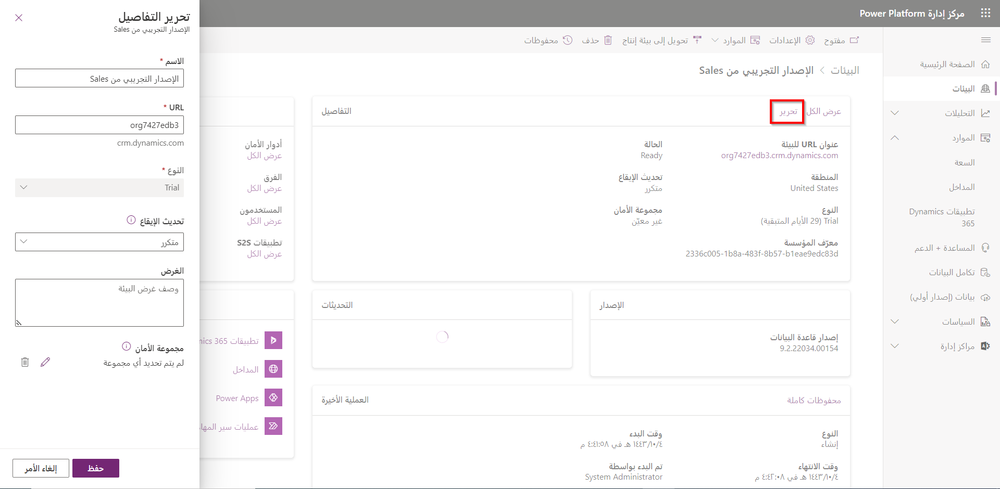
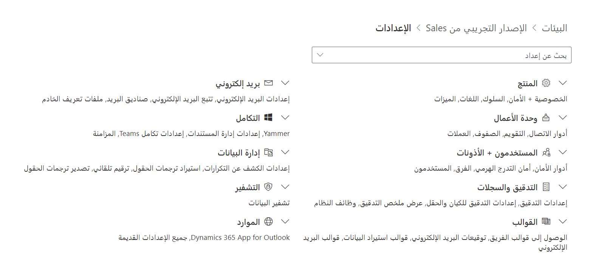

بصفتك مسؤولاً، هناك العديد من المهام المختلفة التي ستحتاج إلى القيام بها في بيئتك. على سبيل المثال، قد ترغب في تعديل إعدادات الأمان أو تمكين التدوين. يمكن إدارة العديد من هذه الإعدادات لكل بيئة في المستأجر الخاص بك من مركز مسؤولي Power Platform. ضمن البيئات، حدد البيئة التي تريد العمل معها. سينقلك هذا إلى شاشة تفاصيل البيئات، حيث يمكنك تحرير وإدارة تفاصيل محددة حول البيئة.

تم تقسيمها إلى سبعة أقسام مختلفة:

-   **التفاصيل:** توفر تفاصيل محددة لبيئتك مثل عنوان URL الخاص بالبيئة والنوع والحالة والمزيد.

-   **الوصول:** يوفر القدرة على التحكم في المستخدمين والفرق والتطبيقات الذين يمكنهم الوصول إلى البيانات في البيئة.

-   **التدقيق:** يوفر القدرة على إدارة إعدادات التدقيق في البيئة.

-   **الموارد:** توفر القدرة على إدارة الأصناف في بيئتك، مثل تدفقات Power Apps أو Power Automate.

-   **الإصدار:** يوفر تفاصيل حول إصدار قاعدة البيانات الحالي.

-   **التحديثات:** توفر تفاصيل متعلقة بإصدارات الموجه، التي يتم نشرها للبيئة.

-   **محفوظات العملية:** توفر معلومات تتعلق بالعمليات، التي تم إجراؤها على البيئة.

**تفاصيل البيئة**

في بعض الأحيان، قد تحتاج إلى إجراء تعديلات على بيئتك. على سبيل المثال، قد ترغب في تغيير عنوان URL إلى شيء يسهل على المستخدمين تذكره. يمكن تعديل هذا والتغييرات على عناصر مثل معدل التحديث عن طريق تحديد الزر **تحرير** في قسم **التفاصيل**.

في الجانب الأيمن، في قسم **الوصول**، يمكنك التحكم في **أدوار الأمان** و **الفِرق** و **المستخدمين** و **تطبيقات S2S (خادم إلى خادم)** وإدارتها عن طريق تحديد **عرض الكل** ضمن القسم المناسب

-   **أدوار الأمان:** تسمح لك بتخصيص أدوار أمان محددة سابقاً أو إنشاء أدوار أمان مخصصة خاصة بك.

-   **Teams:** يسمح لك بمنح أذونات الأمان لوحدات الأعمال بأكملها.

-   **المستخدمون:** يسمح لك بإضافة مستخدمين إلى بيئتك وتحديد أدوار الأمان الخاصة بهم.

-   **تطبيقات S2S (خادم إلى خادم):** تسمح لك بتوصيل بعض تطبيقات الويب بـ Dataverse.

تم شرح أدوار الأمان بالتفصيل في وحدة [الشروع في العمل باستخدام أدوار الأمان في Dataverse](https://docs.microsoft.com/en-us/learn/modules/get-started-security-roles/) في مسار التعليم هذا.

**التحديثات**

يبدأ Microsoft Power Platform عادةً موجات إصدار التحديث مرتين في السنة. تبدأ ميزات وتحديثات Wave 1 عادةً في أبريل، وتبدأ Wave 2 عادةً في أكتوبر. قبل الإصدار، تتوفر العديد من الميزات المضمنة في الإصدار للتجربة. بالنسبة للموجة 1، غالباً ما يبدأ هذا في فبراير، وبالنسبة للموجة 2 في أغسطس أو سبتمبر. يمكنك معرفة التحديثات التي تم نشرها حالياً في قسم تحديثات البيئة. عندما يتوفر تحديث، سيتم إدراجه هنا لتثبيته.

بالإضافة إلى العناصر التي تراها على الشاشة، يمكنك الوصول إلى جميع الإعدادات المتاحة لأي بيئة عن طريق تحديد الزر **إعدادات** في الجزء العلوي من الشاشة.

