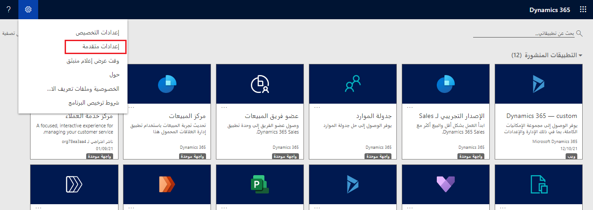
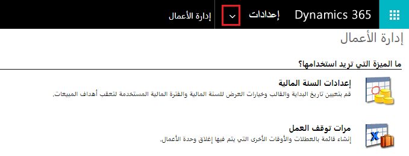
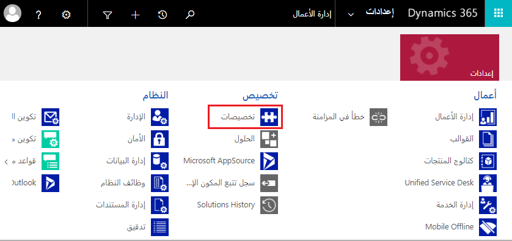
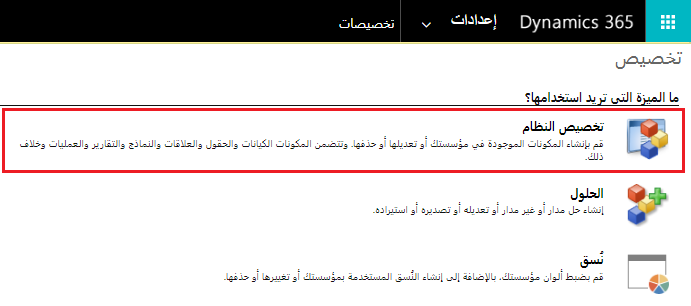
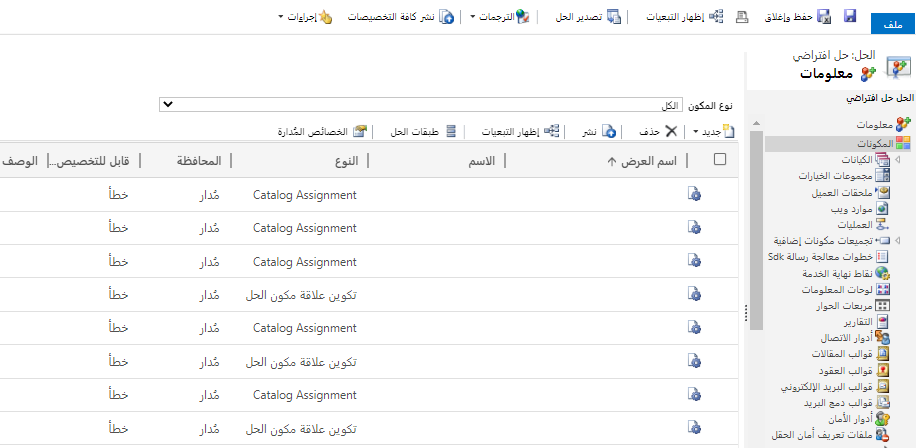

في بعض الأحيان، قد تحتاج إلى الانتقال إلى مركز "إدارة الحلول" لأن هذا هو مركز الإدارة الأصلي ولم يتم ترحيل بعض الإمكانات بعد إلى منطقتي الإدارة الأخريين. من خلال الخطوات التالية، يمكنك الوصول إلى منطقة الإدارة هذه.

1.  قم بتسجيل الدخول إلى Power Apps.

1.  حدد **مركز المسؤولين** تحت أيقونة الترس في القائمة.

1.  على الجانب الأيسر للصفحة في داخل "مركز المسؤولين"، حدد خيار **البيئات**.

1.  حدد البيئة الذي تريد إدارتها.

1.  حدد **عنوان URL الخاص بالبيئة**.

1.  ضمن أيقونة الترس في القائمة، حدد **الإعدادات المتقدم**.

    

1.  حدد سهم القائمة المنسدلة **الإعدادات**.

    

1.  حدد الخيار **التخصيصات**.

    

1. حدد **تخصيص النظام**، حسبما هو موضح في لقطة الشاشة التالية.

    

أنت الآن في مركز الإدارة الكلاسيكي مع العديد من الخيارات الإضافية غير المتوفرة في المداخل الأخرى.

