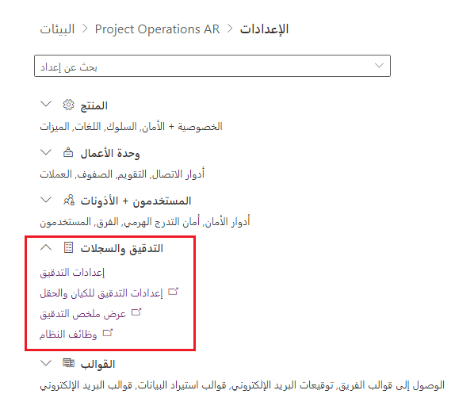
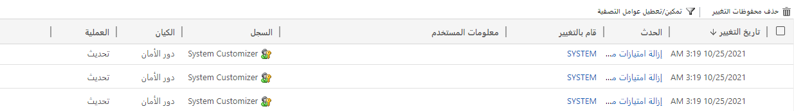
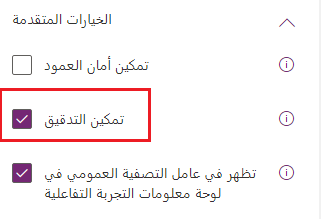
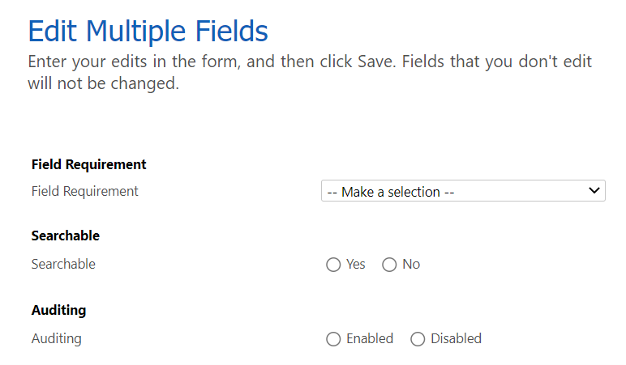
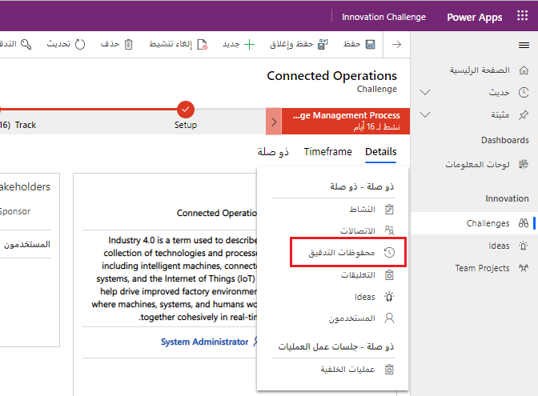
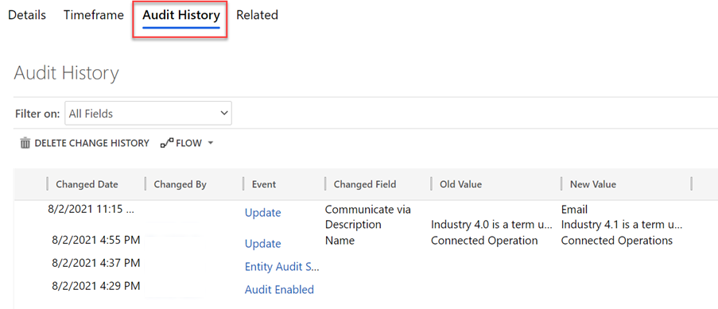
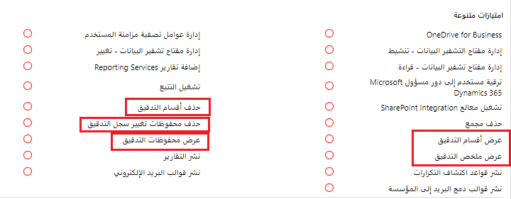

يمكن تمكين التدقيق على بيانات Microsoft Dataverse لتعقب التغييرات. يمكن استخدام التدقيق لتلبية متطلبات الامتثال أو ببساطة للسماح للمستخدمين بمعرفة البيانات التي تم تغييرها في صف واحد. تم تكوين تدقيق تغييرات البيانات على مستوى بيئة Dataverse والجدول والعمود. يمكن تمكين التدقيق وتعطيله فقط من قِبل شخص في دور "مسؤول النظام" أو "مخصص النظام".

بالإضافة إلى التدقيق عند تغيير البيانات، يدعم Dataverse أيضاً تدقيق وصول المستخدم لالتقاط تسجيل الدخول وقراءة التدقيق، مما يسمح بمراقبة استخدام البيانات من قِبل المستخدم. يتم عرض السجل لبيانات التدقيق هذه من [مركز الأمان والتوافق في Microsoft 365](/microsoft-365/compliance/microsoft-365-compliance-center).

في معظم الأحيان، يقوم المسؤول بتكوين التدقيق على مستوى البيئة، مثل تمكين أو تعطيل التدقيق، أو تحديد ما يجب تدقيقه. سيتم القيام بذلك في كل بيئة مستخدمة. على سبيل المثال، يمكنك تشغيل التدقيق بشكل فردي في بيئات التطوير والاختبار والإنتاج الخاصة بك. سيقوم صانع تطبيقات البناء وإدارة جدول Dataverse وتعريفات الجدول والأعمدة بتكوين تدقيق للجداول والأعمدة ذات الصلة. يمكن نقل أي إعدادات تدقيق تقوم بتكوينها للجداول والأعمدة عبر البيئات باستخدام الحلول. يضمن الحل الذي يتم استيراده للاختبار والإنتاج إعدادات تدقيق متسقة ويتجنب التكوين اليدوي في كل بيئة.

> [!NOTE]
> تعد إعدادات التدقيق للجداول والأعمدة على وعي بالحل وسيتم نقله مع المخطط أثناء تثبيت الحل في بيئة أخرى. ومع ذلك، يجب تمكين التدقيق لكل بيئة على مستوى البيئة حتى تعمل هذه الإعدادات على النحو المتوقع.

## إعدادات البيئة

يتم تعطيل التدوين افتراضياً في كل بيئة Dataverse ويجب تمكينه يدوياً باستخدام مركز مسؤولي Power Platform. لن يتم رصد بيانات تدقيق حتى إذا تم تكوين التدوين للجداول والأعمدة في البيئة، إذا تم تعطيله على مستوى البيئة.

يمكن تمكين وتعطيل تدقيق بيئة ما من [مدخل إدارة Power Platform](https://aka.ms/ppac) عن طريق تحديد بيئة واختيار الزر **إعدادات** في الجزء العلوي. يوفر قسم **التدقيق والسجلات** الوصول إلى ميزات التدقيق المختلفة.

## إعدادات التدقيق

توفر منطقة إعدادات التدقيق القدرة على تكوين إعدادات التدقيق الأساسية في البيئة. يمكنك القيام بما يلي:

-   **بدء التدقيق:** يُمكّن تدقيق تغيير البيانات ويستخدم سعة سجل Dataverse.

-   **تسجيل الوصول**: يسجل كلما تم الوصول إلى النظام. يتم ذلك عندما يقوم شخص ما بتسجيل الدخول إلى التطبيق.

-   **سجلات القراءة**: ترسل السجلات حتى يمكن عرضها في [مركز الأمان والتوافق في Microsoft 365](/microsoft-365/compliance/microsoft-365-compliance-center).

## ملخص التدقيق

تسمح طريقة عرض ملخص التدقيق للمسؤولين بعرض بيانات التدقيق التي تم جمعها عبر جميع جداول Dataverse في مكان واحد. يمكنك التنقل للأسفل ومعرفة قيَم الأعمدة التي تم تضمينها في إجراء التحديث، بالنسبة إلى أحداث البيانات التي تم تغييرها مثل التحديث.

يمكنك أيضاً الوصول إلى إعدادات تدقيق الكيان والحقل هنا لعرض التدقيق وتكوينه على مستوى الجدول والعمود. يُعد هذا أفضل استخدام للعرض، وإذا كنت بحاجة إلى التكوين، فيجب عليك اتباع الخطوات لاحقاً في هذه الوحدة وإجراء التغيير من مدخل المنشئ.

من الأمور المهمة التي يتم استخلاصها من منظور المسؤول أنه قد يكون لديك حق الوصول لتمكين التدقيق في بيئة التطوير ولكن ليس في البيئات الأخرى مثل الاختبار والإنتاج. بالنسبة إلى هؤلاء، يجب أن تعمل مع مسؤول البيئة لتمكين الإعداد. ليس من غير المألوف أن يتم تكوين تدقيق الجدول والعمود في التطوير وعدم تمكينه في البيئات الأخرى مما يتسبب في نقص رصد بيانات التدقيق.

## تمكين تدقيق الجداول والأعمدة

يتم تكوين التدقيق في الجداول والأعمدة وفقاً لتعريفاتها إما عند الإنشاء أو لاحقاً عن طريق تحرير الإعدادات. يتم تعقب حالة التدقيق كجزء من بيانات تعريف الجدول والعمود في الحلول التي تحتوي على الجدول. عند استخدام الحل لنقل التعريف من بيئة إلى أخرى مثل من بيئة التطوير إلى بيئة الاختبار، يتم تطبيق إعدادات التدقيق على البيئة الهدف. يمكن تعيين إعدادات التدقيق بواسطة أحدث الحلول، إذا كان لديك الجدول في حلول متعددة تم استيرادها إلى نفس البيئة المستهدفة. عندما تضم الحلول تكويناً مختلفاً لإعدادات التدقيق، يمكن لأحد الحلول تشغيلها ويمكن للحل الأحدث إيقاف تشغيلها. يجب توخي الحذر للتأكد أن جميع الحلول التي تحتوي على الجدول هي إعداد متسق لتكوين التدقيق.

بشكل افتراضي، تحتوي جداول Dataverse التي تم إنشاؤها على تدقيق معطّل. يمكنك تمكين تدقيق الجداول أو تعطيلها باستخدام مستكشف الحلول الكلاسيكي.
يتم تمكين التدوين لجميع الأعمدة المؤهلة لذلك الجدول عندما يتم تمكين التدوين لجدول. عند تحرير عمود، يمكنك العثور على مفتاح التدقيق ضمن قسم الخيارات المتقدمة في خصائص العمود.

يجب عليك نشر التغييرات للجدول أو نشر جميع التغييرات، بعد تغيير أيٍّ من تكوينات تدقيق العمود للتمكين أو التعطيل.

### تكوين الأعمدة المتعددة

إذا كنت بصدد تغيير عدة أعمدة، قد ترغب في استخدام الميزة "تحرير الحقول المتعددة" في مستكشف الحلول الكلاسيكي. من خلال تحديد عدة أعمدة في القائمة، يمكنك تمكين التدقيق أو تعطيله على كل شيء تم تحديده.

## تحديد متى يتم تمكين التدقيق أو تعطيله

يجب أن تفكر فيما إذا كان التدقيق سيكون ذا قيمة أم لا كجزء من إنشاء كل جدول. يكون لديك في أي وقت متطلبات امتثال حول تعقب من قام بتغيير البيانات وما يتم تدقيقه من تغييرات البيانات.
يمكن أن يكون التدقيق أيضاً شبكة أمان جيدة لاستعادة البيانات بسرعة دون الحاجة إلى الانتقال إلى نسخة احتياطية. فمثلاً، خيارك الوحيد لاستعادة البيانات هو استعادة نسخة احتياطية لمعرفة القيم، إذا قام مستخدم بتغيير سجل عن طريق الخطأ أو حذفه دون تدقيق. يمكنك استخدام بيانات سجل التدقيق باستخدام التدقيق لمعرفة طريقة إعادة بناء السجلات قبل التغيير أو الحذف.

يستهلك تدقيق تغييرات البيانات سعة سجل Dataverse. يتم الاحتفاظ ببيانات التدقيق على أساس فترة الاحتفاظ المكوّنة للبيئة. لا يتم تكوين الاستبقاء بحسب الجدول، لذلك إذا كان لديك جدول به تغييرات كبيرة أو كبيرة الحجم، فيجب أن تفكر بعناية في الأعمدة التي تتطلب تدقيقاً. يمكن حذف سجلات التدقيق، باستثناء السجل الحالي.

## عرض بيانات التدقيق

بالإضافة إلى تمكن المسؤولين من رؤية عرض ملخص عبر جميع الجداول من مدخل المسؤول، توفر التطبيقات المستندة إلى نماذج Power Apps أيضاً عرضاً موجزاً ​​متعلقاً بكل صف تم تمكين التدقيق فيه. يمكنك التنقل إلى عرض ملخص التدقيق لهذا الصف فقط، من علامة التبويب ذات الصلة في عرض نموذج الصف.

من هنا، يمكنك عرض ملخص لبيانات التدقيق للصف الحالي. من خلال تحديد صف، يمكن تصديره وبالنقر على الحدث يمكنك رؤية العرض التفصيلي لما تم تغييره وكذلك القيم القديمة والجديدة بالكامل. يمكن للمستخدمين ممن لديهم إذن حذف سجل التغييرات بالكامل للصف.

## تكوين أدوار الأمان للتدقيق

توفر أدوار الأمان امتيازات متعددة تتعلق بالتدقيق يمكن منحها للمستخدمين بحسب الحاجة. يتم تمكين بعض هذه الامتيازات افتراضياً لمخصص النظام ومسؤول النظام. يمكن العثور عليها في قسم "منوعات" في علامة التبويب "السجلات الأساسية". ضع في اعتبارك أنها تنطبق على جميع الجداول والصفوف والأعمدة عندما تمنح المستخدمين هذه الامتيازات.

> [!div class="mx-imgBorder"]
> 

لا بأس بقدر من التدقيق في معظم الحلول ويجب أن يكون جزءاً من الاعتبار في أي وقت تضيف فيه جدولاً أو عموداً جديداً إلى بيئة Dataverse.
يجب استشارة المسؤولين للتأكد من تمكين التدقيق وتهيئة فترات الاستبقاء لتلبية متطلبات العمل.
