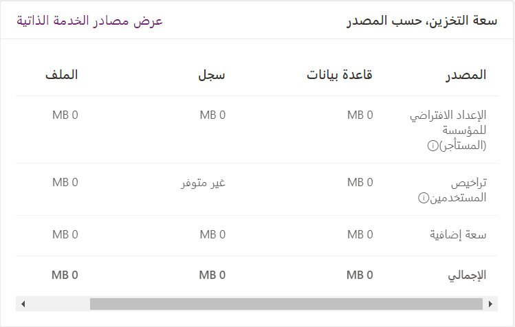
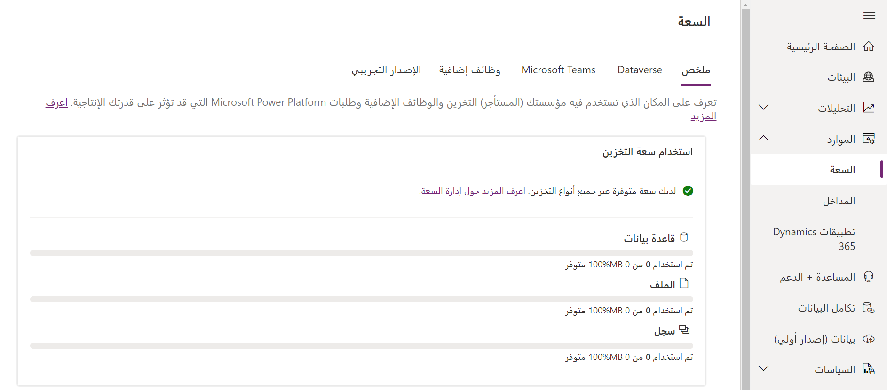

هناك مجال آخر يجب أن تكون على دراية به عند إدارة مستأجري Power Platform، وهو مقدار التخزين المتاح لديك. يتم تقسيم تخزين Dataverse إلى ثلاثة مصادر:

-   **قاعدة البيانات:** تشير إلى البيانات التي يتم تخزينها في جداول في قاعدة بيانات Dataverse الخاصة بك. يتضمن هذا عناصر مثل الجداول الجاهزة والجداول المخصصة والمزيد.

-   **السجل:** يشير إلى ملفات السجل والتي يتم استخدامها لالتقاط معلومات، مثل سجلات التدقيق أو سجلات تتبع المكونات الإضافية.

-   **الملف:** يشير إلى الصور أو الملفات التي يتم تخزينها في بيئة Dataverse الخاصة بك، مثل صورة العميل المخزنة في سجل جهات الاتصال الخاص به.

في البداية يتم تزويدك بتخصيص أساسي لكل مصدر. تتم إضافة المزيد من السعة التخزينية بناءً على عدد تراخيص المستخدم التي لديك. يمكن شراء المزيد من السعة حسب تغير احتياجاتك.

توفر الصورة أدناه مثالاً على كيفية عرض ذلك في مركز المسؤولين.

يتم تقسيم تفاصيل السعة إلى خمس علامات تبويب.

-   **الملخص:** يوفر ملخصاً عاماً لمعلومات السعة للمستأجر الخاص بك، مثل معلومات سعة التخزين الإجمالية حسب المصدر.

-   **Dataverse:** يوفر تفصيلاً تفصيلياً للتخزين الذي يتم استهلاكه عبر كل بيئة من البيئات في المستأجر الخاص بك.

-   **Microsoft Teams:** يوفر توزيعاً تفصيلياً للسعة التي يتم استهلاكها بواسطة Dataverse for Teams.

-   **الوظائف الإضافية:** يوفر توزيعاً تفصيلياً للوظائف الإضافية للسعة التي تم شراؤها بواسطة شركتك لدعم تطبيقات الأعمال المختلفة.

-   **الإصدار التجريبي:** يوفر توزيعاً تفصيلياً للسعة التي تستهلكها بيئة الإصدار التجريبي الخاصة بك.

