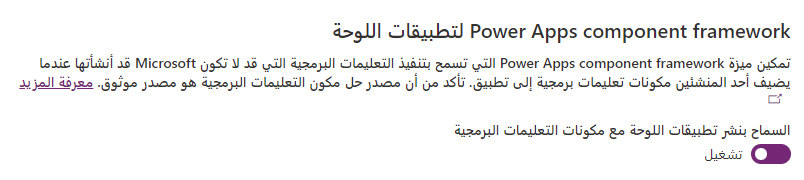

في هذا التدريب، ستقوم بتثبيت ‪Power Platform CLI‬، وإنشاء أول مكون في ‪Power Apps Component Framework (PCF)‬.

## <a name="task-1-install-the-cli"></a>المهمة 1: تثبيت CLI

1.  قم بتثبيت Npm (يأتي مع Node.js) أو [Node.js](https://nodejs.org/en/?azure-portal=true) (يأتي مع npm). نوصي باستخدام الإصدار 10.15.3 من LTS (دعم طويل الأمد) أو إصدار أعلى.

1.  ثبّت [Visual Studio Code](https://code.visualstudio.com/Download/?azure-portal=true).

1.  ثبّت [ملحق Power Platform Tools](https://marketplace.visualstudio.com/items?itemName=microsoft-IsvExpTools.powerplatform-vscode&azure-portal=true).

1.  ابدأ تشغيل Visual Studio Code.

1.  حدد **وحدة طرفية** ثم حدد **وحدة طرفية جديدة**.

    > [!div class="mx-imgBorder"]
    > 

1.  قم بتشغيل الأمر pac لمعرفة الأوامر المتوفرة:

    `pac`

    > [!div class="mx-imgBorder"]
    > 

1.  يمكنك إدخال pac ثم أمر لمعرفة الخيارات التي يوفرها، على سبيل المثال، يمكنك تجربة ما يلي:

    `pac admin`

1.  انتقل إلى [Power Apps maker portal](https://make.powerapps.com/?azure-portal=true) وتأكد من وجودك في البيئة الصحيحة.

1.  في الزاوية العليا اليسرى من الشاشة، حدد أيقونة **الإعدادات** ثم اختر **تفاصيل جلسة العمل**.

    > [!div class="mx-imgBorder"]
    > 

1. في مربع حوار تفاصيل جلسة عمل Power Apps حدد قيمة **Instance url** وانسخها للاستخدام لاحقاً في التدريب.

    > [!div class="mx-imgBorder"]
    > 

1. ارجع إلى وحدة Visual Studio Code الطرفية، واكتب الأمر التالي لإنشاء اتصال من CLI وقم بتسجيل الدخول إلى بيئة الاختبار الخاصة بك عندما يُطلب منك ذلك.

    `pac auth create --name Lab --url <Your Instance URL>`

1. اكتب الأمر who التالي الذي سيعرض معلومات البيئة والمستخدمين. وهذا مفيد للتأكد من أنك في البيئة الصحيحة.

    `pac org who`

## <a name="task-2-create-a-pcf-component"></a>المهمة 2: إنشاء مكون PCF

1.  قم بتشغيل الأمر أدناه لإنشاء مجلد جديد باسم **labPCF** داخل مجلد المستخدم الخاص بك.

    `md labPCF`

1.  قم بتغيير الدليل إلى المجلد الذي قمت بإنشائه.

    `cd labPCF`

1.  قم بتشغيل الأمر أدناه لتهيئة مشروع المكون.

    `pac pcf init --namespace lab --name FirstControl --template field`

1.  اكتب الأمر التالي، ثم اضغط على Enter. يؤدي هذا إلى سحب أي تبعيات من مستودع npm.

    `npm install`

1.  افتح المجلد من خلال Visual Studio Code.

    `code -a .`

1.  استكشف الملفات التي تم إنشاؤها.

1.  افتح **Index.ts** في مجلد **FirstControl**.

1.  الصق المتغيرَين التاليَين داخل التصدير.

    `private label: HTMLInputElement;`

    `private _container: HTMLDivElement;`

    > [!div class="mx-imgBorder"]
    > 

1.  الصق التالي داخل دالة **init()** لإنشاء عناصر تحكم HTML وتعيين قيمة التسمية.

    ```
    this.label = document.createElement("input");
    this.label.setAttribute("type", "label");
    this.label.value = "My First PCF"; this._container = document.createElement("div");
    this._container.appendChild(this.label);
    container.appendChild(this._container);
    ```

1. احفظ الملف.

1. انتقل إلى الوحدة الطرفية والأمر التالي ثم قم بالإدخال. سيؤدي ذلك إلى بدء مفعّل الاختبار باستخدام أحدث كود.

    `npm start`

1. يعد مفعّل الاختبار فعالاً للاستخدام في وقت مبكر من المشروع لمعرفة كيف تبدو عناصر التحكم الخاصة بك بصرياً دون الحاجة إلى توزيعها في بيئة ما. يمكنك تعيين قيم خاصية تغيير حجم منطقة التحكم. بعد الانتهاء من استكشاف مفعّل الاختبار، عد إلى الجهاز الطرفي واضغط على Ctrl-C لإنهاء تنفيذ مفعّل الاختبار.

1. اكتب **Y** و[ENTER].

1. قم بتشغيل الأمر التالي لسرد الحلول في بيئتك.

    `pac solution list`

1. هذه هي الحلول الحالية الموجودة في البيئة الخاصة بك. الخطوة التالية ستضيف واحداً للمكون.

1. اكتب الأمر push التالي لدفع عنصر التحكم الخاص بنا إلى البيئة.

    `pac pcf push --publisher-prefix lab`

1. قم بتشغيل الأمر pac solution list مرة أخرى. من المفترض أن تشاهد الحل PowerAppsTools_lab solution. هذه هي الطريقة التي يتم بها تثبيت المكون الخاص بك في بيئة التطوير لاختبار الوحدة قبل حزمها حتى يختبرها المستخدم أو إنتاجها أو تضمينها كجزء من حل آخر.

## <a name="task-3-use-the-component-in-an-app-optional"></a>المهمة 3: استخدام المكون في تطبيق (اختياري)

1.  انتقل إلى [Microsoft Power Platform مركز مسؤولي](https://aka.ms/ppac/?azure-portal=true).

1.  حدد البيئة التي تستخدمها للتدريب العملي.

1.  حدد **الإعدادات**.

1.  قم بتوسيع منطقة **المنتج** واختر **الميزات**.

1.  على الجانب الأيسر، قم بتمكين ميزة **‏‫السماح بنشر تطبيقات اللوحة من خلال مكونات الكود‬**.

    > [!div class="mx-imgBorder"]
    > 

1.  انتقل إلى [Power Apps maker portal](https://make.powerapps.com/?azure-portal=true) وتأكد من وجودك في البيئة الصحيحة.

1.  حدد **الحلول**.

1.  حدد هذا لفتح حل **PowerAppsTools_lab**.

1.  من المفترض أن تشاهد المكون مدرجاً.

1. حدد **+ جديد | تطبيق | تطبيق اللوحة**.

1. حدد **هاتف** للتنسيق، وقم بإدخال **أول PCF** لاسم التطبيق وحدد **إنشاء**.

1. حدد علامة التبويب **إدراج**.

1. حدد **مخصص** وحدد **استيراد مكون**.

    > [!div class="mx-imgBorder"]
    > 

1. اختَر علامة التبويب **التعليمات البرمجية**.

1. حدد المكون الخاص بك.

    > [!div class="mx-imgBorder"]
    > 

1. حدد **استيراد**.

1. على شريط الأدوات الأيمن، حدد **+** وقم بتوسيع **مكونات الكود**.

1. حدد **FirstControl**. يجب أن تشاهد الآن أداة التحكم مع ظهور النص **الأول PCF** على اللوحة.

    > [!div class="mx-imgBorder"]
    > 

1. حدد **ملف** وقم بحفظ التطبيق.

لقد نجحت الآن في إنشاء أول مكون PCF خاص بك واستخدامه في تطبيق اللوحة.
