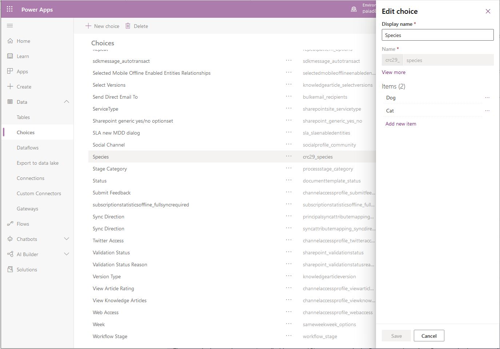

يتضمن Microsoft Dataverse أكثر من مائة من الخيارات القياسية التي يتم إنشاؤها في كل مرة تقوم فيها بإنشاء مثيل جديد لقاعدة بيانات Dataverse. يمكنك الإضافة إلى خيار قياسي، ولكن لا يمكنك حذف إدخال من خيار قياسي.

استكشف الخيارات القياسية المتوفرة في Dataverse وتعرف عليها باتباع الخطوات التالية:

1.  قم بتسجيل الدخول إلى مدخل Power Apps.

2.  في الجزء الأيمن، قم بتوسيع **البيانات** وحدد **الاختيارات**.

3.  قم بالتمرير خلال القائمة التي تضم أكثر من 100 خيار قياسي. حدد أحد الخيارات القياسية وافحص قائمة الإدخالات الافتراضية الخاصة بهذا الاختيار.

يتم إنشاء الخيارات كخيارات عمومية بشكل افتراضي، مما يسمح بإعادة استخدامها عبر جداول متعددة. عند إنشاء اختيار جديد، يمكنك أن تختار أن تجعله **محلي** ضمن خيار **‏‫عرض المزيد‬**. يتوفر هذا الخيار فقط عند إنشاء اختيار أثناء إضافة حقل، وليس من خلال قائمة الاختيار. 

يمكن استخدام الخيارات المحلية فقط بواسطة الجدول والعمود اللذين تم إنشاؤهما مقابلهما ولا يمكن إعادة استخدامها في جداول أخرى. ينصح بهذه الطريقة فقط للمستخدمين المتقدمين الذين لديهم حاجة محددة لاختيار محلي.

