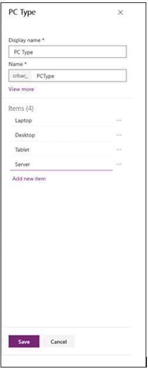
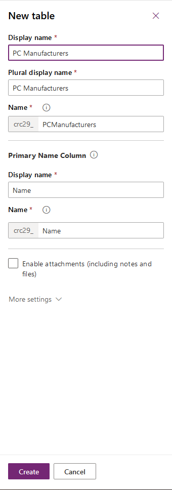
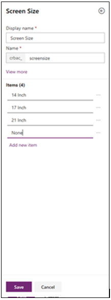
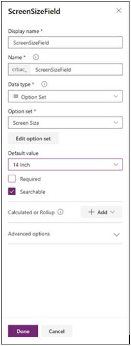

### إنشاء اختيار مخصص جديد

قد ترغب في عمل خيار مخصص جديد لاستخدامه عبر العديد من الكيانات في Microsoft Dataverse. ويمكنك إنشاء اختيار بطريقتين: من خلال إنشاء اختيار عند تحديد حقل جديد داخل جدول، أو من خلال إنشاء اختيار باستخدام وظيفة الاختيار داخل مدخل Power Apps.

لإنشاء اختيار مخصص جديد باستخدام وظيفة الاختيار في مدخل Power Apps، اتبع الخطوات الآتية:

1.  سجِّل الدخول إلى [Power Apps](https://make.powerapps.com/). إذا كنت تستخدم البيئة الافتراضية، فانتقل إلى الخطوة 2.

2.  في الجزء الأيمن، قم بتوسيع **البيانات**/**Dataverse** وحدد **الاختيارات**.

3.  حدد **اختيار جديد** في القائمة الموجودة أعلى القائمة.

4.  أدخل **نوع الكمبيوتر** في **اسم العرض**.

5.  أضف الأصناف الآتية إلى الاختيار:

    **الكمبيوتر المحمول**

    **كمبيوتر سطح المكتب**

    **الكمبيوتر اللوحي**

    **الخادم**
    

    > [!NOTE]
    > يمكنك تعيين قيمة رقمية فريدة من خلال ضبط حقل القيمة بجانب إدخال الاختيار.

6.  حدد الزر **حفظ**.

يتوفر الاختيار **نوع الكمبيوتر** الآن للاستخدام مع أي حقل في أي كيان داخل البيئة. ولاستخدام الاختيار الجديد، اتبع الخطوات الآتية.

> [!TIP]
> قد يستغرق ظهور الاختيار الجديد في قائمة الاختيارات المتوفرة بضع دقائق.

### إنشاء جدول مخصص جديد

أكمل الخطوات التالية، إذا لم تكن قد أنشأت الجدول المخصص للشركات المصنّعة لأجهزة الكمبيوتر في وقت سابق في مسار التعلم هذا.

1. حدد **Dataverse/البيانات** في اللوحة بالجانب الأيسر من مدخل Power Apps لتمديد الاختيارات المتوفرة.

1. حدد **الجداول** ضمن الخيار "البيانات" في الجانب الأيسر من المدخل.

1. حدد **جدول جديد** في القائمة أعلى قائمة الجداول.

1. أدخل ما يلي لـ *اسم العرض:* **الشركات المصنّعة لأجهزة الكمبيوتر‬‏‫**

1. حدد **حفظ.**

    

### أضف الخيار إلى الجدول المخصص

1.  حدد **البيانات**/**Dataverse** في اللوحة بالجانب الأيسر من مدخل Power Apps لتمديد الاختيارات المتوفرة.

2.  حدد **الجداول** ضمن الخيار **البيانات**/**Dataverse** في الجانب الأيسر من المدخل.

3.  حدد الجدول المخصص الجديد **الشركات المصنعة لأجهزة الكمبيوتر** في قائمة الجداول. سيؤدي ذلك إلى فتح قائمة الأعمدة في الجدول.

4.  حدد الزر **عمود جديد** في القائمة أسفل قسم الأعمدة والبيانات.

    

5.  أدخل **نوع الكمبيوتر** على أنه اسم العمود الجديد.

6.  حدد **الاختيار** لنوع البيانات.

7.  قم بالتمرير لأسفل إلى **مزامنة هذا الخيار مع** الخيار وحدد **نوع جهاز الكمبيوتر** من قائمة الخيارات.

8. حدد الزر **حفظ**.

كما يمكنك تحديد اختيار عند إضافة حقل جديد، دون إنشاء اختيار في المدخل. ويمكن أيضاً استخدام الاختيار الذي تضيفه عند تحديد حقل مع أي حقل من النوع **الاختيار** في أي جدول داخل البيئة.

### تحديد اختيار عند إضافة أعمدة جديدة

إذا كنت تفضل تحديد اختيار عند إضافة أعمدة جديدة إلى جدول، فاتبع الخطوات الآتية:

1.  حدد **البيانات**/**Dataverse** في اللوحة بالجانب الأيسر من مدخل Power Apps لتمديد الاختيارات المتوفرة.

2.  حدد **الجداول** ضمن الخيار **البيانات**/**Dataverse** في الجانب الأيسر من المدخل.

3.  حدد الكيان المخصص الجديد **الشركات المصنعة لأجهزة الكمبيوتر** في قائمة الجداول. سيؤدي ذلك إلى فتح قائمة الأعمدة في الكيان.

4.  حدد الزر **عمود جديد** في القائمة الموجودة أعلى قائمة الأعمدة.

5.  أدخل **حقل حجم الشاشة** في الحقل **اسم العرض**.

6.  أدخل **اختيار** في الحقل **نوع البيانات**. حدد موقع الحقل **مزامنة هذا الاختيار مع** وحدد **خيار جديد**.

7.  اكتب **حجم الشاشة** في الحقل **اسم العرض**.

8. اكتب **14 بوصة و17 بوصة و21 بوصة ولا شيء** في العناصر، وحدد الزر **حفظ**.

    

9. اكتب **14 بوصة** في الحقل **القيمة الافتراضية** وحدد الزر **حفظ**.

10. حدد الزر **حفظ الجدول**.

    

إذا كنت بحاجة إلى تعديل اختيار موجود، فاتبع الخطوات الآتية:

1.  سجِّل الدخول إلى [Power Apps](https://make.powerapps.com/).

2.  في الجزء الأيمن، قم بتوسيع **البيانات**/**Dataverse** وحدد **الاختيارات**.

3.  حدد **الاختيار** الذي ترغب في تعديله.

    أ.  أضف إدخالاً جديداً من خلال تحديد زر **إضافة خيار جديد**.

    ب.  يمكنك حذف عنصر عن طريق تحديد سلة المهملات.

    ج.  يمكنك إضافة خصائص إضافية عن طريق تحديد أيقونة الإعدادات بجوار الإدخال.

4.  حدد الزر **حفظ** لحفظ التغييرات.
