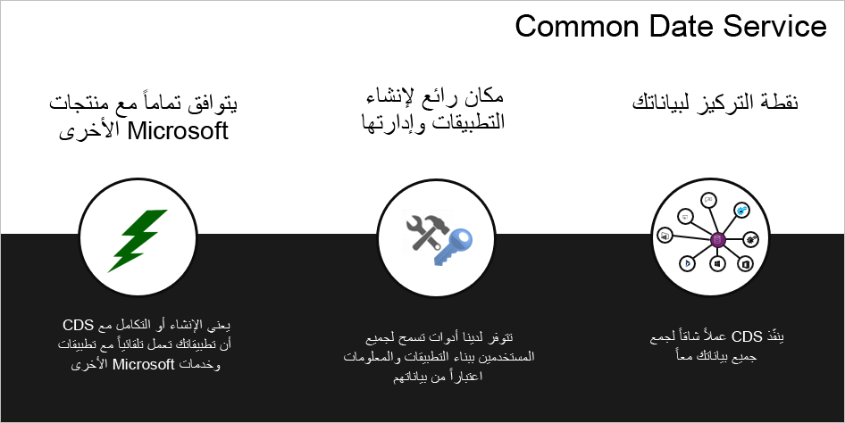

واحدة من أقوى ميزات Power Platform هي نموذج البيانات القابل للتمديد Microsoft Dataverse. يبسّط إدارة البيانات من خلال توفير لغة بيانات مشتركة لتطبيقات الأعمال.
تتيح هذه المشاركة إمكانية التشغيل التفاعلي للبيانات والتطبيقات.

يعد نموذج البيانات المشترك أحد أكثر الميزات قيمة في Dataverse. يوفر نموذج البيانات المشتركة مستودعاً قياسياً للكيانات والحقول للاستفادة من التشغيل الجاهز. يمكن لهذه المقاييس القيام بالتسريع والتبسيط أي ما نشاط تقوم به بجانب البيانات الخاصة بك.

> [!div class="mx-imgBorder"]
> 

ستصبح Dataverse الأداة الرئيسية التي من خلالها يمكنك تكوين حل التطبيق الفريد المستند إلى النموذج.

خلال هذه الوحدة، سنناقش متطلبات العمل في سياق مؤسسة من نسج خيالنا تسمى **Contoso Research.** Contoso Research هي شركة تقوم بتوظيف المشاركين في البحث، وتحتفظ بقاعدة بيانات للموضوعات، وتسهل مجموعات التركيز، وتجري استطلاعات على نطاق واسع. تبحث شركة Contoso Research في استخدام تطبيق Dynamics 365 الذي يستند إلى النموذج لتبسيط عمليات الأعمال الخاصة بهم. إنهم قلقون من كون متطلباتهم فريدة جداً بحيث لا يمكنهم استخدام حل خارج الإطار التقليدي. تتمثل وظيفتك في إظهار كيف يمكن لشركة Contoso Research تكوين تطبيق يستند إلى نموذج بسهولة لتلبية احتياجاتهم.

> [!NOTE]
> على الرغم من أن المحتوى في هذه الوحدة تمهيدية، إلا أنه يعتمد على المفاهيم الأساسية التي تم تقديمها في [Microsoft Dynamics ‏365 Fundamentals](/learn/paths/dynamics-365-fundamentals/) و[Microsoft Power Platform ‏Fundamentals](/learn/paths/power-plat-fundamentals/). إذا لم تكن معتاداً بالفعل على مكونات Power Platform أو تطبيقات Dynamics 365 المستندة إلى نموذج، يوصى بمسارات التعلم هذه.

في نهاية هذه الوحدة، ستكون قادراً على:
- العمل مع كتل الإنشاء لنموذج بيانات تطبيق Dynamics 365 المستند إلى نموذج
- العمل مع نموذج البيانات العامة
- إنشاء مؤثرات عرض البيانات لكل متطلب عمل لعميل
- أتمتة العمليات التجارية
