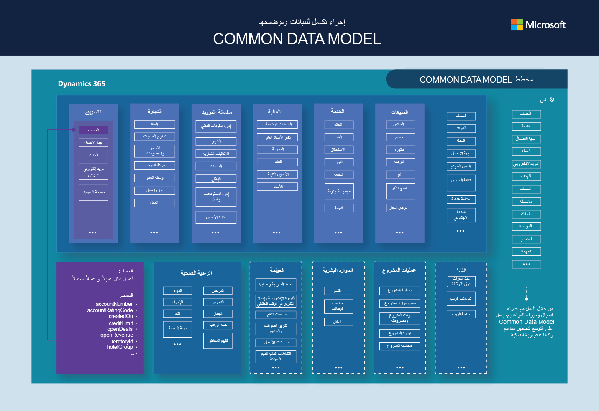
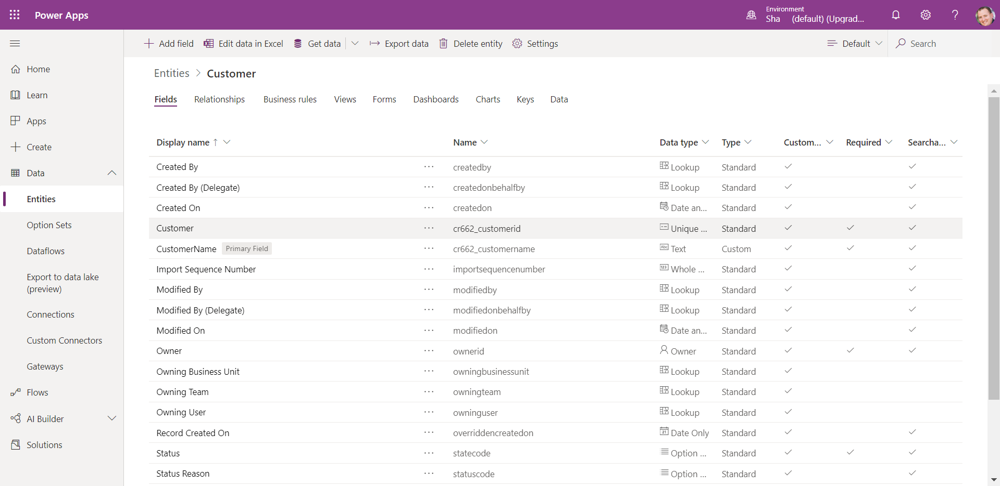

Microsoft Dataverse هو حل قائم على مجموعة يعمل بسهولة على بناء مجموعة متنوعة من البيانات ومنطق الأعمال لدعم التطبيقات والعمليات المترابطة بطريقة آمنة ومتوافقة. تتم إدارتها وصيانتها بواسطة Microsoft، يتوفر، Dataverse عالمياً ولكن يتم نشره جغرافياً للتوافق مع موقع بياناتك المحتمل. إنه غير مصمم للاستخدام المستقل على خوادمك، لذلك ستحتاج إلى اتصال بالإنترنت للوصول إليه واستخدامه.
تم تصميم Dataverse ليكون مستودع البيانات المركزي لبيانات الأعمال. خلف الكواليس، يقوم بتشغيل تطبيقات Microsoft Dynamics 365المستندة إلى النموذج. وهو متوفر أيضاً كجزء من Power Apps وPower Automate مع اتصال أصلي مدمج فيه. ميزات AI Builder وPortals في Power Platform يمكن الاستفادة منها في Dataverse. إذا لم تكن بالفعل على دراية بـ Dataverse وميزاته، يمكنك قراءة المزيد في مسار تعليم Power Platform Fundamentals.

في Dataverse، أنت تعمل بالمفاهيم التالية باعتبارها "لبنات بناء" أساسية لإنشاء بنية بياناتك والتفاعل معها.

-   **الكيان:** يشير المطورون إلى الكيان على أنه "جدول بيانات"، لكن الكيانات هي في الحقيقة مجرد مجموعات من البيانات التي تتبعها في Common Data Service. فكر في الكيان على أنه أي "نوع" من البيانات التي ستقوم بتتبعها في Dynamics
    365. الكيانات الشائعة المستخدمة في التطبيقات المستندة إلى نموذج هي جهة الاتصال والحساب، على سبيل المثال.

-   **السجل:** السجل هو مثيل واحد فقط للكيان. على سبيل المثال، سيكون لكيان جهة الاتصال سجل واحد يمثل كل جهة اتصال في نظامك.

-   **الحقل:** يمكنك إدخال معلومات حول كل سجل في الحقول. في سجل جهة الاتصال، من المحتمل أن يكون لديك حقول حيث يمكن للمستخدم إدخال الاسم الأول والعائلة لكل جهة اتصال وعنوان البريد الإلكتروني ورقم الهاتف وأي معلومات مهمة أخرى حول هذا الشخص.

-   **النموذج:** النموذج هو كيفية تمثيل السجل في تجربة المستخدم. عندما أنظر إلى سجل جهة اتصال فردية، فإنني أشاهد نموذجاً. يتضمن النموذج جميع حقول جهات الاتصال حيث يمكنني إدخال بياناتي.

-   **العلاقة:** في Dataverse، يمكنك إنشاء علاقات لتحديد كيفية ارتباط الكيانات ببعضها البعض. (على سبيل المثال، يمكن أن ترتبط جهات الاتصال بحساب، مما يعني أن جهات الاتصال هذه تعمل على الأرجح لمؤسسة أكبر ممثلة في Dynamics 365 كسجل حساب.)
 
 سنتعمق في هذه المفاهيم في الوحدة التالية.

 نموذج البيانات المشترك
---------------------

يعتمد تصميم الكيان القياسي في قاعدة بيانات Dataverse على معيار نموذج بيانات مفتوح يسمى Common Data Model. نموذج البيانات المشتركة هو تصميم منطقي يتضمن مجموعة من كيانات البيانات مفتوحة المصدر والموحدة والقابلة للتوسيع والعلاقات التي نشرتها Microsoft وشركاؤها في مبادرة على مستوى الصناعة تسمى مبادرة البيانات المفتوحة. تشكل هذه المجموعة من الكيانات والسمات وبيانات التعريف الدلالية والعلاقات المعرفة مسبقاً أساس نموذج البيانات المشترك.

سيتم تضمين نموذج البيانات العامة الجاهز في تطبيقات Dynamics 365 المستندة إلى النموذج. تم تصميم هذه الكيانات لتمثيل السيناريوهات الأكثر شيوعاً. يُظهر الرسم التخطيطي التالي مخطط نموذج البيانات المشترك. ستلاحظ أن كل تطبيق يستند إلى نموذج Dynamics 365 يشتمل على كيانات قياسية مثل **الحساب والموعد وجهة الاتصال،** و **العميل المتوقع**. تتضمن تطبيقات Dynamics 365 المستندة إلى النموذج أيضاً المزيد من الكيانات الخاصة بالصناعة. على سبيل المثال، يتضمن تطبيق Dynamics 365 Sales كيانات مثل **منافس، وفرصة،** و **عرض الأسعار.**

> [!div class="mx-imgBorder"]
> 

تم تكوين الكيانات في نموذج البيانات العامة مسبقاً باستخدام حقول و / أو علاقات و / أو أتمتة مشتركة. يمكنك أدناه مشاهدة لقطة شاشة لكيان العميل القياسي وأنواع مختلفة من الحقول التي يتضمنها.

> [!div class="mx-imgBorder"]
> 

في الوحدة التالية، سنتعلم المزيد عن هذه المفاهيم وكيفية تكوينها في Power Platform.

