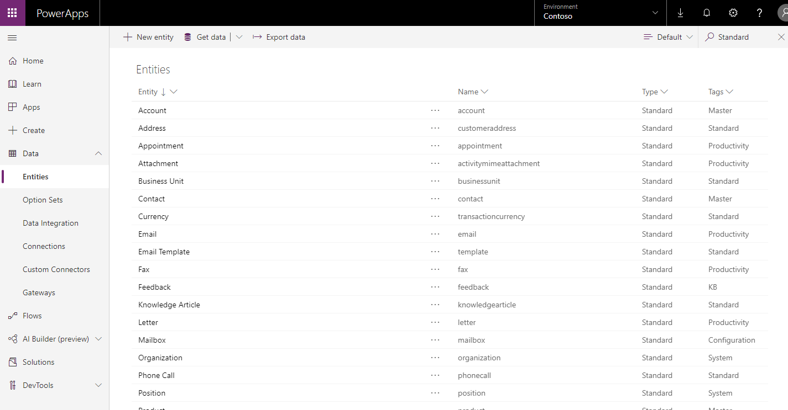

في الوحدة الأخيرة، قدّمنا مفاهيم البيانات الشائعة التي استفادت منها Common Data Service. لنتعمق بصورة أكبر في كلٍّ من الكُتل الأساسية للبيانات ونتعلم كيفية تكوينها.

الكيانات
--------

اعتادت الكيانات نمذجة بيانات الأعمال وإدارتها. عندما تعمل باستخدام تطبيق يستند إلى نموذج Dynamics 365، يمكنك استخدام كيانات قياسية أو كيانات مخصصة أو كليهما. يوفر Microsoft Dataverse كيانات قياسية بصورة افتراضية. تم تصميمها، وفقًا لأفضل الممارسات، لرصد أكثر المفاهيم والسيناريوهات شيوعًا داخل أية مؤسسة. إذا كانت لمؤسستك متطلبات عمل فريدة خارج تلك السيناريوهات الشائعة، فيمكنك إنشاء أحد الكيانات المخصصة. تُظهر الشاشة التالية الكيانات الموجودة حاليًا داخل النظام، وتوفر خيارًا لإضافة كيان مخصص جديد.

> [!div class="mx-imgBorder"]
> 

لنناقش الكيانات في سياق مؤسستنا النموذجية، **Contoso Research**. تستخدم Contoso Research تقنية Dynamics 365 للاحتفاظ بقائمة من الأفراد المهتمين بالمشاركة في مجموعة مركّزة أو الذين شاركوا من قبل. يقومون بتخزين أسماء هؤلاء الأفراد ومعلومات الاتصال بهم في كيان يسمى **Contact.** Contact هي كيان خارج الصندوق؛ نظرًا لأن معظم المؤسسات بحاجة إلى تتبع قائمة جهات الاتصال، فهذا كيان قياسي في Common Data Model.

ومع ذلك، تضم Contoso Research أيضًا عددًا قليلاً من العمليات الفريدة التي تحتاج إلى تعقبها في Dynamics 365.
كشرط من متطلبات العمل، تحتاج إلى تتبع كل مجموعة مركّزة تقوم بتنظيمها وتسهيل العمل بها. ونظرًا لأن **Focus group** ليست كيانًا قياسيًا في Common Data Model، يمكنك إنشاء كيان مخصص جديد لتتبع تاريخ مجموعات التركيز ووقتها ونتائجها وموقعها أو أيm معلومات أخرى ذات صلة.

السجلات
-------

يُعد السجل مجرد مثيل واحد للكيان.

فمثلاً، استفسر فردًا جديدًا يُدعى Joanna Meyers إلى **Contoso Research** حول المشاركة في مجموعات التركيز أو الاستطلاعات القادمة. سيقوم مستخدم Dynamics 365 بإنشاء سجل **Contact** جديد يسمى **Joanna Meyers.**
في هذا السجل الفردي، يمكن للمستخدم رصد البيانات ذات الصلة بـ Joanna (مثل معلومات الاتصال الخاصة بها) لمطابقتها مع فرص البحث القادمة.

الحقول
------

هل تتذكر كيف نحتاج إلى تعقب البيانات ذات الصلة بجوانا Meyers في سجل Contact الخاص بها؟ الحقول هي طريقة رصد هذه البيانات وعرضها.

الحقول هي طريقة لتخزين جزء منفصل من المعلومات داخل أحد السجلات في أحد الكيانات. قد تفكر فيهم كعمود في Excel. تضم الحقول أنواعًا، أي أنه يمكنك تخزين بيانات من نوع معين في حقل يطابق نوع البيانات هذا. فمثلاً، إذا كان لديك حلاً يتطلب تواريخ، فيمكنك حينئذٍ تخزين التاريخ في حقل بالنوع **Date**. وبالمثل، إذا كنت تريد تخزين رقم ما، فحينئذٍ تقوم بتخزين الرقم في حقل بالنوع **Number**.

نظرًا لأن كيان **Contact** هو كيان قياسي في نموذج البيانات العامة، فإنه يأتي مع مجموعة قياسية من الحقول (أو سمات). من بين هذه الحقول **الاسم الأول والاسم الأخير وتاريخ الميلاد،** و **عنوان البريد الإلكتروني،** من بين معلومات أخرى. قد يرغب ممثل Contoso Research على الأرجح في تسجيل كل هذه السمات حول Joanna Meyers، لكنهم ربما يريدون أيضًا بعض المعلومات الإضافية الخاصة بمؤسسته. في هذا الوضع، يمكنك إضافة **حقل مخصص** إلى كيان Contact لتكملة الحقول القياسية المضمّنة في Common Data Model.

فمثلاً، لنفترض أن Contoso Research به متطلب يحتاجون إلى تسجيل نوع الأنشطة البحثية الذي قد تكون جهة الاتصال مهتمة به. يمكنني إنشاء حقل مخصص جديد باسم العرض **مهتم بـ** ونوع الحقل **مجموعة خيارات التحديد المتعدد**. يمكنك وضع الخيارات المخصصة التالية في مجموعة الخيارات هذه ليتمكن المستخدم من الاختيار من بينها:

-   مجموعات التركيز

-   الاستطلاعات عبر الإنترنت

-   استطلاعات الهاتف

-   دراسات شخصية طويلة المدى

-   دراسات افتراضية طويلة المدى

باستخدام نوع الحقل MultiSelect، يمكن للمستخدم تحديد أنواع الأنشطة البحثية التي تهتم بها Joanna حتى يتمكن من الوصول إليها للحصول على فرص محددة عند ظهورها.

العلاقات
-------------

تحدد علاقات الكيانات كيف يمكن أن ترتبط السجلات ببعضها البعض في قاعدة البيانات. هناك نوعان من علاقات الكيانات:

| **نوع العلاقة**  | **الوصف**                                                                                                                                                                                                                                                                                                                                                                        |
|------------------------|----------------------------------------------------------------------------------------------------------------------------------------------------------------------------------------------------------------------------------------------------------------------------------------------------------------------------------------------------------------------------------------|
| **1:N (واحد إلى متعدد)**  | علاقة كيان حيث يمكن إقران سجل كيان واحد لـ **الكيان الأساسي** بالعديد من سجلات **الكيان ذي الصلة** الأخرى بسبب حقل بحث في الكيان المرتبط.  |
| **N:N (متعدد إلى متعدد)** | علاقة كيان تعتمد على **كيان علاقة** خاص، تسمى أحيانًا كيان التقاطع، بحيث يمكن ربط العديد من سجلات كيان واحد بالعديد من سجلات كيان آخر.  عند عرض سجلات أي كيان في العلاقة N: N، يمكنك مشاهدة قائمة بأي سجلات للكيان الآخر المرتبط به.                                        |

تتواجد العلاقات 1:N بالفعل *بين* الكيانات وتشير إلى كل كيان إما **أساسي / كيان حالي** أو **كيان ذي صلة**. يحتوي الكيان المرتبط، الذي يُطلق عليه أحيانًا اسم الكيان *الفرعي*، على حقل بحث يسمح بتخزين مرجع إلى سجل من الكيان الأساسي، والذي يُسمى أحيانًا الكيان *الأصل*.

في أبسط مستوى، تؤدي إضافة حقل بحث إلى كيان إلى إنشاء العلاقة 1: N (واحد إلى متعدد) جديدة بين الكيانين وتتيح لك وضع حقل البحث هذا في نموذج. باستخدام حقل البحث، يمكن للمستخدمين إقران العديد من السجلات *الفرعية* لهذا الكيان بسجل كيان *أصل* واحد.

فضلاً عن تحديد كيفية طريقة ربط السجلات بسجلات أخرى، توفر علاقات الكيانات 1: N أيضًا بيانات لمعالجة الأسئلة التالية:

-   متى أقوم بحذف أحد السجلات، هل ينبغي أيضًا حذف أي سجلات مرتبطة بهذا السجل؟

-   عندما أقوم بتعيين أحد السجلات، هل أحتاج أيضًا إلى تعيين جميع السجلات المتعلقة بهذا السجل إلى المالك الجديد؟

-   كيف يمكنني تبسيط عملية إدخال البيانات عندما أقوم بإنشاء سجل جديد مرتبط في سياق سجل موجود؟

-   كيف يمكن للأشخاص الذين يعرضون أحد السجلات أن يكونوا قادرين على عرض السجلات المرتبطة؟

فلنتحدث عن أحد الأمثلة حول مؤسسة من نسج خيالنا، وهو **Contoso Research**. في الماضي، عملنا مع كيانين: **Contact** (وهو كيان قياسي) و **Focus group** (كيان مخصص). في الحياة الواقعية، هذان المفهومان مرتبطان. يمكن لجهة الاتصال المشاركة في مجموعات تركيز متعددة، وعادة ما يكون لمجموعة التركيز جهات اتصال متعددة مشاركة. في Dynamics 365، سننشئ بالتالي علاقة N: N (متعدد إلى متعدد) بين كيان جهة الاتصال وكيان مجموعة التركيز. يمكن تسمية كيان العلاقة (أو الكيان المتقاطع) بـ **مشارك في مجموعة التركيز**. من منظور سجل جهات الاتصال، يمكنك تتبع مجموعات التركيز التي شارك فيها (أو سيشارك فيها) أحد المشاركين. من سجل مجموعة التركيز، يمكنك تتبع جهات الاتصال المشاركة.

عند تكوين تطبيق جديد يستند إلى نموذج، استخدم دائمًا الكيانات والحقول القياسية عندما يكون ذلك ممكنًا. يمكنك إعادة تسمية الكيان إذا كان ذلك يجعل الكيان أكثر قابلية للفهم في سياق الحل الخاص بك. راجع دائمًا قائمة الكيانات القياسية وتأكد أن الكيان القياسي لن يلبي احتياجاتك قبل إنشاء كيان جديد.

في الوحدة التالية، سنتعلم كيفية تصور هذه المفاهيم داخل واجهة المستخدم.

