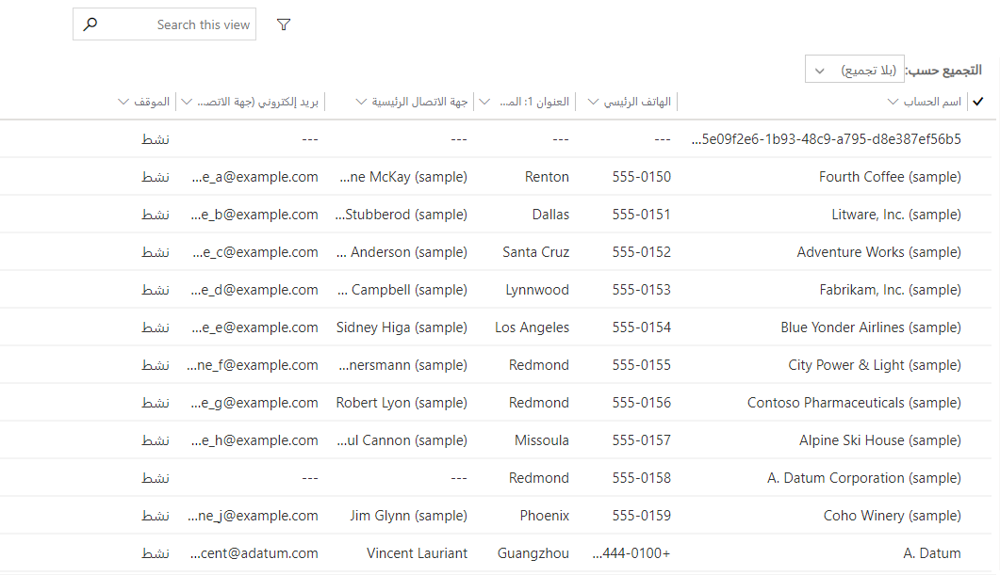
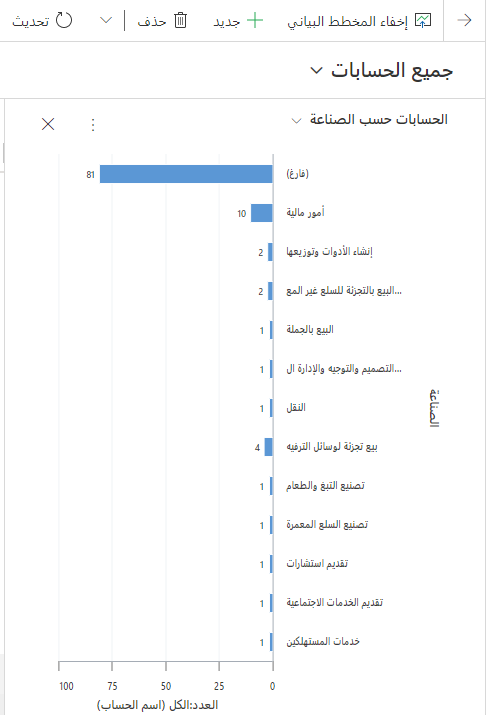

في الوحدة الأخيرة، تعرفنا على المعالم الرئيسية لنموذج بيانات Common Data Service. في هذه الوحدة، سنتعلم كيفية تصور هذه المفاهيم في واجهة مستخدم Dynamics 365.

النماذج
-----

توفر النماذج واجهة المستخدم التي تستخدمها المؤسسة للتفاعل مع البيانات التي يحتاجون إليها للقيام بعملهم. يجب تصميم النماذج بحيث يتمكن المستخدمون من العثور على المعلومات التي يحتاجون إليها وإدخالها بكفاءة. يمكنك إنشاء نماذج جديدة أو تحرير النماذج الحالية لكل كيان.

هناك العديد من أنواع النماذج. يمكنك إنشاء نماذج متعددة من كل نوع، وتكوين المستخدمين الذين يمكنهم استخدام كل نموذج.

| **نوع النموذج**    | **الوصف**                                                                                                                                                                                                                    |
|------------------|------------------------------------------------------------------------------------------------------------------------------------------------------------------------------------------------------------------------------------|
| **الأساسية**         | توفر هذه النماذج واجهة المستخدم الرئيسية للتفاعل مع بيانات الكيان.                                                                                                                                                      |
| **إنشاء سريع** | توفر هذه النماذج نموذجًا أساسيًا محسنًا لإنشاء سجلات جديدة. تحتوي نماذج الإنشاء السريع عادةً على الحقول المطلوبة فقط حتى يتمكن المستخدم من إنشاء سجل بأسرع ما يمكن، وإدخال المعلومات الأكثر أهمية فقط. |
| **عرض سريع**   | تظهر هذه النماذج في النموذج الرئيسي لعرض بيانات إضافية لسجل يُشار إليه بواسطة حقل بحث في النموذج.                                                                                                  |
| **بطاقة**         | تُستخدم في طرق عرض تطبيقات الواجهة الموحدة. تم تصميم نماذج البطاقة لتقديم المعلومات بتنسيق مضغوط مناسب للأجهزة المحمولة.                                                                                  |

نظرًا لإمكانية إنشاء نماذج رئيسية متعددة وتعيين أدوار أمان مختلفة لكل نموذج، يمكنك تقديم مجموعات مختلفة في مؤسستك بنموذج تم تحسينه لطريقة استخدامهم للتطبيق. يمكنك أيضًا تزويد كل مجموعة بخيارات مختلفة بحيث يكون لديهم أشكال مختلفة يمكنهم الاختيار من بينها.
يمكنك أن تتوقع مدى رغبة المديرين وصناع القرار في النماذج التي تم تحسينها لتوفير مرجع سريع لنقاط البيانات الرئيسية. وفي الوقت ذاته، قد يحتاج المستخدمون الذين يتفاعلون مباشرة مع العملاء إلى نماذج مخصصة للمهام التي يؤدونها بشكل متكرر. 

ستود معرفة ما يريده المستخدمون في مؤسستك وما يحتاجون إليه. غالبًا ما تكون هذه عملية تكرارية حيث تقوم بجمع المدخلات وتجربة أشياء مختلفة وإنشاء نماذج يمكن للأشخاص استخدامها. ضع في اعتبارك أن لديك مجموعة متنوعة من الأدوات المتاحة لك وأنه لا يجب عمل كل شيء في النموذج. استخدم قواعد العمل وعمليات سير العمل ومربعات الحوار وتدفق إجراءات العمل مع النماذج الخاصة بك لتوفير حل مناسب لمؤسستك. سنتحدث أكثر عن استراتيجيات الأتمتة هذه في الوحدة التالية.

طرق العرض
-----

تحدد طرق العرض كيفية عرض قائمة سجلات لكيان معين داخل التطبيق. يمكنك التحكم في الأعمدة المراد عرضها، وعرض هذه الأعمدة، والفرز الافتراضي، وعوامل التصفية الافتراضية.

> [!div class="mx-imgBorder"]
> 

هناك ثلاثة أنواع من طرق العرض: *الشخصية* و *النظام* و *عام*.

-   **طرق العرض الشخصية:** يمكنك أنت وأي شخص آخر لديه على الأقل وصول على مستوى المستخدم إلى الإجراءات لكيان طريقة العرض المحفوظة إنشاء طرق عرض شخصية. بصفتك مسؤول النظام، يمكنك تعديل مستوى الوصول لكل إجراء في دور الأمان للتحكم في العمق الذي يمكن للأشخاص إنشاء طرق العرض الشخصية أو قراءتها أو كتابتها أو حذفها أو تعيينها أو مشاركتها.

-   **طرق عرض النظام:** بصفتك مسؤول النظام أو مخصص النظام، يمكنك تحرير طرق عرض النظام. طرق عرض النظام هي طرق عرض خاصة يعتمد عليها التطبيق، وهي موجودة لكيانات النظام أو يتم إنشاؤها تلقائياً عند إنشاء كيانات مخصصة.

-   **طرق العرض العامة:** طرق العرض العامة هي طرق عرض للأغراض العامة يمكنك تخصيصها على النحو الذي تراه مناسبًا. تتوفر طرق العرض هذه في محدد طرق العرض ويمكنك استخدامها في شبكات فرعية داخل نموذج أو كقائمة في لوحة معلومات. توجد بعض طرق العرض العامة بشكل افتراضي لكيانات النظام ولأي كيان مخصص.

يمكن إضافة طرق العرض إلى النماذج أو لوحات المعلومات.

تعد إضافة طريقة عرض إلى أحد النماذج طريقة رائعة لتمثيل العلاقة بين كيانين مرتبطين. لنعد إلى مثالنا من المؤسسات، **Contoso Research،** التي تمتلك بيئة Dynamics 365 الخاصة بها العلاقة N: N بين **Contact** و **Focus group.** باستخدام مصمم النموذج، يمكنني إضافة عرض إلى النموذج الرئيسي لـ Focus group يمثل جميع جهات الاتصال التي تشارك في Focus group هذه. على العكس من ذلك، يمكنني وضع إحدى طرق العرض في نموذج Contact يمثل مجموعات التركيز التي شاركت فيها contact. ستشير طريقتا العرض هذين إلى الكيان المتقاطع.

المخططات
-----

تعرض المخططات مرئيات سريعة وقابلة للتنفيذ لبياناتك. المخططات تفاعلية حتى يتمكن المستخدمون من متابعة التنقل لأسفل وصولاً إلى البيانات ذات الصلة.
يمكن وضع المخططات على لوحات المعلومات وعرضها بما يتماشى مع البيانات التي تعرضها.

تُظهر لقطة الشاشة أدناه مثالاً على مخطط Dynamics 365 Sales.

> [!div class="mx-imgBorder"]
> 

لإنشاء مخطط نظام أو تحريره، حدد **المكوّنات** \> **الكيانات**.

1.  قم بتوسيع اسم الكيان، وحدد **المخططات**، ثم على شريط أدوات "الإجراء"، حدد **جديد**.  لتحرير أحد المخططات، حدد **المزيد من الإجراءات**، ثم حدد **تحرير**.

2.  قم بتحديد طريقة عرض لاستخدام الإصدار الأولي للمخطط.

3.  حدد نوع المخطط، وكيف يتم عرض البيانات في المخطط.

    -   حدد اسم المخطط لتحريره.

    -   حدد الحقول لمحاور السلسلة والفئة.

    -   أضف وصفًا لتحديد طريقة الغرض من المخطط.

4.  حدد **حفظ**.

في الوحدة التالية، سنتعرف على تكوين الأتمتة.
